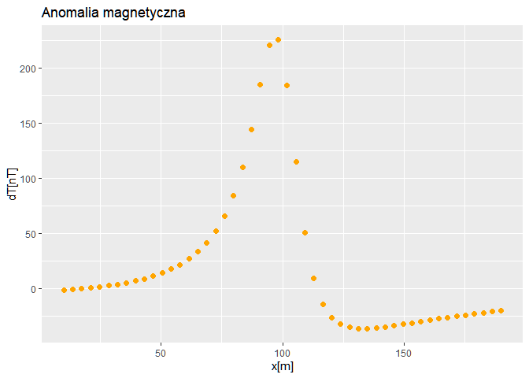
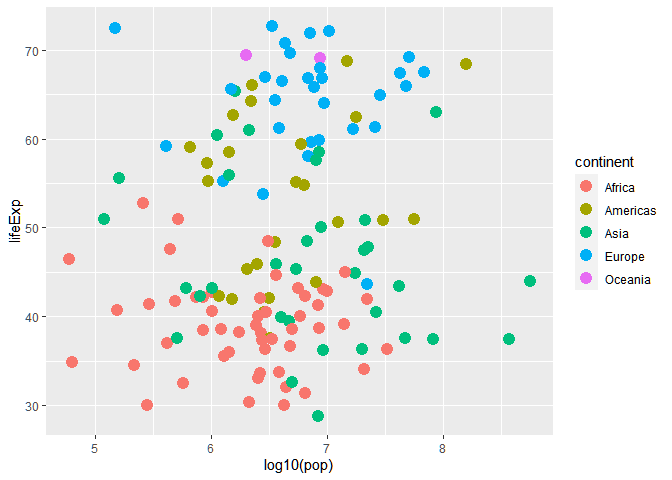
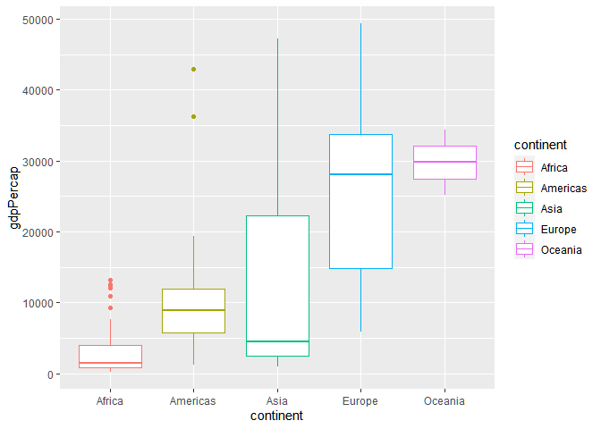

Untitled
================

``` r
A<-c(1,2,3)
B<-c(4,5,6)
A+B
```

    ## [1] 5 7 9

``` r
hotdogs<-read.table("hotdogs.txt", header=FALSE)
summary(hotdogs)
```

    ##       V1                  V2              V3       
    ##  Length:54          Min.   : 86.0   Min.   :144.0  
    ##  Class :character   1st Qu.:132.0   1st Qu.:362.5  
    ##  Mode  :character   Median :145.0   Median :405.0  
    ##                     Mean   :145.4   Mean   :424.8  
    ##                     3rd Qu.:172.8   3rd Qu.:503.5  
    ##                     Max.   :195.0   Max.   :645.0

``` r
weather<-readRDS("weather.rds")
class(weather)
```

    ## [1] "data.frame"

``` r
dim(weather)
```

    ## [1] 286  35

``` r
colnames(weather)
```

    ##  [1] "X"       "year"    "month"   "measure" "X1"      "X2"      "X3"     
    ##  [8] "X4"      "X5"      "X6"      "X7"      "X8"      "X9"      "X10"    
    ## [15] "X11"     "X12"     "X13"     "X14"     "X15"     "X16"     "X17"    
    ## [22] "X18"     "X19"     "X20"     "X21"     "X22"     "X23"     "X24"    
    ## [29] "X25"     "X26"     "X27"     "X28"     "X29"     "X30"     "X31"

``` r
library(tidyverse)
```

    ## Warning: package 'tidyverse' was built under R version 4.0.3

    ## -- Attaching packages --------------------------------------- tidyverse 1.3.0 --

    ## <U+221A> ggplot2 3.3.3     <U+221A> purrr   0.3.4
    ## <U+221A> tibble  3.0.4     <U+221A> dplyr   1.0.2
    ## <U+221A> tidyr   1.1.2     <U+221A> stringr 1.4.0
    ## <U+221A> readr   1.4.0     <U+221A> forcats 0.5.0

    ## Warning: package 'ggplot2' was built under R version 4.0.5

    ## Warning: package 'tibble' was built under R version 4.0.3

    ## Warning: package 'tidyr' was built under R version 4.0.3

    ## Warning: package 'readr' was built under R version 4.0.3

    ## Warning: package 'purrr' was built under R version 4.0.3

    ## Warning: package 'dplyr' was built under R version 4.0.3

    ## Warning: package 'stringr' was built under R version 4.0.3

    ## Warning: package 'forcats' was built under R version 4.0.3

    ## -- Conflicts ------------------------------------------ tidyverse_conflicts() --
    ## x dplyr::filter() masks stats::filter()
    ## x dplyr::lag()    masks stats::lag()

``` r
mg<-read.table("mg.txt", header=TRUE, sep="\t", dec=",")
mg
```

    ##            x         dT
    ## 1   10.00000  -1.134389
    ## 2   13.67347  -0.602593
    ## 3   17.34694   0.024113
    ## 4   21.02041   0.761810
    ## 5   24.69388   1.629756
    ## 6   28.36735   2.651189
    ## 7   32.04082   3.854389
    ## 8   35.71429   5.274115
    ## 9   39.38775   6.953561
    ## 10  43.06122   8.947090
    ## 11  46.73469  11.324096
    ## 12  50.40816  14.174569
    ## 13  54.08163  17.617280
    ## 14  57.75510  21.812029
    ## 15  61.42857  26.978370
    ## 16  65.10204  33.424712
    ## 17  68.77551  41.594175
    ## 18  72.44898  52.136779
    ## 19  76.12245  66.018970
    ## 20  79.79592  84.665796
    ## 21  83.46939 110.027782
    ## 22  87.14286 144.003357
    ## 23  90.81633 185.247987
    ## 24  94.48980 221.040155
    ## 25  98.16326 225.412853
    ## 26 101.83674 184.072955
    ## 27 105.51020 114.830521
    ## 28 109.18367  50.950741
    ## 29 112.85714   9.052123
    ## 30 116.53061 -14.204407
    ## 31 120.20408 -26.309530
    ## 32 123.87755 -32.360014
    ## 33 127.55102 -35.146380
    ## 34 131.22449 -36.138295
    ## 35 134.89796 -36.121674
    ## 36 138.57143 -35.529889
    ## 37 142.24490 -34.609903
    ## 38 145.91837 -33.506804
    ## 39 149.59184 -32.308105
    ## 40 153.26531 -31.067737
    ## 41 156.93878 -29.819475
    ## 42 160.61225 -28.584673
    ## 43 164.28571 -27.376845
    ## 44 167.95918 -26.204455
    ## 45 171.63265 -25.072648
    ## 46 175.30612 -23.984350
    ## 47 178.97959 -22.940986
    ## 48 182.65306 -21.942951
    ## 49 186.32653 -20.989933
    ## 50 190.00000 -20.081128

``` r
ggplot(mg, aes(x, dT))+
  geom_point(color="orange", pch=16, size=2)+
  ggtitle("Anomalia magnetyczna")+xlab("x[m]")+ylab("dT[nT]")
```

<!-- -->

``` r
library(gapminder)
```

    ## Warning: package 'gapminder' was built under R version 4.0.3

``` r
library(dplyr)

gapminder %>%
  filter(year=="1957")
```

    ## # A tibble: 142 x 6
    ##    country     continent  year lifeExp      pop gdpPercap
    ##    <fct>       <fct>     <int>   <dbl>    <int>     <dbl>
    ##  1 Afghanistan Asia       1957    30.3  9240934      821.
    ##  2 Albania     Europe     1957    59.3  1476505     1942.
    ##  3 Algeria     Africa     1957    45.7 10270856     3014.
    ##  4 Angola      Africa     1957    32.0  4561361     3828.
    ##  5 Argentina   Americas   1957    64.4 19610538     6857.
    ##  6 Australia   Oceania    1957    70.3  9712569    10950.
    ##  7 Austria     Europe     1957    67.5  6965860     8843.
    ##  8 Bahrain     Asia       1957    53.8   138655    11636.
    ##  9 Bangladesh  Asia       1957    39.3 51365468      662.
    ## 10 Belgium     Europe     1957    69.2  8989111     9715.
    ## # ... with 132 more rows

``` r
gapminder%>%
  filter(year=="2002" & country=="China")
```

    ## # A tibble: 1 x 6
    ##   country continent  year lifeExp        pop gdpPercap
    ##   <fct>   <fct>     <int>   <dbl>      <int>     <dbl>
    ## 1 China   Asia       2002    72.0 1280400000     3119.

``` r
gapminder %>%
  arrange(desc(lifeExp))
```

    ## # A tibble: 1,704 x 6
    ##    country          continent  year lifeExp       pop gdpPercap
    ##    <fct>            <fct>     <int>   <dbl>     <int>     <dbl>
    ##  1 Japan            Asia       2007    82.6 127467972    31656.
    ##  2 Hong Kong, China Asia       2007    82.2   6980412    39725.
    ##  3 Japan            Asia       2002    82   127065841    28605.
    ##  4 Iceland          Europe     2007    81.8    301931    36181.
    ##  5 Switzerland      Europe     2007    81.7   7554661    37506.
    ##  6 Hong Kong, China Asia       2002    81.5   6762476    30209.
    ##  7 Australia        Oceania    2007    81.2  20434176    34435.
    ##  8 Spain            Europe     2007    80.9  40448191    28821.
    ##  9 Sweden           Europe     2007    80.9   9031088    33860.
    ## 10 Israel           Asia       2007    80.7   6426679    25523.
    ## # ... with 1,694 more rows

``` r
gapminder %>%
  filter(year=="1957")%>%arrange(desc(pop))
```

    ## # A tibble: 142 x 6
    ##    country        continent  year lifeExp       pop gdpPercap
    ##    <fct>          <fct>     <int>   <dbl>     <int>     <dbl>
    ##  1 China          Asia       1957    50.5 637408000      576.
    ##  2 India          Asia       1957    40.2 409000000      590.
    ##  3 United States  Americas   1957    69.5 171984000    14847.
    ##  4 Japan          Asia       1957    65.5  91563009     4318.
    ##  5 Indonesia      Asia       1957    39.9  90124000      859.
    ##  6 Germany        Europe     1957    69.1  71019069    10188.
    ##  7 Brazil         Americas   1957    53.3  65551171     2487.
    ##  8 United Kingdom Europe     1957    70.4  51430000    11283.
    ##  9 Bangladesh     Asia       1957    39.3  51365468      662.
    ## 10 Italy          Europe     1957    67.8  49182000     6249.
    ## # ... with 132 more rows

``` r
x1<-gapminder %>%
  filter(year=="1952")

ggplot(x1, aes(log10(pop), lifeExp, color=continent))+
  geom_point(size=4)
```

<!-- -->

``` r
x2<-gapminder %>%
  filter(year=="2007")

ggplot(x2, aes(continent, gdpPercap, color=continent))+
  geom_boxplot()
```

<!-- -->
