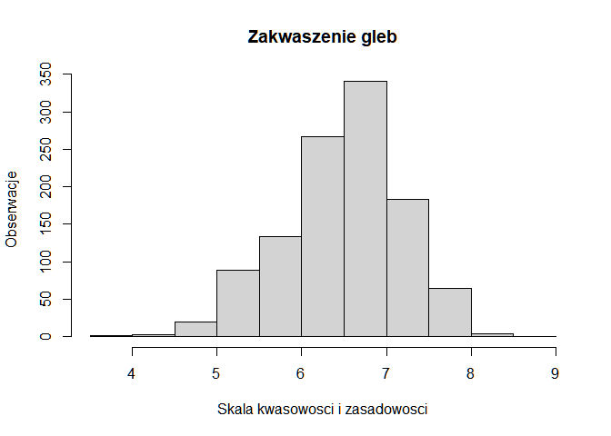

Untitled
================

``` r
library(sp)
```

    ## Warning: package 'sp' was built under R version 4.0.5

``` r
soil<-data.frame(readRDS("gleby.rds"))
class(soil)
```

    ## [1] "data.frame"

``` r
colnames(soil)
```

    ##  [1] "ID"       "Elev"     "pH"       "Zn"       "Cu"       "Pb"      
    ##  [7] "Ni"       "Co"       "Ag"       "Mn"       "Fe"       "Mo"      
    ## [13] "U"        "W"        "Sn"       "Hg"       "As"       "Sb"      
    ## [19] "Ba"       "Cd"       "V"        "Bi"       "Cr"       "LoI"     
    ## [25] "F"        "Au"       "x"        "y"        "optional"

``` r
soil
```

    ##              ID Elev  pH  Zn   Cu  Pb  Ni Co  Ag   Mn    Fe Mo    U  W  Sn
    ## 1     92L881002  240 8.0  94   97   4 162 36 0.1 1100  6.50  1  1.0  1   1
    ## 3     92L881004  265 7.5  75   74   1  55 25 0.1 1100  5.20  1  1.9  1   1
    ## 4     92L881005  265 6.7  76  112   1  50 28 0.1  820  5.80  1  0.4  1   1
    ## 5     92L881006  370 6.8  85  125   1  55 32 0.1  970  6.40  1  0.3  1   1
    ## 6     92L881008  155 7.0  87   59   1  24 24 0.1 1200  6.80  2  0.8  1   1
    ## 7     92L881009  320 8.1  92   46   2  24 20 0.1 1100  6.60  4  4.2  1   1
    ## 8     92L881010  125 7.8  92   60   1  40 22 0.1  900  5.50  3  3.9  1   1
    ## 9     92L881011  125 7.0  86   46   1  28 19 0.1  950  5.40  4  3.0  1   1
    ## 10    92L881012  110 6.9  95   39   1  19 23 0.1  920  6.50  2  1.5  1   1
    ## 11    92L881013   70 6.8 115   50   2  23 21 0.1 1000  5.30  2  1.4  1   1
    ## 12    92L881014  115 8.0  90   48   1  44 19 0.1  940  4.80  2  2.7  1   1
    ## 13    92L881015   75 7.4 106   32   1  18 15 0.1  970  4.80  2  2.2  1   1
    ## 14    92L881016  320 6.9  80  100   1  43 28 0.1  770  5.10  1  0.5  1   1
    ## 15    92L881017  265 5.9  32   17   1   5  8 0.8  240  2.90  1  2.5  1   1
    ## 16    92L881018  260  NA  83  164   1  60 39 0.1  800  4.90  1  0.4  1   1
    ## 17    92L881019  230 5.9  40   26   1   6 10 0.1  370  3.00  2  3.2  1   1
    ## 18    92L881020  525 6.7  98  167   1   7 39 0.1  970  5.80  1  0.4  1   1
    ## 19    92L881022  137 7.2  83  127   1  95 37 0.1  980  6.30  2  0.2  1   1
    ## 20    92L881023  137 6.6  94  113   1  88 36 0.1 1100  6.40  1  0.3  1   1
    ## 21    92L881024  152 6.5  76   87   1  66 30 0.1  920  5.60  1  0.4  1   1
    ## 23    92L881026  140 6.5  70  110   1  57 27 0.1  810  6.00  1  0.3  1   1
    ## 24    92L881028  274 7.3  86   40   1  32 22 0.1 1000  5.50  2  2.2  1   1
    ## 25    92L881029  479 6.6  89   21   1  11 18 0.1 1600  6.00  1  1.0  1   1
    ## 26    92L881030  107 7.3 100   65   1  49 25 0.1 1200  5.90  1  2.4  1   1
    ## 27    92L881031  290 7.1  90   76   1  71 28 0.1 1200  5.50  2  3.1  1   1
    ## 28    92L881032  290 6.7  89   88   1  95 37 0.1  960  6.20  1  0.3  1   1
    ## 29    92L881033  120 6.6  75   96   1  64 30 0.1 1100  6.00  1  0.2  1   1
    ## 30    92L881034  240 6.6  73   82   1  55 36 0.1 1700  6.10  1  0.3  1   1
    ## 31    92L881035  150 7.4  65   33   2  25 18 0.1 1300  6.10  1  1.3  1   1
    ## 32    92L881036   60 7.1 102   40   2  26 26 0.1 1600  5.70  1  1.8  1   1
    ## 33    92L881037   30 7.1  99   75   2  29 26 0.1 1700  6.40  1  0.9  1   1
    ## 34    92L881038   90 7.2  73   22   8   8 12 0.1  500  4.50  1  5.1  1   1
    ## 35    92L881039  240 6.2  55   27   1  29 19 0.1  600  4.40  1  2.0  1   1
    ## 36    92L881040  365 6.9  43    7   1   3  6 0.1  410  2.70  1  3.5  1   1
    ## 37    92L881042   76 7.0 120   43   1  20 20 0.1  910  6.40  1  1.2  1   1
    ## 38    92L881043  152 7.2 104   24   1   7 16 0.1 1700  5.90  1  1.3  1   1
    ## 39    92L881044   61 6.7 120   35   1  20 20 0.1 1000  6.00  1  1.0  1   1
    ## 40    92L881045   61 6.7 130   32   1  15 19 0.1 1500  6.30  1  1.4  1   1
    ## 41    92L881046  259 6.8  46   38   1  28 20 0.1  620 11.60  1  2.5  1   1
    ## 42    92L881047   20 6.5  70   17   4   9 11 0.1  770  4.20  1  1.5  1   1
    ## 43    92L881048   25 5.9 112   26   7  11 21 0.1 1900  5.10  1  1.0  1   1
    ## 44    92L881050   30  NA 160   63   6  95 33 0.1 1700  7.00  1  0.8  1   1
    ## 45    92L881051   40  NA  64   34   1  17 19 0.1  940  5.10  2  1.9  1   1
    ## 46    92L881052   40 6.9 118   36   3  22 19 0.1 5300  5.20  2  0.9  1   1
    ## 47    92L881053   30 7.1 110   40   4  34 22 0.1 1200  4.90  2  1.0  1   1
    ## 48    92L881054   20 7.2 180   30   6   9 13 0.1 3400  4.50  1  1.7  1   1
    ## 49    92L881055  100 6.8 186   52   3  24 24 0.1 2000  6.10  1  0.8  1   1
    ## 51    92L881057   35 7.1 138   39   1  23 27 0.1 1400  7.20  1  0.8  1   1
    ## 52    92L881058   40 6.8  92   38   1  22 21 0.1 1700  5.60  1  1.2  1   1
    ## 53    92L881059   35 6.8 107   42   1  36 24 0.1 1300  6.80  1  0.9  1   1
    ## 54    92L881060   40 6.9  95   37   1  27 23 0.1 1600  6.40  1  0.8  1   1
    ## 55    92L881062  310 7.0 105   29  12  10 10 0.1  660  3.20  1  3.7  1   1
    ## 57    92L881065  290 6.8 102   60   1  32 28 0.1 1100  7.70  1  1.1  1   1
    ## 58    92L881066  315 6.0  34   15   1   4 12 0.1  350  4.40  1  2.0  2   1
    ## 59    92L881067  330 6.5  35    9   1   3  7 0.1  680  2.50  1  5.9  2   1
    ## 60    92L881068   80 6.9  88   23   1  10 18 0.1 1100  6.80  1  1.2  1   1
    ## 61    92L881069   20 6.9  88   35   1  16 22 0.1 1000  7.70  1  1.4  2   1
    ## 62    92L881070   20 7.0  80   51   1  41 23 0.1  820  5.60  1  0.6  2   1
    ## 63    92L881071   15 7.1  92   35   2  11 16 0.1 1200  5.40  1  1.2  1   1
    ## 64    92L881072   25 6.8 140   36   4  17 20 0.1 1400  6.00  1  1.2  1   1
    ## 65    92L881073  170 6.8  61   74   1  42 23 0.1  930  4.70  1  1.2  3   1
    ## 66    92L881074  160 6.7 108   70   1  29 21 0.1 1100  4.60  2  1.4  1   1
    ## 67    92L881075   95 7.3 108   51   3  19 23 0.1 1200  5.90  1  1.2  2   1
    ## 68    92L881076   20 7.3  83   52   1  21 23 0.1 1300  5.80  1  1.0  2   1
    ## 69    92L881077   65 7.6 510   68  18  35 22 0.3 1300  5.60  3  3.2  1   1
    ## 70    92L881078   75 7.6 170   80  18  36 25 2.3 1100  5.40  2  1.8  2   1
    ## 71    92L881079   65 7.3  81   44   1  35 20 0.1  730  6.00  1  0.6  2   1
    ## 72    92L881080   65 7.1  90   47   1  16 19 0.1  940  6.60  2  0.9  1   1
    ## 73    92L881082   60 7.0 110   41   2  21 24 0.1 1700  6.80  1  0.7  2   1
    ## 74    92L881083   85 7.1  79   42   1  31 21 0.1 1200  5.90  1  0.8  3   1
    ## 75    92L881084  300 6.5  70  102   1 161 37 0.1  840  5.50  1  0.3  1   1
    ## 76    92L881085  270 7.7  88  112   1 212 44 0.1 1200  7.20  1  0.5  1   1
    ## 77    92L881086  300 6.4 102   86   1 162 56 0.1 2500  5.60  1  0.3  1   1
    ## 78    92L881087  290 6.0  84  100   1 119 37 0.1  860  5.30  2  0.2  1   1
    ## 79    92L881088   85 6.1  29   28   7   6  6 0.1  200  2.50  1  3.1  1   1
    ## 80    92L881089   75 6.3  46   33  12   8 10 0.1  220  6.00  1  3.2  3   1
    ## 81    92L881091  330 7.0 370   50   1  45 40 0.1 1700  7.20  2  1.2  1   1
    ## 82    92L881092  360 6.9 156   77   2  30 26 0.1 1300  6.20  2  2.0  1   1
    ## 84    92L881094   90 7.0  62  170   1  45 43 0.1  840  6.30  1  1.7  2   1
    ## 85    92L881095   75 6.9 125   48   1  23 19 0.1  700  6.30  2  1.8  4   1
    ## 86    92L881096   25 6.8  75   44   3  24 24 0.1 1500  5.00  1  1.0  5   1
    ## 87    92L881097  120 7.2  94   66   1  24 24 0.1  680  5.40  1  2.1  3   1
    ## 88    92L881098  115 7.6 165   68   6  36 21 0.1  780  5.30  3  2.6  2   1
    ## 89    92L881099   20 7.4  83   44   1  38 20 0.1  780  4.30  1  1.4  2   1
    ## 90    92L881100   15 7.7 300   72   1  35 26 0.1  920  7.20  3  2.4  4   1
    ## 91    92L881102   25 6.8 125   24   1  19 18 0.1 1200  6.40  1  1.2  1   1
    ## 92    92L881103   20 6.6  80   27   1  27 21 0.1  950  5.30  1  1.0  1   1
    ## 93    92L881104   25 6.7  60   38   1  24 23 0.1 1200  4.00  1  1.0  1   1
    ## 94    92L881105   20 6.4  40   11   1   8 11 0.1  950  4.00  1  3.4  1   1
    ## 95    92L881106   30 6.2  34    6   1   5  6 0.1  360  3.70  1  4.6  1   1
    ## 96    92L881107   25 6.7  38   10   1  25 16 0.1  550  3.50  1  1.4  2   1
    ## 97    92L881108  457 6.0 105  132   1  93 43 0.1 1700  7.40  1  0.2  1   1
    ## 98    92L881109  384 6.4  94  136   1  67 33 0.1 1400  7.10  1  0.4  1   1
    ## 99    92L881110  427 7.5  93  102   1  64 32 0.1 1200  7.00  2  5.3  1   1
    ## 100   92L881111  366 7.2  80  118   1  30 30 0.1  970  8.50  4  4.7  1   1
    ## 102   92L881113  351 6.3  85   89   1  58 34 0.1 1200  6.50  1  0.3  1   1
    ## 103   92L881114  329 6.5  82  118   1 124 37 0.1 1000  6.20  1  0.6  1   1
    ## 104   92L881115  335 6.4  92  155   1  67 35 0.1 1100  6.80  1  0.3  1   1
    ## 105   92L881116  213 7.7 132  158   5  95 50 0.1 1300  7.00  2  4.6  1   1
    ## 106   92L881117   76 7.3  48   48   1  84 24 0.1  620  5.40  1  1.5  1   1
    ## 107   92L881119   76 7.0 265   54   6  23 23 0.1 1000  4.80  1  1.8  1   1
    ## 108   92L881120   61 6.7  93   43   1  17 20 0.1  660  4.30  1  1.3  1   1
    ## 109   92L881122   20 6.7  59   46   3  24 29 0.1 1800  4.40  1  0.9  1   1
    ## 110   92L881123   30 5.3  47   26   2  33 21 0.1  690  5.70  1  0.4  1   1
    ## 111   92L881124   20 5.9  50   32   2  26 47 0.1 2500  4.70  1  0.7  1   1
    ## 112   92L881126  110 5.7  72   72   1  51 28 0.1 1000  6.00  1  0.5  1   1
    ## 113   92L881127  110 6.6  46   31   2  22 30 0.1 1500  4.40  1  0.8  1   1
    ## 114   92L881128   20 5.8  34   27   3  14 24 0.1 1100  4.20  1  0.8  1   1
    ## 115   92L881129  110 5.2  50   32   7  25 28 0.1 1500  6.60  1  0.4  1   1
    ## 116   92L881130  110 5.5  39   23   3  20 21 0.1 1000  5.00  1  0.7  1   1
    ## 117   92L881131   20 5.5  25   18   5   7 23 0.1 1200  4.10  1  0.6  1   1
    ## 118   92L881132   25 5.3  41   32   1  18 36 0.1 1900  5.40  1  0.7  1   1
    ## 119   92L881133   20 5.4  57   57   4  29 25 0.1 2100  6.60  1  0.3  1   1
    ## 120   92L881134   20 6.0  50   46   1  27 44 0.1 2500  5.70  1  0.6  1   1
    ## 121   92L881135   25 6.1  42   29   1  16 77 0.1 6000  5.00  1  0.5  1   1
    ## 122   92L881136   20 5.8  66   84   1  35 58 0.1 3400  6.80  1  0.5  1   1
    ## 123   92L881137   20 6.4  60   45   1  33 71 0.1 4500  5.30  1  0.4  1   1
    ## 124   92L881138  210 5.7  62   50   1  34 43 0.1 2300  6.10  1  0.5  1   1
    ## 126   92L881140  275 5.9  58   59   4  33 48 0.1 3300  6.00  1  0.3  1   1
    ## 127   92L881142  230 6.1  50   32   1  34 26 0.1 1200  4.80  1  0.5  1   1
    ## 128   92L881143  275 6.2  46   36   1  26 30 0.1 2000  5.10  1  0.5  1   1
    ## 129   92L881144  275 6.2  66   54   1  37 39 0.1 2300  7.60  2  0.6  1   1
    ## 130   92L881145  360 5.9  30   14  16   7 17 0.1 1400  7.60  1  0.3  1   1
    ## 131   92L881146  150 5.7  42   50   1  26 16 0.1  500  5.10  1  1.0  1   1
    ## 132   92L881147  305 6.2  50   35   1  28 46 0.1 3400  5.70  1  0.6  1   1
    ## 133   92L881148  230 6.2  42   29   1  20 21 0.1 1300  5.70  1  1.0  1   1
    ## 134   92L881149  135 6.4  50   95   1  31 25 0.1 1400  7.60  1  0.9  1   1
    ## 135   92L881150  190 7.5 110   48   1  28 25 0.1 1500  6.50  1  1.2  1   1
    ## 136   92L881152  180 7.7 170   58   1  35 28 0.1 1500  7.20  1  1.4  1   1
    ## 138   92L881154  150 7.3  72   37   1  24 21 0.1 1000  6.80  1  1.1  2   1
    ## 139   92L881155  170 7.2 400   59  42  35 34 0.1 1800  6.10  3  1.0  2   1
    ## 140   92L881156  165 6.8 185   35  54  25 22 0.2 1500  5.20  7  2.0  3   1
    ## 141   92L881157   75 7.8  96   92   1  42 33 0.1  840  6.40  2  1.6  2   1
    ## 142   92L881158  210 7.5 175   81   3  55 29 0.1 1000  5.90  2  1.6  2   1
    ## 143   92L881159   20 7.5  95   90   1  53 31 0.1  740  6.00  4  0.6  1   1
    ## 144   92L881160  150 7.6 142   91   2  43 36 0.1 1000  7.10  1  1.4  3   1
    ## 145   92L881162  150 7.4 140   66   1  48 42 0.1 1300  6.60  1  0.8  1   1
    ## 146   92L881163   50 7.7  91   67   1  41 30 0.1 1200  6.00  1  1.5  1   1
    ## 147   92L881164   15 7.2  46   24   3  11  9 0.1  340  2.90  1  3.8  1   1
    ## 149   92L881166   30 7.2  65   36   4  24 17 0.1  460  4.90  1  1.3  1   1
    ## 150   92L881167   60 7.0  52   30   1   7 16 0.1  520  4.50  1  1.3  1   1
    ## 151   92L881168   20 7.2  58   17  12   6 21 0.1 1400  4.80  1  0.8  1   1
    ## 152   92L881169   25 7.8  82   51   4  14 18 0.1  760  4.10  1  0.4  1   1
    ## 153   92L881170   25 7.6  78  130   1 228 61 0.1 1200  6.40  1  0.2  1   1
    ## 154   92L881171   40 7.7 188   60  80  80 34 1.5 2100  5.80  1  0.2  2 140
    ## 155   92L881172   30 6.7  98   46   2  25 27 0.1  700  8.50  1  0.6  1   1
    ## 156   92L881173   55 7.4  80   55   2  27 23 0.1  780  5.20  1  0.4  1   1
    ## 157   92L881174   20 7.4  61   46   1  19 28 0.1  770 12.20  1  0.8  1   1
    ## 158   92L881175   15 7.2  42   16   1   3 11 0.1  490  6.60  1  1.5  1   1
    ## 159   92L881176   20 7.0  60   21   3  10 15 0.1  760  4.50  1  2.5  1   1
    ## 160   92L881177   20 7.2  78   38   3  35 25 0.1  800  5.30  1  1.1  1   1
    ## 161   92L881178   15 7.1  52   11  15   5 21 0.1 1760  3.10  1  1.1  1   1
    ## 162   92L881179   15 7.0  64   43   2  17 17 0.1  860  5.00  1  0.8  1   1
    ## 163   92L881182   60 7.6  95   41   1  27 23 0.1 1200  6.00  1  1.1  1   1
    ## 164   92L881183   30 6.3 123   39   1  31 26 0.1  580 12.60  2  1.1  1   1
    ## 165   92L881184  210 7.6 398   87   1  52 57 0.1 1200  7.60  2  1.0  1   1
    ## 167   92L881186  190 7.2 110   81   1  25 43 0.1  600 13.40  2  1.3  1   1
    ## 168   92L881187   90 7.3  45   60   1  37 27 0.1  720  4.40  2  1.3  1   1
    ## 169   92L881188  240 7.1 160   75   1  26 27 0.1 1800  7.60  1  1.0  1   1
    ## 170   92L881189  210 7.2 245  112   3  37 72 0.1 1000 10.40  2  1.0  3   1
    ## 171   92L881190   75 6.5  39   44   2  21 45 0.1  860  5.90  2  2.0  1   1
    ## 172   92L881192   20 7.6  78   50   1 132 42 0.1  920  5.30  1  0.6  1   1
    ## 173   92L881193   25 7.3  95   37   2  20 21 0.1 1100  5.60  2  0.7  3   1
    ## 174   92L881194   15 7.6 115   30   3  23 16 0.1  880  4.60  1  1.4  1   1
    ## 175   92L881195   25 6.7  79   27   2  13 10 0.1 1000  4.10  2  1.4  1   1
    ## 176   92L881196   90 6.8  88   40   1  25 32 0.1  890 15.00  1  0.9  1   1
    ## 177   92L881197  360 5.4  52   46   1   7  8 0.1  310  3.50  1  1.6  1   1
    ## 178   92L881198  360 6.4  66   53   1  32 18 0.1  430  3.70  1  0.7  1   1
    ## 179   92L881199  490 5.8  47   39   1   6 12 0.1  370  3.80  5  1.1  1   1
    ## 180   92L881200  490 6.6 175   67  10  26 21 0.1  930  4.60  4  1.2  2   1
    ## 181   92L881202  152 7.4  61   60   1  29 27 0.1  930  5.50  1  0.9  1   1
    ## 183   92L881204  122 6.8 163   36   7  19 20 0.1 1900  5.20  1  1.8  1   1
    ## 184   92L881205   20 7.8 220   80   3  38 34 0.1 1300  6.60  1  1.2  1   1
    ## 185   92L881206   30 7.6 160   48   2  32 24 0.1 1000  5.40  1  1.1  1   1
    ## 186   92L881207   60 7.2  72  116   1  45 45 0.1 1100  6.40  1  0.6  1   1
    ## 187   92L881208   30 7.3  87   22   3   7 14 0.1  800  4.60  1  0.9  1   1
    ## 188   92L881209   20 7.1  95   21   8   4  5 0.1  340  2.20  4  5.9  3   1
    ## 189   92L881210   50 6.2  73   33  43   6 24 0.1 2500  4.00 20  1.4  5   1
    ## 190   92L881211   35 6.7  42   18   6   5 13 0.1  490  3.90  1  0.8  1   1
    ## 191   92L881212   10 7.3  85   34   6  46 18 0.1  650  4.00  1  1.6  1   1
    ## 192   92L881213   60 7.5 153   57  12  35 26 0.1  810  5.80  1  0.5  1   1
    ## 193   92L881214   60 7.3  75   44   1  13 27 0.1  690 10.40  1  0.6  1   1
    ## 194   92L881216   25 7.0  60   38   2   9 16 0.1  520  5.70  1  1.3  1   1
    ## 195   92L881217   10 7.8  63   15   3   6 11 0.1  850  3.20  1  1.9  1   1
    ## 196   92L881218   15 7.3  75   40   5  16 19 0.1  740  4.50  1  1.1  1   1
    ## 197   92L881219   60 7.5  78   70   1  57 32 0.1 1000  5.50  1  0.8  1   1
    ## 198   92L881220  274 7.1 178   45   1  33 23 0.1  850  4.60  1  1.5  1   1
    ## 199   92L881222   40 7.4  96   85   2  41 27 0.1 1000  5.10  2  2.6  1   1
    ## 200   92L881223   40 7.1  98   70   1  32 22 0.1  740  4.70  2  2.0  1   1
    ## 201   92L881224   15 6.7  42   10  11   1 16 0.1 1100  3.30  2  1.9  1   1
    ## 202   92L881225   76 7.2 142   54   5  47 24 0.1 1200  5.90  4  3.0  1   1
    ## 203   92L881226   15 7.5 114   42   3  21 26 0.1  880  5.50  1  1.1  1   1
    ## 204   92L881227   25 7.7 295  112   3  44 31 0.1 1100  5.90  4  2.7  1   1
    ## 205   92L881228   20 7.2  78   94   1  49 34 0.1  890  5.50  2  0.9  1   1
    ## 206   92L881229   25 6.7  62   52   1  36 32 0.1  890  5.30  1  0.6  1   1
    ## 207   92L881230   91 7.3  60   73   1  50 37 0.1  900  5.60  2  1.0  1   1
    ## 209   92L881232   60 7.6  68  130   1  44 35 0.1  920  6.00  2  1.8  1   1
    ## 210   92L881233   50 7.4  46   19   1  11 40 0.1  790  4.40  2  2.2  1   1
    ## 211   92L881234   50 7.6 230  104  12  40 39 0.1 1200  5.60  2  1.8  1   1
    ## 212   92L881235   45 7.4 128   46   2  19 29 0.1  950  7.60  1  1.0  1   1
    ## 213   92L881236   15 7.2 102   37   1  20 21 0.1 1200  6.40  1  1.0  1   1
    ## 214   92L881238   15 7.5  85   77   1  43 25 0.1 1000  6.00  1  0.7  1   1
    ## 215   92L881239   30 6.4  69   78   1  11 16 0.1  750  6.20  1  1.2  1   1
    ## 216   92L881240  105 6.9  42   30   1  16 15 0.1  410  7.10  1  1.4  1   1
    ## 217   92L881242   20 7.1  88   38   1  18 19 0.1 2000  4.60  3  1.3  1   1
    ## 218   92L881243  150 7.7  84   43   1  19 22 0.1 1500  5.50  1  1.1  1   1
    ## 219   92L881244  200 6.8  84   28   5   8 19 0.1 2100  4.10  1  1.2  1   1
    ## 220   92L881245  120 7.4 115   38   1  27 25 0.1 1400  6.40  1  1.2  1   1
    ## 221   92L881246  290 7.1 106   30   1  35 24 0.1 1400  6.80  1  1.1  1   1
    ## 222   92L881247   20 7.2 102   47   1  26 29 0.1 1200  7.80  2  0.9  1   1
    ## 223   92L881248  310 6.8  40   21   1  14 10 0.1  390  4.80  1  1.2  1   1
    ## 224   92L881249  325 6.2  50   24   3   8 12 0.1  710  4.90  1  1.0  1   1
    ## 225   92L881250  325 5.9  50   30   1  15 21 0.1 1200  5.20  2  0.9  1   1
    ## 226   92L881251  277 6.3  44   21   1   9 73 0.1 3500  9.50  3  0.9  1   1
    ## 227   92L881253  213 6.0  46   21   3   4 11 0.1  700  5.10  2  1.5  1   1
    ## 228   92L881254  290 6.3  36   19   1   4 11 0.1  940  5.90  2  1.5  1   1
    ## 229   92L881255  290 6.6  36   12   4   4 15 0.1 2500  6.00  3  1.5  1   1
    ## 230   92L881256   91 5.9  44   54   3  27 41 0.1 3500  6.10  1  0.6  1   1
    ## 231   92L881257   60 6.4  42   34   1   6 14 0.1 1200  6.20  1  1.3  1   1
    ## 232   92L881258   90 6.2  36   16   1   9 11 0.1  750  8.30  1  2.1  1   1
    ## 233   92L881259   95 6.4  45   26   1   4 15 0.1 1200  9.60  1  1.4  1   1
    ## 235   92L881262   24 6.3  50   55   1  24 38 0.1 2600  5.70  1  0.5  1   1
    ## 236   92L881263   15 6.4  52   45   1  23 42 0.1 3500  6.00  1  0.6  1   1
    ## 237   92L881264   15 6.3  51   39   1  32 45 0.1 2900  5.40  1  0.5  1   1
    ## 238   92L881265   20 6.4  51   61   1  30 21 0.1  780  4.50  1  0.7  1   1
    ## 239   92L881266   60 6.6 101   30   1  19 14 0.1 1300  4.40  1  1.2  2   1
    ## 240   92L881267  150 6.8  58   22   1  19 13 0.1  540  6.00  1  1.6  1   1
    ## 241   92L881268  180 7.0  75   30   1  20 17 0.1  620  6.90  1  1.6  1   1
    ## 242   92L881269   30 6.8  76   37   3  35 21 0.1 2300  3.50  1  0.7  1   1
    ## 243   92L881270   30 7.9  50   30   1  25 15 0.1  710  4.00  2  1.5  1   1
    ## 244   92L881271   90 6.6  49   94   1  12 30 0.1 1900  7.50  2  2.8  1   1
    ## 246   92L881273   25 6.8 200   46   8  25 25 0.1 1600  6.80  2  1.6  1   1
    ## 247   92L881274   25 7.0 165   47   3  31 25 0.1 1500  6.20  1  0.8  1   1
    ## 248   92L881275   25 6.9  93   43   1  19 18 0.1 1400  5.20  2  2.0  3   1
    ## 249   92L881276   90 7.0 120   39   6  30 20 0.1 1500  5.50  1  1.0  1   1
    ## 250   92L881277  215 6.5  42   62   1  11 11 0.1  350  3.50  1  1.8 16   1
    ## 251   92L881279  120 7.2 190   81   6  16 25 0.1 1000  5.20  7  1.3  4   1
    ## 252   92L881280  120 6.8 160   47   6  10 23 0.1 1200  5.80  1  0.9  1   1
    ## 253   92L881282  114 6.7  70  100   1  20 17 0.1  540  3.60  2  1.0  4   1
    ## 254   92L881283   20 6.6 100   33   1  20 28 0.1 2100  6.80  2  0.8  1   1
    ## 255   92L881284  244 6.2  77  135   1  68 36 0.1 1500  6.60  2  0.2  1   1
    ## 256   92L881285  122 6.1  43   16   1  12 14 0.1  420  8.80  1  2.4  1   1
    ## 257   92L881286  122 6.2  50   30   1  26 24 0.1  650 10.40  1  1.0  1   1
    ## 258   92L881287  323  NA 103  184   1  62 41 0.1 1200  7.10  1  0.3  1   1
    ## 259   92L881288  323 6.8  85  107   3  45 31 0.1  870  6.40  1  0.4  1   1
    ## 260   92L881289  396 6.4  85  115   1 190 44 0.1 1000  6.50  1  0.2  1   1
    ## 261   92L881290  762 6.2  88  115   1  43 33 0.1 2000  5.70  1  0.2  1   1
    ## 262   92L881291   70 6.5 113   49   1  20 25 0.1 1600  7.40  1  0.7  1   1
    ## 263   92L881292  274 6.7  76  112   1  44 26 0.1  880  6.00  1  0.3  1   1
    ## 264   92L881293  259 7.1  72  116   1  45 25 0.1  900  5.70  1  0.2  1   1
    ## 265   92L881294  366 7.5  73   87   3  35 18 0.1 1900  2.90  1  0.3  1   1
    ## 266   92L881296  227 7.0  97  148   1  61 35 0.1 1100  7.10  1  0.2  1   1
    ## 268   92L881298  320 7.7 116  155   1  54 35 0.1 1500  6.80  1  0.3  1   1
    ## 269   92L881299  330 6.4  61  137   1  45 19 0.1  500  4.50  1  1.0  1   1
    ## 270   92L881300  366 7.3 192  190  45  66 34 0.1 1700  6.70  2  0.3  1   1
    ## 271   92L881302   91 6.7  71   25   1  21 22 0.1  980  6.00  2  1.2  1   1
    ## 272   92L881303   60 6.7 120   93   9  22 36 0.1 1100  7.70  4  0.8  1   1
    ## 273   92L881304   25 7.0 127   35   1  25 19 0.1 1200  4.90  2  0.9  2   1
    ## 274   92L881305   25 7.0  71   38   1  18 17 0.1 1100  4.80  1  1.0  1   1
    ## 275   92L881306  150 7.0  68   35   1  17 18 0.1  600  5.70  1  1.5  2   1
    ## 276   92L881307  215 6.4  79   41   1  14 17 0.1  550  5.60  3  0.9  3   1
    ## 278   92L881309  115 6.0 140   27   1   8 19 0.1 1800  6.70  2  0.9  1   1
    ## 279   92L881310   60 6.5  78   38   2  23 22 0.1 1100  6.00  2  0.7  1   1
    ## 280   92L881311  120 6.4 108   30   1  14 20 0.1 1200  6.30  1  0.9  1   1
    ## 281   92L881312   90 6.1  65   98   1 165 32 0.1  850  6.20  1  0.2  1   1
    ## 282   92L881313  350 6.4  65   92   1 160 32 0.1  830  6.10  1  0.2  1   1
    ## 283   92L881314  350 6.5  68  118   1  60 28 0.1 1200  6.40  1  0.3  1   1
    ## 284   92L881315   15 6.4  56   16   1  17 16 0.1  810  3.60  2  1.8  1   1
    ## 285   92L881316  315 6.4  58   74   1 192 36 0.1  730  4.90  1  0.2  1   1
    ## 286   92L881317  595 6.6  84  125   1  58 28 0.1 1000  6.20  1  0.2  1   1
    ## 287   92L881318  595 6.1  81   80   1  65 35 0.1 1400  6.00  1  0.2  1   1
    ## 288   92L881320  320 6.7  67   85   1 340 48 0.1  780  5.20  1  0.2  1   1
    ## 289   92L881323  457 7.1 354  147  66  82 39 0.6 1900  7.50  1  0.3  1   1
    ## 290   92L881324  488 6.7 175  156   8  68 38 0.2 1500  6.80  1  0.2  1   1
    ## 291   92L881325  518 6.6  98  162   1  56 35 0.1 1400  6.50  1  0.3  1   1
    ## 292   92L881326   NA 6.5  78  104   1  45 25 0.1  640  6.60  1  1.1  1   1
    ## 294   92L881328  366 6.6 100  140   2  65 34 0.1 1100  6.20  2  0.3  1   1
    ## 295   92L881329  427 6.0  72  183   2  45 18 0.1  380  3.90  2  1.2  1   1
    ## 296   92L881330  366 6.8  60   41   1   7 11 0.1  650  3.90  1  4.9  1   1
    ## 297   92L881331  488 6.1  78  170   6  81 27 0.1  550  3.80  1  0.6  1   1
    ## 298   92L881332  335 5.6 125  220  12  47 28 0.1  760  4.20  1  1.0  1   1
    ## 299   92L881333  518 6.5  73  196   1  46 23 0.1  530  3.20  2  0.9  1   1
    ## 300   92L881334  579 6.9  50   22   1   1 12 0.1  540  8.00  1  2.0  1   1
    ## 301   92L881335  488 6.4  47  114   1  42 17 0.1  330  4.90  1  0.8  1   1
    ## 302   92L881336  366 6.4  41   24   1   6  9 0.1  490  7.00  1  1.3  1   1
    ## 303   92L881337  457 6.6  62  138   1  87 28 0.1  580  4.10  1  0.5  1   1
    ## 304   92L881338  411 6.5  68  123   1  67 26 0.1  540  4.90  1  0.6  1   1
    ## 305   92L881339  518 5.1 100  152   1  47 31 0.1 1000  6.40  1  0.3  1   1
    ## 306   92L881340  549 7.5  93  137   1  45 29 0.1 1800  6.00  1  0.4  1   1
    ## 307   92L881342  395 7.1 110   48  10  42 29 0.1 3000  3.80  2  1.0  1   1
    ## 309   92L881344  395 6.7  83  108   5  36 19 0.1  750  3.90  1  1.6  1   1
    ## 310   92L881345  520 7.0 105   72   2  38 20 0.1  910  5.40  2  2.1  1   1
    ## 311   92L881346  520 6.8  96  175   2  60 32 0.1  910  6.50  1  0.3  1   1
    ## 312   92L881347  625 6.9  77  130   1  44 26 0.1 1000  5.40  1  0.5  1   1
    ## 313   92L881348  655 6.2 150  180   7  52 27 0.1 1000  4.90  3  2.2  1   1
    ## 314   92L881349  595 6.1 105  238   1  82 29 0.1  820  5.30  1  0.9  1   1
    ## 315   92L881350  610 6.8  97  176   1  61 35 0.1 1000  6.60  2  0.3  1   1
    ## 316   92L881351  610 7.0  88  141   1  47 29 0.1 1900  5.50  1  0.4  1   1
    ## 317   92L881352  520 6.9 105  154   1  57 33 0.1 1200  7.00  1  0.2  1   1
    ## 318   92L881353  520 6.7  90  160   1  52 34 0.1 1300  6.40  1  0.2  1   1
    ## 319   92L881354  400 6.2  31   47   1  12 11 0.1  340  6.70  1  1.7  1   1
    ## 320   92L881355  460 6.6  34   26   1   6  8 0.1  790  2.40 13  2.4  4   1
    ## 321   92L881356  460 6.1  32   50   1  15  7 0.1  400  2.40 26  2.3  1   1
    ## 322   92L881358  470 6.8  35   60   1   7  6 0.1  370  2.50  4  1.4  3   1
    ## 323   92L881359  460 6.3  35   65   1  30 11 0.1  390  3.60  1  1.2  1   1
    ## 324   92L881360  490 6.1  39   61   1  24 15 0.1  390  5.90  1  0.8  1   1
    ## 325   92L881362  518 7.1  90  124   1  53 28 0.1  850  6.10  2  0.4  1   1
    ## 326   92L881363  579 6.6  88  139   1  44 29 0.1  920  5.90  1  0.3  1   1
    ## 327   92L881364  427 7.1  98  142   1  56 32 0.1 1100  6.60  1  0.2  1   1
    ## 328   92L881365  427 6.6  80  116   1  50 27 0.1  850  6.70  2  0.3  1   1
    ## 329   92L881366  366 7.9 480   96  13  73 24 0.1 3100  4.90  5  4.8  1   1
    ## 330   92L881367  518 6.9  95  149   1  48 21 0.1 1500  6.40  1  0.3  1   1
    ## 331   92L881368  610 6.6  98  152   1  56 31 0.1 1000  6.30  1  0.3  1   1
    ## 332   92L881369  533 6.7  59  180   1  49 21 0.1  550  3.90  2  0.3  1   1
    ## 333   92L881370   NA 7.1  90  118   1  68 29 0.1 1500  6.60  2  0.4  1   1
    ## 335   92L881372  122 3.9  78  115   1  67 27 0.1  840  6.40  1  0.2  1   1
    ## 336   92L881373  122 7.2  86  140   1  87 31 0.1 1300  6.50  2  0.2  1   1
    ## 337   92L881374  310 6.6  83  112   1  74 31 0.1 1000  6.20  2  0.3  1   1
    ## 338   92L881375  310 6.4  82  103   1  66 26 0.1 1000  6.00  2  0.3  1   1
    ## 339   92L881377  290 6.7  68  103   1  61 26 0.1 1300  6.20  1  0.3  1   1
    ## 340   92L881378  305 5.7  60   80   1  36 25 0.1 1200  4.60  2  1.2  1   1
    ## 341   92L881379  213 7.0 110  161   1 126 40 0.1 1500  6.30  1  0.4  1   1
    ## 342   92L881380  183 6.9  85  125   1  67 32 0.1 1000  6.40  1  0.3  1   1
    ## 343   92L881382  425 7.2  60  105   1  58 24 0.1  780  5.10  1  0.6  1   1
    ## 344   92L881383  395 7.7 100  190   4 134 46 0.1 1600  7.00  1  0.4  1   1
    ## 345   92L881384  275 6.5  80  112   1 128 38 0.1 1000  6.00  2  0.3  1   1
    ## 346   92L881385  135 7.6  46   64   1 140 26 0.1  620  5.00  2  0.5  1   1
    ## 347   92L881386  490 7.0  75  100   1  47 27 0.1  850  5.60  2  0.3  1   1
    ## 348   92L881387  425 6.7  58   88   1  61 25 0.1  620  4.90  1  0.3  1   1
    ## 349   92L881388  610 6.0  82  166   3  38 30 0.1 1700  5.60  2  0.3  1   1
    ## 350   92L881389  580 6.8  78   84   1  38 26 0.1  870  5.70  2  0.6  1   1
    ## 352   92L881392  259 6.2  77   86   2 138 38 0.1 1200  5.00  1  0.3  1   1
    ## 353   92L881393  320 6.9  91  128   1  80 35 0.1 1100  6.80  1  0.2  1   1
    ## 354   92L881394  869 6.8  80   96   1  68 31 0.1 1100  5.90  2  0.5  1   1
    ## 355   92L881395  564 6.8  87  100   1  62 32 0.1 1000  6.40  1  0.4  1   1
    ## 356   92L881396  366 7.0  73  120   1  51 31 0.1  890  5.80  2  0.3  1   1
    ## 357   92L881397  457 7.3  55  140   1  47 31 0.1  630  6.20  2  0.5  1   1
    ## 358   92L881398  914 6.4  41  150   1  24 18 0.1  300  4.50  2  0.8  1   1
    ## 359   92L881399  701 6.4  51   98   1  26 21 0.1  570  3.50  2  0.5  1   1
    ## 360   92L881400  716  NA  75  148   1  51 30 0.1  740  4.50  2  0.3  1   1
    ## 361   92L881402  640 6.7  33   42   1  18 13 0.1  300  2.70  1  0.4  1   1
    ## 362   92L881403  549 6.7  35   63   1  22 17 0.1  420  4.00  1  0.8  1   1
    ## 363   92L881404  122 6.7  45  105   1  34 19 0.1  420  4.50  1  0.5  1   1
    ## 364   92L881405  107 6.7  49   98   1  31 21 0.1  580  5.20  1  0.5  1   1
    ## 366   92L881407  137 6.7  40   56   1  20 16 0.1  290 10.60  1  2.0  1   1
    ## 367   92L881408   61 6.9  93  136   1  42 30 0.1 1100  6.20  1  0.3  1   1
    ## 368   92L881409  640 6.4  67  108   7  39 22 0.1  560  3.60  1  0.6  1   1
    ## 369   92L881410   61 6.6  56   65   1  34 24 0.1  880  4.80  1  0.5  1   1
    ## 370   92L881411  640 7.6  64   71   2  33 20 0.1  780  3.30  1  0.7  1   1
    ## 371   92L881412  427 7.0  95   95   1  48 28 0.1 1100  5.00  1  0.8  1   1
    ## 372   92L881413  823 6.8 132  290  11 113 44 0.1  860  4.80  2  0.6 12   1
    ## 373   92L881414  549 7.1  76  182   1  71 28 0.1  700  5.20  2  0.4  1   1
    ## 374   92L881415  579 6.5  82  165   2  46 23 0.1  520  4.50  2  1.2  1   1
    ## 375   92L881416  579 6.8  92  177  10  74 31 0.1  700  4.50  2  1.7  5   1
    ## 376   92L881417  701 6.7  75  405   3  59 30 0.1  720  4.40  1  0.4  1   1
    ## 377   92L881419  610 6.7 104  250   4  47 30 0.1  720  4.90  1  0.4  1   1
    ## 378   92L881420  427 6.3  38   65   1  16 15 0.1  340  6.10  1  1.6  1   1
    ## 379   92L881423  610 6.5  96   94   1  65 26 0.1  920  5.00  1  1.2  1   1
    ## 380   92L883003   40 6.2  35   25   1  15 14 0.1  690  3.50  1  1.3  1   1
    ## 381   92L883004   30  NA  59   18  18   6  4 0.1  500  0.90  1  0.2  1   1
    ## 382   92L883005   30 6.3  58   33   4  24 25 0.1 1100  4.00  1  0.7  1   1
    ## 383   92L883006   30 7.0  64  100   2  40 29 0.1  740  6.10  1  0.7  1   1
    ## 384   92L883007   65 6.0  42   80  15  18 42 0.1 1900  3.80  4  0.7  1   1
    ## 385   92L883008   65 6.1  45   36   5  16 28 0.1 1400  3.50  1  0.9  1   1
    ## 387   92L883010   65 6.1  50   37   7  18 30 0.1 1200  4.40  6  0.9  1   1
    ## 388   92L883011  100 6.5  70  307   8  28 48 0.1 4000 10.00  3  0.8  1   1
    ## 389   92L883012  100 7.4  60   58   2  30 28 0.1 1300  5.90  2  0.8  1   1
    ## 390   92L883013  200 6.0  41   47   1  20 18 0.1  610  5.10  1  0.9  1   1
    ## 391   92L883014  170 6.5  51   48   2  27 27 0.1 1100  4.00  1  0.5  1   1
    ## 392   92L883015  230 6.6  57   59   1  31 21 0.1  600  5.30  2  0.7  1   1
    ## 393   92L883016  270 6.5  72   47   1  33 24 0.1 1400  4.80  1  0.8  1   1
    ## 394   92L883017  303 6.4  64   29   1  21 18 0.1  690  4.20  1  0.7  1   1
    ## 395   92L883018  200 6.2  63   32   1  38 61 0.1 3000  4.30  1  0.5  1   1
    ## 396   92L883019  180 6.7  75   28   1  28 22 0.1  640  6.20  1  1.1  1   1
    ## 397   92L883020  215 6.5  72   27   1   4 21 0.1  500  6.00  1  0.8  1   1
    ## 398   92L883022   50 6.1  40   27   8  20 26 0.1 1400  3.30  1  0.8  1   1
    ## 399   92L883023   10 6.4  42   13   2  19 11 0.1  440  2.30  1  1.9  1   1
    ## 400   92L883025   30 5.7  38   12   3  17 12 0.1  510  2.70  1  1.5  1   1
    ## 401   92L883026  100 5.6  40   30  13  18 50 0.1 4000  4.00  1  1.3  1   1
    ## 402   92L883027   30 6.4  68   47   3  33 26 0.1 2500  4.50  2  0.9  1   1
    ## 404   92L883029   30 6.7  55   27   1  26 21 0.1 1400  4.00  1  0.8  1   1
    ## 405   92L883030  100 6.8 124   76   6  41 55 0.1 6100  5.10  4  1.8  1   1
    ## 406   92L883031   15 6.7  65   20   3  10 13 0.1  610  4.30  1  1.5  1   1
    ## 407   92L883032   30 6.6  60   22   2  14 14 0.1  610  4.80  1  1.6  1   1
    ## 408   92L883033   30 6.5  76   23   3  17 19 0.1 1000  4.50  1  1.5  1   1
    ## 409   92L883034   30 6.6  68   26   2  12 15 0.1  940  5.00  1  1.0  1   1
    ## 410   92L883035   30 6.3  58   16   1  12 11 0.1 1200  3.90  1  1.6  1   1
    ## 411   92L883036   15 6.5  44   31   1  20 13 0.1  520  3.30  1  1.1  1   1
    ## 412   92L883037  215 6.4  58   33   1  36 20 0.1  840  4.50  1  0.7  1   1
    ## 413   92L883038  130 6.7  61   46   1  41 21 0.1  840  5.10  1  0.8  1   1
    ## 414   92L883039  100 6.6  92   52   1  62 42 0.1 3000  5.20  1  0.6  1   1
    ## 415   92L883040   65 6.5  76   23   1  18 18 0.1 1600  4.70  1  1.1  1   1
    ## 416   92L883042  170 6.3  43   20   2   4 12 0.1  700  6.00  1  2.3  1   1
    ## 417   92L883043  270 7.6  45   45  22  22 22 0.1 2400  4.60  1  2.1  1   1
    ## 418   92L883044  130 6.0  39   19   1   1 12 0.1  680  6.20  1  1.5  1   1
    ## 419   92L883045  130 7.3 142   32  12  14 13 0.1 1100  5.10  1  2.4  1   1
    ## 420   92L883046  130 6.8  57   29   1   6 15 0.1 1000  6.70  2  1.7  1   1
    ## 421   92L883047  130 6.9 100   73   6  14 23 0.1 1300  4.90  4  1.7  1   1
    ## 422   92L883049  100 5.9  40   17   2   3 13 0.1  850  4.70  2  1.1  1   1
    ## 424   92L883051  100 6.6  33   15   1   3  9 0.1  830  4.80  1  1.4  1   1
    ## 425   92L883052  100 6.4  46   41   1  14 23 0.1 1000  8.80  1  1.4  1   1
    ## 426   92L883053    5 7.3  82   38   1  38 22 0.1 1800  5.50  1  0.7  1   1
    ## 427   92L883054  230 7.5  96   34  13  17 13 0.1  920  5.20  1  1.9  1   1
    ## 428   92L883055  270 7.4 240   93  28  40 32 0.1 2300  6.00  2  1.4  1   1
    ## 429   92L883056  130 7.4  60   46   1  30 42 0.1  810  6.00  1  1.1  1   1
    ## 430   92L883057  130 6.8  74   27   1  23 22 0.1  950  4.90  1  2.0  1   1
    ## 431   92L883058   10 7.3  95   80   1  37 37 0.1 1200  6.30  1  0.8  1   1
    ## 432   92L883059   20 7.5  90  100   1  45 35 0.1 1000  6.60  2  1.5  1   1
    ## 433   92L883060   10 7.7 204  157   2  53 37 0.1 1100  7.60  4  2.6  1   1
    ## 434   92L883063  130 7.6  75   29   3  20 13 0.1  780  4.90  1  2.4  1   1
    ## 435   92L883064  160 7.4  78   32   2  18 16 0.1  960  5.00  1  1.3  1   1
    ## 436   92L883065  200 7.2  70   25   2  20 17 0.1 1000  4.50  1  1.4  1   1
    ## 437   92L883066  150 7.4  66   33   2  25 17 0.1  840  5.00  1  1.9  1   1
    ## 438   92L883067  100 7.1  70   38   2  34 19 0.1  920  5.00  1  1.6  1   1
    ## 439   92L883068   30 7.2  79   94   1 120 36 0.1  930  6.40  1  0.9  2   1
    ## 440   92L883069  230 7.3 242   38   4  47 22 0.6 3600  5.00  5  3.9  1   1
    ## 442   92L883071  220 6.9 110   29   4  18 20 0.1 1300  6.30  1  1.2  1   1
    ## 443   92L883072  220 6.9 110   42   8  13 21 0.1  950  8.30  1  0.9  1   1
    ## 444   92L883073  330 6.5 100   60  16  23 24 0.4  820 11.60  3  1.1  1   1
    ## 445   92L883074  220 6.8 140   48   9  15 24 0.3  930 12.00  2  1.1  1   1
    ## 446   92L883075  220 6.8  88   48  11  20 17 0.1  750  6.80  2  1.5  1   1
    ## 447   92L883076  300 6.2  90   57  18  31 28 0.1  600  9.40  5  1.4  1   1
    ## 448   92L883077  260 4.4  94   67  21  12  9 0.1  530  6.70 10  1.2  1   1
    ## 449   92L883078  260 6.8 158   44  18  37 22 0.1  920  5.50  4  3.0  1   1
    ## 450   92L883079  250 6.3 119   44  22  24 18 0.1  870  9.60  2  2.0  1   1
    ## 451   92L883080  250 6.7 124   24  13  17 11 0.1  770  4.40  3  2.2  1   1
    ## 452   92L883082   60 7.1 240   41  13  32 19 0.1 1500  4.70  1  1.1  1   1
    ## 453   92L883083   50 7.1 230   62   7  41 24 0.1 1600  5.80  1  0.8  1   1
    ## 454   92L883084  100 7.1  91   69   3  56 45 0.1 6000  5.40  1  0.6  1   1
    ## 455   92L883085   NA 7.1  61   57   1  44 22 0.1 1000  5.70  1  0.5  1   1
    ## 456   92L883086   80 6.7  78   63   1  44 28 0.1 2300  6.10  1  0.7  1   1
    ## 457   92L883088  700 6.1  71   85   4  31 31 0.1 1200  4.40  1  1.0  1   1
    ## 458   92L883089  200 7.1  69   65   1  70 31 0.1 1700  5.60  1  0.6  1   1
    ## 459   92L883090    5 8.7 142   31   6  40 26 0.1 1400  5.40  1  0.8  1   1
    ## 460   92L883091  100 7.1  66   82   1  56 26 0.1  830  5.80  1  0.6  1   1
    ## 461   92L883092  100 7.4 104  100   4  43 24 0.1 2900  5.00  1  2.0  1   1
    ## 462   92L883093   20 7.3 130   46   9  30 23 0.1 1100  5.90  1  0.6  1   1
    ## 464   92L883095  100 7.2  73   32   2  22 17 0.1  970  7.40  1  1.2  1   1
    ## 465   92L883096   10 6.6  86   19   4  21 17 0.1 1200  4.00  1  1.2  1   1
    ## 466   92L883097   15 6.6  78   19   3  13 18 0.1 2200  4.10  1  1.3  1   1
    ## 467   92L883098    5 6.0  60   17   2   9 16 0.1 1500  5.00  1  1.9  1   1
    ## 468   92L883099    5 6.9  56   21   3  14 12 0.1  700  3.80  1  1.4  1   1
    ## 469   92L883100    5 7.0  50   17   3   9  9 0.1  530  3.40  2  1.3  1   1
    ## 470   92L883102  260 6.6 118   69  52  33 41 0.1 2900  5.70  1  0.8  1   1
    ## 471   92L883103  100 5.7  28   37   5   8  5 0.1  170  5.10  1  1.2  1   1
    ## 472   92L883104   60 5.9  53   33   4  25 24 0.1 1000  4.40  1  0.8  1   1
    ## 473   92L883105  100 6.0  49   46   6  27 23 0.1  980  5.00  1  0.6  1   1
    ## 474   92L883106   NA 6.1  45   32   9  13 22 0.1 2000  3.60  1  9.0  1   1
    ## 475   92L883107   NA 5.3   1    1   1   1  1 0.1    2  0.01  1  0.2  1   1
    ## 476   92L883108  300 5.6  39   53   1  22 20 0.1  780  7.00  1  1.1  1   1
    ## 477   92L883109  300 5.5  59   34   5  42 46 0.1 2000  6.80  1  0.3  1   1
    ## 478   92L883111  270 5.5  58   43   3  33 40 0.1 2600  7.20  2  0.4  1   1
    ## 479   92L883112  270 5.5  62   59   5  34 31 0.1 1500  7.00  1  0.3  1   1
    ## 481   92L883114  270 5.5  43   41   1  16 42 0.1  840  6.00  1  0.7  1   1
    ## 482   92L883115  270 5.8  28   23   2  13 10 0.1  340  4.40  1  1.0  1   1
    ## 483   92L883116  300 6.3  17   10   5   5  4 0.1  260  3.30  1  0.5  1   1
    ## 484   92L883117  350 7.1  80   41   4  26 18 0.1 1400  4.40  3  1.7  1   1
    ## 485   92L883118  200 6.8 125   39   6  20 25 0.1 1300  7.60  1  0.7  1   1
    ## 486   92L883119  170 7.0 145   57   7  22 30 0.1 1700  5.80  3  1.0  1   1
    ## 487   92L883120  100  NA  86   33   6  19 19 0.1 1900  5.10  2  0.8  1   1
    ## 488   92L883122  100 7.4  75   52   1  20 23 0.1 1300  6.80  1  0.8  1   1
    ## 489   92L883123  100 7.1  78   39   1  22 25 0.1 1100  6.10  2  2.0  1   1
    ## 491   92L883125  100 7.6  54  118   2  34 21 0.1 1000  6.00  1  2.0  1   1
    ## 492   92L883126  130 6.2  24    8   4   3 35 0.1 1600  2.50  1  1.1  1   1
    ## 493   92L883127  100 7.3  82   38   1  24 23 0.1 1200  5.20  1  1.3  1   1
    ## 494   92L883128  100 7.1  76   32   1  26 22 0.1  970  6.20  1  1.1  1   1
    ## 495   92L883129  100 7.0  86   44   1  41 22 0.1 1100  6.20  1  0.7  1   1
    ## 496   92L883130   60 6.4  86   18   3  22 27 0.1 1600  4.40  1  1.0  1   1
    ## 497   92L883131   60 6.8  75   33   2  28 18 0.1 1300  5.20  1  1.0  1   1
    ## 498   92L883132  230 6.7  50   21   3  15 19 0.1  620  3.80  1  1.4  1   1
    ## 499   92L883134  230 5.6  40   19   3  22 12 0.1  500  4.00  1  1.7  1   1
    ## 500   92L883135  200 5.8  30   13   1  10 11 0.1  470  5.20  2  1.5  1   1
    ## 501   92L883136   15 4.2  68   25   5   9  8 0.1  570  6.80  4  1.5  1   1
    ## 502   92L883137   60 6.1  40   20   3  15  9 0.1  620  4.80  2  1.2  1   1
    ## 503   92L883138  100 6.7 212   40  17  27 15 0.1 3600  4.10  4  1.7  1   1
    ## 504   92L883139  100 6.3  52   43   1  22 23 0.1 1100  3.40  1  0.6  1   1
    ## 505   92L883140    5 6.7 145   21   8  13 23 0.1 1900  4.90  2  1.4  1   1
    ## 506   92L883142    5 7.2  55   23   1  14 11 0.1  580  4.70  1  1.3  1   1
    ## 507   92L883143   15  NA  60   24   3  12 10 0.1  580  5.00  1  1.4  1   1
    ## 508   92L883144    5  NA 103   61   1  13 27 0.1 1300  8.00  1  0.6  1   1
    ## 509   92L883145    5 6.3 110   28   3  26 36 0.1 4100  3.10  2  5.4  1   1
    ## 510   92L883146    5 7.0 303 2950   3  28 23 7.9  830  7.80  2  1.9  2   1
    ## 512   92L883148    5 7.6  19    9   1   3  3 0.1  140  3.20  1  1.1  1   1
    ## 513   92L883150   10 8.0  40   22   1  16  9 0.1  830  2.60  2  1.8  1   1
    ## 514   92L883151   10 7.9  56   21   1  19 15 0.1  610  4.40  1  2.2  1   1
    ## 515   92L883152    5 7.3 192   41   7  26 25 0.2 1300  7.00  1  1.1  1   1
    ## 516   92L883153    5 7.2  93   44   1  22 24 0.1 1200  6.90  1  1.0  1   1
    ## 517   92L883154    5 7.3  90   44   1  20 27 0.1 1900  6.80  1  0.7  1   1
    ## 518   92L883155    5 8.0  59   34   1  34 25 0.1  740  6.80  2  2.4  1   1
    ## 519   92L883156   10 7.7  72   30   1  23 17 0.1  830  5.20  1  2.3  1   1
    ## 520   92L883157    5 7.2  68   68   1  41 24 0.1 1900  5.90  1  0.6  1   1
    ## 521   92L883158    7 7.5  55   49   1  70 21 0.1  920  5.80  1  1.5  1   1
    ## 522   92L883159  110 7.8   1    1   1   1  1 0.1    5  0.01  1  1.7  1   1
    ## 523   92L883160  110  NA 112   55   1  17 28 0.1 1800  8.00  1  0.6  1   1
    ## 524   92L883162  150 7.3 102   36   1  32 31 0.1 1400  7.40  1  0.8  1   1
    ## 525   92L883163  230 6.9  87   24   1  24 25 0.1 1200  7.00  1  1.0  1   1
    ## 526   92L883164  250 6.6  66   29   1  13 18 0.1  780  5.70  1  1.6  1   1
    ## 527   92L883165  270 7.0  80   29   1  14 27 0.1 1400 10.00  1  1.2  1   1
    ## 529   92L883167  180 7.0  83   33   1  35 22 0.1  780  5.40  1  0.7  1   1
    ## 530   92L883168  180 7.0  91   53   1  26 23 0.1  760  5.50  3  1.0  1   1
    ## 531   92L883169  130 7.1 106   30   1  13 22 0.1 1800  6.00  2  0.7  1   1
    ## 532   92L883170  270 7.0 132   35   1  15 23 0.1 1300  6.60  1  0.9  1   1
    ## 533   92L883171  270 7.1 100   44   1   6 21 0.1 1100  6.70  2  0.7  1   1
    ## 534   92L883172  230  NA 152   33   2  14 21 0.1 1500  7.00  4  2.7  1   1
    ## 535   92L883173  230 7.5  85   30   1  15 17 0.1 1300  6.00  3  1.5  1   1
    ## 536   92L883175  230 7.1  96   25   1   6 14 0.1 1800  6.50  1  0.9  1   1
    ## 537   92L883176  100 7.4 110   13  16   6  6 0.2  560  3.60  1  2.3  1   1
    ## 538   92L883177  270 6.9  85   11   3  11 10 0.1  630  3.50  1  1.5  1   1
    ## 539   92L883178  170 7.3  90   30   1  10 16 0.1  950  7.80  1  1.6  1   1
    ## 540   92L883179  620 6.6  86  125   1  53 41 0.1 1800  6.10  1  0.3  1   1
    ## 541   92L883180  130  NA  88   42   1  10 19 0.1 1200  7.20  2  2.5  1   1
    ## 542   92L883182   30 7.2 135   27   4  17 25 0.1 1700  5.90  1  1.1  1   1
    ## 543   92L883183   30 7.5  78   29   1  15 24 0.1 1400  7.00  2  1.3  1   1
    ## 544   92L883184  130 7.4  75   36   1  17 25 0.1 1800  5.50  2  1.3  1   1
    ## 545   92L883185  130 7.3  81   45   1  36 27 0.1 1100  6.50  1  1.2  1   1
    ## 546   92L883186  100 7.6 135   42   1  31 26 0.1 1400  6.50  1  1.3  1   1
    ## 547   92L883187  100 7.4 105   38   1  22 23 0.1 1700  5.40  1  1.4  1   1
    ## 548   92L883188  100 7.7  84   47   1  20 32 0.1 1500  9.00  2  0.7  1   1
    ## 550   92L883190   30 7.7   1    1   1   1  1 0.1    2  0.01  1  0.4  1   1
    ## 551   92L883191   30 7.8 112   34  24  35 21 0.1 1200  5.80  5  3.9  1   1
    ## 552   92L883192  100 7.3  84   28   4  18 16 0.1  870  5.40  2  2.2  1   1
    ## 553   92L883193  230 7.6  73   34   1  48 25 0.1 1300  5.10  4  4.4  1   1
    ## 554   92L883194  200  NA  94   25   3  24 16 0.1  870  4.40  1  2.4  1   1
    ## 555   92L883196  130 7.9  82   86   2  55 27 0.1 1700  6.20  1  7.9  1   1
    ## 556   92L883197  230 7.4  61   10   1  12 10 0.1  780  3.50  1  1.9  1   1
    ## 557   92L883198  200 7.7  79   46   1  37 23 0.1 2300  5.20  1  3.0  1   1
    ## 558   92L883199  100 6.4  33   25   1  36 18 0.1  640  3.00  1  0.5  1   1
    ## 559   92L883200  160 6.8  60   71   1 116 40 0.1 1200  5.20  1  0.3  1   1
    ## 560   92L883202  600 6.0  84   71   1  68 30 0.1 1300  5.70  3  0.3  1   1
    ## 561   92L883203  480 6.9 110   26   1   5 15 0.1 1100  6.00  1  1.3  1   1
    ## 562   92L883204  480 6.5  82   30   1   4 21 0.1  520 10.60  2  1.1  1   1
    ## 563   92L883205  300 7.2  82  386   1  14 32 0.2  800 14.40  3  2.7  1   1
    ## 564   92L883206  230 7.8 138 1050   1   7 46 2.1  950 24.00  3  3.3  1   1
    ## 565   92L883208  200 7.4 258   42   6  16 18 0.1 1200  6.90  2  3.0  1   1
    ## 566   92L883209  200 7.0  97   40   2  13 20 0.1 1100  6.00  2  1.3  1   1
    ## 567   92L883210  190 7.5 185   43   3  17 18 0.1 1100  6.80  4  3.0  1   1
    ## 568   92L883211  250 6.7 145   39   4   6 19 0.1 1300  6.30  2  0.9  1   1
    ## 570   92L883213  230 7.4 100   82   1  27 17 0.1  820  6.30  3  3.5  1   1
    ## 571   92L883214  570 6.3 105  114   1 140 48 0.1 2000  6.50  2  0.3  1   1
    ## 572   92L883215  600 6.2  74  103   1 100 33 0.1 1200  6.00  2  0.3  1   1
    ## 573   92L883216  400 6.2  72  104   1  68 27 0.1  800  6.30  2  0.2  1   1
    ## 574   92L883217  370 6.7 110  120   1  98 40 0.1 1500  6.90  2  0.6  1   1
    ## 575   92L883218  230 6.3  88  148   1  52 38 0.1 1800  6.80  2  0.4  1   1
    ## 576   92L883219  220 6.5  55  105   1  92 27 0.1  760  6.00  1  0.3  1   1
    ## 577   92L883220  400 7.0  62   93   1  38 20 0.1 2300  2.90  1  0.9  1   1
    ## 578   92L883222  130 7.0  63  122   1  40 26 0.1 1200  4.80  1  1.3  1   1
    ## 579   92L883223  100 6.6  50   86   1  36 20 0.1  650  4.30  2  0.5  1   1
    ## 580   92L883224   60 6.6  60  122   1  38 29 0.1 1200  4.00  2  0.4  1   1
    ## 581   92L883225  100 6.6  50   55   1  33 20 0.1  900  4.30  1  0.4  1   1
    ## 582   92L883227  100 7.2  50   52   1  27 20 0.1  560  5.40  1  0.7  1   1
    ## 583   92L883228  330 7.3  60   30   4   7 11 0.1  830  3.40  2  1.2  1   1
    ## 584   92L883229  300 7.2 118   43   1  24 25 0.1 1600  5.70  2  1.7  1   1
    ## 585   92L883230  130 7.1 162   40   4  29 25 0.1 1100  7.40  4  1.2  1   1
    ## 587   92L883232  200 6.3  67   34   1  26 31 0.1 1000  8.50  2  1.4  1   1
    ## 588   92L883233  160 6.5  56  102   1 162 35 0.1  600  4.80  1  0.2  1   1
    ## 589   92L883234   60 6.7  42   12   1  13 15 0.1  760  3.30  2  1.4  1   1
    ## 590   92L883235   30 7.4 112   57   4  43 23 0.1 1000  5.20  2  0.9  1   1
    ## 591   92L883236   30 7.4 117   43   2  26 17 0.1  600  5.40  2  1.5  1   1
    ## 592   92L883237   60 6.7  87   34   3  12 18 0.1 2100  4.40  1  1.0  3   1
    ## 593   92L883238   10 7.1  68   19   1  14 11 0.1  660  3.70  1  1.5  1   1
    ## 594   92L883239  160 7.0 114   32   8  12 17 0.2 2800  4.20  2  1.3  1   1
    ## 595   92L883240  200 7.1 122   54   1  18 23 0.1 1500  6.50  2  1.4  1   1
    ## 596   92L883242  270 6.6  65  103   1  54 26 0.1  740  6.90  2  0.3  1   1
    ## 597   92L883243  250 7.3  82  123   1  65 30 0.1 1100  5.60  2  0.4  1   1
    ## 598   92L883244  330 6.4  80   85   1 110 39 0.1 1100  5.50  1  0.2  1   1
    ## 599   92L883245  260 7.1  49   37   2  43 19 0.1  600  4.00  2  0.3  1   1
    ## 600   92L883246  270 6.6  85   90   1 100 34 0.1 1000  5.30  2  0.5  1   1
    ## 602   92L883248  280 6.4  68   60   1  41 32 0.1 1700  5.00  2  0.6  1   1
    ## 603   92L883250  280 6.8  65   68   1  54 24 0.1  770  5.00  1  0.6  1   1
    ## 604   92L883251  470 6.9  63   97   1 128 32 0.1  780  4.80  2  0.2  1   1
    ## 605   92L883252  470 6.9  62   83   1 150 35 0.1 1000  4.60  2  0.2  1   1
    ## 606   92L883253  260 6.2  60  116   1 108 33 0.1  780  4.60  2  0.2  1   1
    ## 607   92L883254  580 6.3  60   53   1  63 22 0.1  680  4.10  1  0.6  1   1
    ## 608   92L883255  580 6.0  55   44   1  38 22 0.1  590  4.20  2  0.6  1   1
    ## 609   92L883256  370 6.6  45   32   1  28 16 0.1  690  3.60  2  1.4  1   1
    ## 610   92L883257  300 6.4  48   29   1  34 17 0.1  670  3.80  2  2.5  1   1
    ## 611   92L883258  330 6.3  65   21   8   6 11 0.1 1000  7.20  1  1.6  1   1
    ## 612   92L883259  330 5.6  35   14   1   2 10 0.1  450  8.00  1  1.9  1   1
    ## 613   92L883260  270 6.8  83  129   1  51 30 0.1 1100  6.20  2  0.4  1   1
    ## 614   92L883262   15 7.2 230   34   9  23 18 0.1 2100  5.10  1  1.2  1   1
    ## 615   92L883263    5 7.1 152   39   3  34 18 0.1 1200  4.90  2  1.2  1   1
    ## 617   92L883265  200 7.4 102   41   1  28 20 0.1  880  5.20  2  1.1  2   1
    ## 618   92L883266  200 7.4 135   43   3  55 23 0.1  920  5.10  1  1.2  1   1
    ## 619   92L883267  100 7.3  87   44   1  16 15 0.1 1000  3.70  3  1.4  1   1
    ## 620   92L883268  160 6.4  50  155   1  40 28 0.1  560  5.20  1  0.4  1   1
    ## 621   92L883269  160 6.6  70  118   2  39 27 0.1 1200  5.00  2  0.6  1   1
    ## 622   92L883270  250 7.2 100   50   1  35 25 0.1 1300  6.00  1  0.5  1   1
    ## 623   92L883271  300 7.8 120   42   1  25 23 0.1 1700  5.50  3  1.0  1   1
    ## 624   92L883272  225 7.4 135   48   1  33 26 0.1 1500  6.00  1  1.2  1   1
    ## 625   92L883273  200 7.1  90   26   1  17 15 0.1 1100  5.30  2  1.6  1   1
    ## 626   92L883274  100 7.1 135   20   1   8 11 0.1 1300  6.60  2  2.0  1   1
    ## 627   92L883275  180 6.4  33   19   1   8 14 0.1  670  3.60  2  1.6  1   1
    ## 628   92L883276   10 6.5  43   22   6  22 13 0.1  620  2.40  1  0.7  1   1
    ## 629   92L883277   30 7.2  62  164   1  17 19 0.1  670  6.40  1  2.5  1   1
    ## 630   92L883279    5 7.3  40   32   1  23 13 0.1  420  3.60  1  1.0  1   1
    ## 631   92L883280  300 6.6  37   21   1   6  9 0.1  340  4.40  1  2.5  1   1
    ## 632   92L883282    5 6.0  50   23   1  15 18 0.1  860  4.40  2  1.2  1   1
    ## 633   92L883283    5 6.2  55   29   1  18 14 0.1  650  4.00  2  1.7  1   1
    ## 634   92L883284    5 7.2 105   35   1  23 19 0.1 1500  5.00  2  1.9  1   1
    ## 636   92L883286   60 7.3 126   21   1  13 17 0.1 1100  8.00  2  1.2  1   1
    ## 637   92L883287   60 6.0  48   29   2   6  8 0.1  470  6.30  3  1.5  1   1
    ## 638   92L883288   10 6.8  77   39   2  25 16 0.1 1200  4.90  2  2.7  1   1
    ## 639   92L883289    5 7.4 103   61   1  55 22 0.1 1400  5.00  2  2.7  1   1
    ## 640   92L883290    5 7.0  88  138   1 148 42 0.1 1800  6.00  1  0.4  1   1
    ## 641   92L883292    5 7.6  64   33   1  30 15 0.1  690  3.70  1  3.5  1   1
    ## 642   92L883293   10 3.9  76   33   3  11 17 0.1  560  8.80  3  1.7  1   1
    ## 643   92L883294    5 7.4  75   27   1  22 12 0.1  610  3.60  1  2.2  1   1
    ## 644   92L883295    5 7.2  77   34   1  20 16 0.1  860  4.80  1  1.6  1   1
    ## 645   92L883296   NA 7.2  71   28   1  18 14 0.1  590  5.00  1  1.8  1   1
    ## 646   92L883297    5 8.1  73   36   1  26 17 0.1  760  4.40  1  2.6  1   1
    ## 647   92L883298    5  NA  38   22   6   7 18 0.1 2400  2.70  1  0.6  1   1
    ## 648   92L883299  130 6.5  60   61   1  97 56 0.1 1700  4.50  1  0.6  1   1
    ## 649   92L883300  100 7.2  85   40   2  13 19 0.1 1200  4.80  2  3.5  1   1
    ## 650   92L883302  100 6.9 167   77   8  39 17 0.1 1100  5.40  1  2.0  1   1
    ## 651   92L883303  100 6.6  58   50  12  30 14 0.1  550  2.80  1  1.6  1   1
    ## 652   92L883304   60 6.7 185   38  10  10  9 0.1  820  3.10  1  2.3  1   1
    ## 653   92L883305   30 7.1  82   60   4  46 20 0.1  820  3.80  1  3.6  1   1
    ## 654   92L883306   60 7.7  67   80   1  95 29 0.1  750  8.10  1  1.4  1   1
    ## 655   92L883307  200 7.8  70   46   4  55 22 0.1  690  4.40  2  1.5  1   1
    ## 656   92L883308  260 6.9  50   38   1  28 14 0.1 1000  3.50  2  4.0  1   1
    ## 657   92L883310  360 6.1  84  116   1  66 32 0.1 1000  6.30  1  0.6  1   1
    ## 658   92L883311  300 6.3  86  125   1  87 34 0.1 1100  6.50  2  0.7  1   1
    ## 660   92L883313  300 7.1 146   75   7  18 15 0.1  790  6.40  2  2.8  1   1
    ## 661   92L883314  100 6.7  31   25   1   7  8 0.1  400  2.70  1  2.2  1   1
    ## 662   92L883315  100 6.6  32   22   1   6  9 0.1  600  2.60  1  3.3  1   1
    ## 663   92L883316  130 6.3  46   36   1  13 20 0.1  910  2.70  9  3.9  1   1
    ## 664   92L883317   NA  NA  60  113   6  27 26 0.1  950  5.90  1  1.3  1   1
    ## 665   92L883318  430 7.0  63   72   1  31 18 0.1  650  4.70  1  1.1  1   1
    ## 666   92L883319  430 6.0  48   83   1  28 24 0.1  620  4.80  1  1.1  1   1
    ## 667   92L883320  660 6.2  38   69   1  16 16 0.1  390  4.60  1  1.0  1   1
    ## 668   92L883322  560 6.4  53   80   1  27 22 0.1 1100  3.90  1  0.5  1   1
    ## 669   92L883323  560 6.1  53   89   1  33 24 0.1  730  4.30  1  0.5  1   1
    ## 670   92L883324  560 6.1  58   85   1  35 25 0.1  650  4.60  1  0.8  1   1
    ## 671   92L883325  600 6.4  50   58   2  12 18 0.1  620  4.40  1  2.3  1   1
    ## 672   92L883326  330 6.3  37   36   1  10 11 0.1  460  4.10  1  2.4  1   1
    ## 674   92L883328  330 7.6 175   54   1  92 26 0.1 1100  5.30  3  3.5  1   1
    ## 675   92L883329  260 6.2  64   54   1  31 30 0.1 1700  5.30  1  0.5  1   1
    ## 676   92L883331  330 6.7  89  142   1  47 35 0.1 1000  6.20  1  0.9  1   1
    ## 677   92L883332  400 6.8  57   17   2   7 18 0.1  920  2.50  1  3.1  1   1
    ## 678   92L883333  500 6.6  35   26   4   9 11 0.1  610  2.80  1  9.0  1   1
    ## 679   92L883334  500 6.8  48  138   2  26 18 0.1  470  3.50  1  2.6  1   1
    ## 680   92L883335  600 6.7  82  200   3  70 28 0.1  970  5.50  1  0.4  1   1
    ## 681   92L883336  600 6.6  64  169   1  68 26 0.1  840  4.70  1  0.4  1   1
    ## 682   92L883337  600 6.4  50  100   1  28 17 0.1  600  3.90  1  0.7  1   1
    ## 683   92L883338  330 6.8  30   10   3   3  6 0.1  640  1.90  1  1.8  1   1
    ## 684   92L883339  330  NA  38   21   2   6  7 0.1  420  3.00  1  1.9  1   1
    ## 685   92L883340  330 6.7  60   88   1  20 15 0.1  550  5.80  1  0.9  1   1
    ## 686   92L883343  400  NA  60  315   3  88 39 0.1  650  4.10  1  0.9  1   1
    ## 687   92L883344  450 6.3  47   38   1   7 12 0.1  480  6.40  1  1.9  1   1
    ## 689   92L883346  430 6.3  40   29   1   5 12 0.1  670  6.00  1  1.6  1   1
    ## 690   92L883347  330 6.7  34   16   1   3 11 0.1  740  3.60  3  1.8  1   1
    ## 691   92L883348  330 6.2  30   13   2   2 11 0.1  820  3.90  3  1.5  1   1
    ## 692   92L883349  400 6.4  36   26   1   5 12 0.1  420  9.50  1  1.8  1   1
    ## 693   92L883350  430 6.4  44   28   1   4 14 0.1  700  7.40  1  2.8  1   1
    ## 694   92L883351  360 6.4  34    9   3   2 14 0.1 1400  2.90  1  2.2  1   1
    ## 695   92L883352  330 6.2  38   13   1   2  7 0.1  400  6.70  1  1.8  1   1
    ## 696   92L883353  430 6.9  73   13   3   8 67 0.1 9700  4.00  8  4.3  1   1
    ## 697   92L883354  440 5.9  30   13   1   1 10 0.1  390  7.90  1  3.0  1   1
    ## 698   92L883355  430 6.2  28   11   2   2  7 0.1  520  4.40  1  4.3  1   1
    ## 699   92L883356  400 6.5  34   27   1   6 10 0.1  480  5.20  1  2.0  1   1
    ## 700   92L883357  400 6.4  33   20   1   5 10 0.1  550  6.30  1  2.8  1   1
    ## 701   92L883358  380 7.7 123   48   3  40 16 0.1  770  4.30  1  2.8  1   1
    ## 702   92L883359  500 6.8 100   55   2 147 22 0.1  780  3.50  1  2.9  1   1
    ## 703   92L883360  400 7.2 210   52  11  26 16 0.1 1200  3.60  1  2.4  1   1
    ## 704   92L883362  330 8.2  40   49   1  35 15 0.1 1300  3.40  2  1.6  1   1
    ## 705   92L883363  400 7.0  61   98   2  37 22 0.1 1200  4.70  1  0.6  1   1
    ## 706   92L883364  400 7.0  34   49   1  20 14 0.1  470  4.30  1  0.7  1   1
    ## 707   92L883365  390 6.2  78  110   1  43 32 0.1 1500  6.50  1  0.7  1   1
    ## 708   92L883366  560 8.5  48   88   1  29 21 0.1  800  4.10  2  0.4  1   1
    ## 709   92L883367  450 6.6  64  110   1  51 30 0.1 1000  5.20  1  0.5  1   1
    ## 710   92L883368  480 6.3  71   76   1  28 36 0.1 2500  5.30  1  0.8  1   1
    ## 711   92L883370  500 6.2  74  104   1  38 26 0.1 1000  6.00  1  0.7  1   1
    ## 712   92L883371  490 6.1  48   66   1  31 22 0.1  800  5.30  1  0.5  1   1
    ## 714   92L883373  570 6.2  42   25   2   5 10 0.1  600  3.60  1  4.4  1   1
    ## 715   92L883374  300 6.7  41   28   1   4 11 0.1  500  8.00  2  5.7  1   1
    ## 716   92L883375  600 6.7  74  114   1  40 28 0.1  890  6.20  1  0.2  1   1
    ## 717   92L883376  600 7.2  82  128   1  44 30 0.1 1000  7.20  1  0.3  1   1
    ## 718   92L883377  430 6.7  71   91   1  43 26 0.1  830  6.40  1  0.4  1   1
    ## 719   92L883378  480 6.7  53  104   1  29 26 0.1  930  4.50  1  0.7  1   1
    ## 720   92L883379  330 7.2  88  117   1  44 30 0.1 1000  6.90  1  0.2  1   1
    ## 721   92L883380  270 7.2  78  122   1  49 28 0.1  780  7.50  1  0.4  1   1
    ## 722   92L883382  330 6.5  45   36   1  10 11 0.1  540  3.40  1  1.2  1   1
    ## 723   92L883383  330 6.2  60  102   1  48 27 0.1 1600  4.20  1  1.0  1   1
    ## 724   92L883384   60 6.7  43   28   1  32 34 0.1 2000  3.40  1  0.7  1   1
    ## 725   92L883385   60 6.8  33   25   4  18 22 0.1 1500  2.40  1  0.4  1   1
    ## 726   92L883386  160 7.9 320   75   7  78 20 0.3 1400  3.50  2  3.5  1   1
    ## 727   92L883387  130 7.8  64   24   2  14 10 0.1  540  5.90  1  1.4  1   1
    ## 728   92L883388  100 7.0  84   26   3  26 11 0.1 3000  2.10  1  1.8  1   1
    ## 729   92L883389  260 7.8 135   59   2  45 17 0.1  790  5.20  3  2.4  1   1
    ## 730   92L883390  400 7.6 118   44   1  60 17 0.1  840  4.10  1  2.4  2   1
    ## 731   92L883391  400 7.1 128   52   1 118 23 0.1  590  4.00  3  2.8  1   1
    ## 732   92L883393  430 7.2 100   35   1  37 14 0.1  720  4.40  2  2.7  1   1
    ## 733   92L883394  160 6.6  78  112   1  83 33 0.1  980  6.50  2  0.4  1   1
    ## 734   92L883395  160 7.2  86  167   1  50 34 0.1 1000  6.20  1  0.3  1   1
    ## 736   92L883397  160 6.8  78  107   1  46 30 0.1 1000  5.40  1  0.5  1   1
    ## 737   92L883398  260 6.7  76  102   4  30 31 0.1 1500  5.40  1  0.4  1   1
    ## 738   92L883399  300 6.7 206   56   5  45 15 0.2  650  3.80  4  4.3  1   1
    ## 739   92L883400  300 7.7  96   46   3  29 15 0.1  700  4.90  3  2.6  2   1
    ## 740   92L883402  230  NA  56  102   1  25 18 0.1  610  4.00  1  0.8  1   1
    ## 741   92L883403  230 5.2  46   54   3   6 12 0.1  350  4.40  2  2.1  1   1
    ## 742   92L883404  230 6.7 108  146   1  36 33 0.1 1400  6.90  1  0.4  1   1
    ## 743   92L883405  260 6.7  57  100   1  33 23 0.1  580  5.80  1  0.5  1   1
    ## 744   92L883406  400  NA  53  236   1  35 27 0.1  600  4.20  1  0.4  1   1
    ## 745   92L883407  400 7.0  88   62  12   7 12 0.1  590  5.50  1  3.1  1   1
    ## 746   92L883408  400 6.5  40   20   1   3 12 0.1 1000  8.00  1  2.7  1   1
    ## 747   92L883409  600 6.5  36   21   1   4 11 0.1  560  9.80  2  3.8  1   1
    ## 749   92L883412  600 6.4  43  111   1  40 18 0.1  470  4.90  1  1.1  1   1
    ## 750   92L883413  400 6.7  45  203   1  40 27 0.1  420  5.60  1  0.3  1   1
    ## 751   92L883414  400 6.9  94  142   1  48 30 0.1 1200  6.40  2  0.2  1   1
    ## 752   92L883415  400 7.3 108  144   5  52 35 0.1 1000  6.80  3  0.4  1   1
    ## 753   92L883416  530 6.9  73  132   1  43 28 0.1  800  5.50  1  0.2  1   1
    ## 754   92L883417  560 6.7  65  162   1  44 27 0.1  690  4.80  1  0.3  1   1
    ## 755   92L883418  230  NA  55  117   1  25 19 0.1  640  6.00  1  0.7  1   1
    ## 756   92L883419  230 6.7  50   14   1   5 11 0.1  980  3.60  2  2.5  1   1
    ## 757   92L883420  230 6.1 112  115   8  33 29 0.1 1000  5.30  2  0.6  1   1
    ## 758   92L883422  330 6.9  72   85   3  32 19 0.1  720  4.40  1  1.0  1   1
    ## 759   92L883423  230  NA  55   43   1  10 12 0.1  600  4.60  1  1.2  1   1
    ## 760   92L883424  200 6.6  42   25   1   4 12 0.1  450  6.40  2  1.5  1   1
    ## 761   92L883425  400 6.9  40   18   1   3 10 0.1  520  5.10  1  2.6  1   1
    ## 762   92L883427  380 6.7  29   15   1   3  7 0.1  330  4.30  1  1.5  1   1
    ## 763   92L883428  400 6.8  41   15   1   4 16 0.1 1200  2.60  2  1.4  1   1
    ## 764   92L883429  270 6.9  53   25   1   6 11 0.1  560  4.80  1  2.1  1   1
    ## 765   92L883430  270 6.3  47   25   5   7 10 0.1  570  4.20  1  1.2  1   1
    ## 766   92L883431    5 6.7 146   32   4  36 26 0.1 1200  5.50  1  0.9  1   1
    ## 767   92L883432    5 7.2  30    7   5   3  4 0.1 1000  0.60  1  6.9  1   1
    ## 768   92L883433    5 6.6  30    7   5   4  8 0.1 1100  1.40  1  1.4  1   1
    ## 769   92L883434  230 5.7  94   20   5   8 14 0.1  700  5.50  2  2.0  1   1
    ## 770   92L883435  330 6.0  30   17   1  13  9 0.1  280  2.80  1  0.6  1   1
    ## 771   92L883436  330 6.0  67   41   6  66 36 0.1 2400  6.00  1  0.4  1   1
    ## 772   92L883437  330 5.8  64   40   3  31 41 0.1 2500  7.10  1  0.6  1   1
    ## 773   92L883438  100 5.9  50   22   4  12 12 0.1  540  2.50  1  1.0  1   1
    ## 774   92L883439  160 6.0  93  145   1  54 32 0.1 1500  6.50  1  0.3  1   1
    ## 776   92L883442  200 6.5  81  156   1  47 28 0.1  980  6.20  1  0.3  1   1
    ## 777   92L883443  330 6.9  78  142   3  42 28 0.1 1200  5.60  1  0.2  1   1
    ## 778   92L883445  500 6.6  93  108   1  46 28 0.1  750  5.80  1  0.4  1   1
    ## 779   92L883446  500 6.7  97  140   1  43 31 0.1 1100  6.40  1  0.3  1   1
    ## 781   92L883448  450 6.8  82  120   1  43 26 0.1  820  5.50  1  0.3  1   1
    ## 782   92L883449  500 6.2  79  116   1  42 26 0.1  890  5.30  1  0.3  1   1
    ## 783   92L883450  500 6.6  99  105   1  38 29 0.1 1400  5.20  1  0.4  1   1
    ## 784   92L883451  600 6.2  33   65   1  15 15 0.1  260  9.50  1  1.5  1   1
    ## 785   92L883452  530 6.4  65   84   1  29 24 0.1  790  4.30  1  0.6  1   1
    ## 786   92L883453  330 6.5  35   19   1   3  7 0.1  350  6.90  1  3.1  1   1
    ## 787   92L883454  330 6.2  35   14   1   1 10 0.1  360 12.20  1  2.9  1   1
    ## 788   92L883455   20 6.7  54   25   1   5 16 0.1 1200  5.30  2  2.3  1   1
    ## 789   92L883456   20 6.5  64  105   1  46 26 0.1  680  5.40  1  0.8  1   1
    ## 790   92L883457   20 6.6  55   74   1  36 19 0.1  640  5.30  1  0.3  1   1
    ## 791   92L883458   20 6.5  76  126   1  65 28 0.1  900  6.10  1  0.4  1   1
    ## 792   92L883459   20 6.7  66  108   1  81 30 0.1  750  5.70  2  0.4  1   1
    ## 793   92L883460   20 6.8  72   90   1  66 28 0.1  850  5.60  1  0.3  1   1
    ## 794   92L883462  770 6.6  80  125   1  41 27 0.1 1100  6.20  1  0.2  1   1
    ## 795   92L883464  770 6.2  57   83   1  41 24 0.1  480  5.60  1  0.3  1   1
    ## 796   92L883465  740 6.4  56  138   1  35 22 0.1  710  5.40  1  0.3  1   1
    ## 797   92L883466  730 6.2  40   85   1  24 16 0.1  330  5.80  1  0.5  1   1
    ## 799   92L883468  800 6.3  52   88   1  31 21 0.1  550  4.60  1  0.3  1   1
    ## 800   92L883469  800 6.3  63  100   1  35 25 0.1  890  5.80  1  0.4  1   1
    ## 801   92L883470  830 6.2  78   91   1  41 43 0.1 2300  6.50  1  0.4  1   1
    ## 802   92L883471  170 6.8  53   24   1   6 11 0.1  450  7.50  1  1.9  1   1
    ## 803   92L883472  180 6.6  52   73   1  26 19 0.1  630  5.00  1  0.7  1   1
    ## 804   92L883473  360 6.8  75   31   3  15 17 0.1  800  3.70  1  1.9  1   1
    ## 805   92L883474  430 7.4 116  138   2  27 17 0.1  600  5.00  3  2.3  3   1
    ## 806   92L883475  430 7.7 265   53   8  50 20 0.1 1400  5.40  2  3.7  1   1
    ## 807   92L883476   75 7.1  74  142   1  51 29 0.1  800  6.20  2  0.2  1   1
    ## 808   92L883477   80 7.0  77  140   1  77 32 0.1  950  6.20  1  0.2  1   1
    ## 809   92L883478  330 6.4  27   21   1   5  8 0.1  360  4.50  1  2.2  1   1
    ## 810   92L883479  330 6.7 135   42  10  12 19 0.1 1600  4.40  3  2.3  1   1
    ## 811   92L883480  350 5.9  46   52   1  13 14 0.1  480  6.50  2  2.1  1   1
    ## 812   92L883482  460 6.4  73  115   1  58 30 0.1  790  5.10  1  0.6  1   1
    ## 813   92L883483  230  NA  53   35   5  13 12 0.1  580  3.60  1  1.5  1   1
    ## 814   92L883484  230 6.3  46   14   1   4  8 0.1  540  3.10  1  1.7  1   1
    ## 815   92L883485  330 6.3  51   20   1   3  7 0.1  440  2.10  3  1.6  1   1
    ## 816   92L883486  330 6.4  78   22   1   2 10 0.1  590  8.10  3  1.9  1   1
    ## 817   92L883487  360 6.0  38   35   1  10 11 0.1  480  3.00  1  1.1  1   1
    ## 819   92L883489  430 5.8  45  105   1  22 15 0.1  660  3.00  1  4.0  1   1
    ## 820   92L883490  200  NA  55   41   1   5 11 0.1  550  3.40  1  1.2  1   1
    ## 821   92L883491  160  NA  87   78   4  45 20 0.1  810  4.50  2  1.2  1   1
    ## 822   92L883492  460 6.3  86  110   1  34 34 0.1 1700  5.20  2  0.7  1   1
    ## 823   92L883493  460 7.3  88   62   8  40 20 0.1  850  5.30  2  1.5  1   1
    ## 824   92L883494  160  NA  56   46   1  16 16 0.1  750  3.80  2  1.3  1   1
    ## 825   92L883496  300 6.2  38   82   1  28 17 0.1  370  7.30  1  1.0  1   1
    ## 826   92L883497  130 6.6 180   91 195  21 18 0.1 1400  4.10  2  2.0  1   1
    ## 827   92L883498  430 6.3  75  162   4  98 26 0.1  630  4.00  2  1.0  1   1
    ## 828   92L883499  450 7.1 115  323   1 118 42 0.1 1000  6.00  2  0.6  1   1
    ## 829   92L883500  430 6.3  98  204   1 120 31 0.1  760  6.00  3  0.5  1   1
    ## 830   92L883502  200 6.7  35  102   1  20 13 0.1  280  4.00  1  0.8  1   1
    ## 831   92L883503  400 6.4  86   55   3  23 18 0.1  870  3.90  3  1.5  1   1
    ## 832   92L883504  400 5.6  47   58   1   7 14 0.1  430  4.00  2  1.6  1   1
    ## 833   92L883505  300 6.6  82  125   2  37 29 0.1 1200  6.30  2  0.4  1   1
    ## 834   92L883506  330 6.4  80  150   7  37 38 0.1 1700  6.60  2  0.5  1   1
    ## 835   92L883507  400 5.5  41   44   3   8 12 0.1  500  4.70  3  1.9  1   1
    ## 836   92L883508  360 6.0  40   39   3   3 10 0.1  500  3.60  3  3.7  1   1
    ## 837   92L883509  530 5.6  40   86   6   4 16 0.1  650  3.70  2  4.6  1   1
    ## 838   92L883510  380 5.6  44   45   6   6 19 0.1 1000  4.10  2  1.5  1   1
    ## 840   92L883512  530 6.2  56   87  15  16 22 0.1  850  4.20  1  3.5  1   1
    ## 841   92L883513  430 5.5  36   38   4   3 11 0.1  470  4.70  3  2.8  1   1
    ## 842   92L883514  200 5.3  44   26   4   2 11 0.1  480  7.00  4  2.8  1   1
    ## 843   92L883515  200 5.3  40   28   1   6 11 0.1  450  6.50  3  1.7  1   1
    ## 844   92L883517  200 6.4  45   38   4   9 22 0.1 1300  4.00  4  1.4  1   1
    ## 845   92L883518  170 6.2  44   22   1   5 11 0.1  540  6.90  1  5.7  1   1
    ## 846   92L883519  170 5.2  39   33   1   9 10 0.1  340 10.20  2  3.1  1   1
    ## 847   92L883520   NA 6.7  50   31   1  18 16 0.1  880  3.00  2  1.2  1   1
    ## 848   92L883522  230 6.6  96   87   5  29 31 0.1 1600  5.50  1  0.4  1   1
    ## 849   92L883523  220 6.7  75   84   5  32 42 0.1 2000  5.90  2  0.5  1   1
    ## 850   92L883524  330 6.9  37   22   1   9 11 0.1  260  9.50  1  2.5  1   1
    ## 851   92L883525  330  NA  52   24   1   7 10 0.1  600  5.90  1  1.5  1   1
    ## 852   92L883526  300 6.9  52   55   1  13 16 0.1  750  5.80  3  1.8  1   1
    ## 853   92L883527  330 6.7  38   73   1  12 14 0.1  850  4.20  1  0.9  1   1
    ## 854   92L883528  400 6.1  35   19   1   5 13 0.1  290  9.40  2  1.8  1   1
    ## 855   92L883529  330 6.3  36   17   1   9 14 0.1  300 10.00  1  2.2  1   1
    ## 856   92L883530  400 5.4  37   17   1  23 16 0.1  350  6.50  1  1.3  1   1
    ## 857   92L883531  300 6.0  40   20   1   9 16 0.1  330 15.40  2  2.0  1   1
    ## 858   92L883532  190 6.5  39  153   1  25 16 0.1  560  4.10  1  0.5  1   1
    ## 859   92L883534  200  NA  46  178   1  42 23 0.1  450  4.90  1  0.4  1   1
    ## 860   92L883535  600 6.9  86  146   1  50 31 0.1  940  6.00  1  0.3  1   1
    ## 862   92L883537  320 6.5  42   63   1  12 14 0.1  740  4.40  2  2.1  1   1
    ## 863   92L883538  230 6.6  35   25   1   3 12 0.1  660  6.60  2  3.2  1   1
    ## 864   92L883539  300  NA  43   23   1   1 13 0.1  390 12.40  2  2.3  1   1
    ## 865   92L883540  350 6.5  21    6   1   1  6 0.1  600  4.20  1  6.3  1   1
    ## 866   92L883542  530 6.6  92  136   1  44 31 0.1 1000  6.50  4  0.3  1   1
    ## 867   92L883543  300  NA  38   37   1  12 14 0.1  480  8.70  2  7.4  1   1
    ## 868   92L883544  320 5.9  27    8   1   2  6 0.1  450  6.00  1  5.2  1   1
    ## 870   92L883546  370 6.6  31   16   1   4 10 0.1  390  8.40  2  5.2  1   1
    ## 871   92L883547  400 6.7  35   57   1  18 13 0.1  370  6.30  2  3.3  1   1
    ## 872   92L883548  430 6.6  36   65   1  22 14 0.1  560  6.20  2  3.6  1   1
    ## 873   92L883549  400 6.5  41   83   1  25 19 0.1  450  4.30  2  1.0  1   1
    ## 874   92L883550  400 6.3  41  133   1  31 24 0.1  350  5.50  2  0.5  1   1
    ## 875   92L883551  400 6.4  28   39   1   6  9 0.1  310  5.60  1  3.4  1   1
    ## 876   92L883552  260 6.7  74  142   1  50 30 0.1  900  6.00  2  0.3  1   1
    ## 877   92L883553  530  NA  93  145   1  63 34 0.1  980  6.70  2  0.3  1   1
    ## 878   92L883554  530 6.8  87  136   1  59 33 0.1  980  6.60  2  0.3  1   1
    ## 879   92L885002   25 6.9  69  134   5  35 26 0.1  840  4.90  1  0.6  1   1
    ## 880   92L885003   20 6.8  39   57   6  16 13 0.1  630  3.80  1  0.8  1   1
    ## 881   92L885004   20 6.9  88   53   8  20 37 0.1 2000  3.90  2  4.1  1   1
    ## 882   92L885006   20 6.7  42   21   1   9 11 0.1  470  3.10  1  2.1  1   1
    ## 883   92L885007   30 6.9  53   34   1  12 14 0.1  720  3.80  1  1.6  1   1
    ## 885   92L885009   20 6.9  52   28   1  13 13 0.1  720  3.90  1  1.4  1   1
    ## 886   92L885010   20 6.7  39   20   1   9 12 0.1  260 10.40  1  2.8  1   1
    ## 887   92L885011   25 6.2  46   48   1  22 19 0.1  670  5.10  1  0.8  1   1
    ## 888   92L885012   15 6.8  63   95   2  35 26 0.1  850  4.70  1  0.5  1   1
    ## 889   92L885013   15 7.2  62   43   2  35 26 0.1  530  8.70  2  0.7  1   1
    ## 890   92L885015   15  NA  41   36   1  12 10 0.1  640  2.40  1  1.1  1   1
    ## 891   92L885016   15 6.8  43   25   2   9 11 0.1  500  2.40  1  2.0  1   1
    ## 892   92L885017   25 7.0  37   18   1   9 11 0.1  570  2.70  1  1.3  1   1
    ## 893   92L885018   35 6.3  33   10   2   5  8 0.1  520  1.50  1  1.2  1   1
    ## 894   92L885019   15 6.7  44   17   1   7 12 0.1  750  2.70  1  1.7  1   1
    ## 895   92L885020   15 6.5  36   11   1   5 11 0.1  870  1.80  2  1.4  1   1
    ## 896   92L885022    5 6.6  35   16   1   3 11 0.1  330  5.80  1  1.1  1   1
    ## 898   92L885024    5 5.8  33   41   1  50 19 0.1  200  3.80  1  0.3  1   1
    ## 899   92L885025    5 5.6  37   39   1  20 18 0.1  360  5.30  1  0.8  1   1
    ## 900   92L885026    5 6.4  27   18   1   4  9 0.1  240  3.60  1  0.6  1   1
    ## 901   92L885027   10 5.1  27   13   2   2  5 0.1  210  2.80  2  1.4  1   1
    ## 902   92L885028   10 5.1  22    7   1   1  5 0.1  180  3.40  1  1.4  1   1
    ## 903   92L885029   15 5.6  24    5   1   2  6 0.1  170  1.90  1  1.0  1   1
    ## 904   92L885030    5 5.8  24    8   1   2  6 0.1  250  2.00  1  0.9  1   1
    ## 905   92L885031    5 7.0  34    8   1   3  6 0.1  220  2.20  1  1.6  1   1
    ## 906   92L885032    5 5.8  17    4   1   2  5 0.1  130  2.10  1  2.0  1   1
    ## 907   92L885034    5 5.3  27    9   1   2  6 0.1  210  4.20  1  1.6  1   1
    ## 908   92L885035    5 4.8  18    6   1   2  4 0.1  130  1.90  1  1.0  1   1
    ## 909   92L885036    5 5.4  17    3   1   2  4 0.1  110  1.10  1  1.3  1   1
    ## 910   92L885037    5 6.0  54   21   3  39 25 0.1 1500  3.90  1  1.1  1   1
    ## 911   92L885038    5 6.0  32    8   2   5  8 0.1  280  1.90  1  1.0  1   1
    ## 912   92L885039    5 6.5  34    9   1   4 10 0.1  560  2.50  1  1.1  1   1
    ## 913   92L885040    5 5.5  20    6   1   2  5 0.1  140  2.30  1  1.0  1   1
    ## 914   92L885042   15 6.6  96  103   1 186 46 0.1 1400  6.70  1  0.3  1   1
    ## 915   92L885043   15 6.8  75  100   1  47 27 0.1 1000  6.20  1  0.5  1   1
    ## 916   92L885044   20 6.8  74   93   1  45 27 0.1  880  5.70  1  0.5  1   1
    ## 917   92L885045   20 6.5  74   95   1  54 27 0.1  850  6.80  1  0.3  1   1
    ## 919   92L885047   20 6.4  58   71   1  39 21 0.1  650  8.40  1  0.7  1   1
    ## 920   92L885048   25 6.9  47   59   1  28 17 0.1  600  4.90  2  1.6  1   1
    ## 921   92L885049   40 6.9  30   13   1   5  7 0.1  430  2.70  1  1.7  1   1
    ## 922   92L885050   40 6.3  76   55   1   5 19 0.1 1700 12.00 46  2.1  1   1
    ## 923   92L885052   25 5.9  35   11   5   5 15 0.1 1200  1.90  4  1.2  1   1
    ## 924   92L885053   25 6.4  33   10   1   6  9 0.1  570  1.80  1  1.4  1   1
    ## 925   92L885054   25 5.8  35   10   2   5  7 0.1  280  1.70  1  1.0  1   1
    ## 926   92L885055   10 6.4  34    9   1   5  7 0.1  410  1.70  1  1.4  1   1
    ## 927   92L885056   15 6.1  41   14   1   6 10 0.1  480  4.20  1  1.6  1   1
    ## 928   92L885057   15 5.1  17    3   2   1  4 0.1  130  1.70  1  0.9  1   1
    ## 929   92L885058   20 6.8  35    9   1   4  7 0.1  340  2.50  1  1.6  1   1
    ## 930   92L885059   20 6.7  38   11   1  16 13 0.1  450  6.00  1  1.9  3   1
    ## 931   92L885060   10 5.7  32   11   1   5  8 0.1  290  4.30  1  2.2  1   1
    ## 932   92L885062   25 6.4  35   10   1   4 11 0.1  740  2.90  1  2.0  1   1
    ## 933   92L885063  215 5.3  25   13   1   4  7 0.1  210  3.10  3  1.0  1   1
    ## 934   92L885064  125 6.0  17    6   1   1  5 0.1  150  1.50  1  0.8  1   1
    ## 935   92L885065  200 5.5  30   11   1   1  5 0.1  330  3.30  3  0.9  1   1
    ## 936   92L885066  185 6.3  25   11   1   1  8 0.1  320  4.20  2  0.9  1   1
    ## 937   92L885067   85 5.8  31   10   1   2  9 0.1  460  3.00  2  1.4  1   1
    ## 938   92L885068   10 5.8  42   14   1   9 16 0.1  540  4.10  6  1.9  1   1
    ## 939   92L885069   10 5.6  40   11   9   2  7 0.1  380  2.70  3  1.4  1   1
    ## 940   92L885070   10 6.8  36   11   1   4  7 0.1  450  2.60  1  1.8  1   1
    ## 942   92L885072   10 5.5  37   13   1   5  8 0.1  310  2.90  1  1.5  1   2
    ## 943   92L885074   15 6.6  37   17   2   8 15 0.1 1000  2.60  2  1.1  1   1
    ## 944   92L885075   35 6.4  46   13   1   4 11 0.1  740  2.10  1  1.2  1   1
    ## 945   92L885076   35 5.3  40   13   2   4  7 0.1  330  2.30  1  0.9  1   1
    ## 946   92L885078   10 5.2  33   15   1   1  7 0.1  240  5.20  1  1.3  1   1
    ## 947   92L885079   20 5.1  43   20   3   2 10 0.1  280  4.30  4  0.9  1   1
    ## 948   92L885080   15 5.0  36   10   1   2  7 0.1  270  3.30  2  1.0  1   1
    ## 949   92L885082   45 5.6  27   17   2   2  6 0.1  180  2.20  2  0.8  1   1
    ## 950   92L885083   45 5.3  32   17   1   6  9 0.1  220  4.50  2  0.9  1   1
    ## 951   92L885084   60 6.2  28   11   1   3  7 0.1  230  4.50  2  1.1  1   1
    ## 952   92L885085   60 5.8  40   26   1  13 11 0.1  340  3.90  2  1.3  1   1
    ## 953   92L885086  100 5.7  32   25   1   3  8 0.1  240  3.00  2  0.6  1   1
    ## 954   92L885087  340 5.6  36   20   1  12 10 0.1  310  3.40  2  0.9  1   1
    ## 955   92L885088  340 5.1  33   16   1   4  8 0.1  290  3.50  2  1.1  1   1
    ## 956   92L885089  340 5.2  32   14   4   1  6 0.1  240  1.60  1  0.6  1   1
    ## 957   92L885092   10 6.5  32   15   1   1  9 0.1  260  8.00  1  1.4  1   1
    ## 958   92L885093   15 6.4  31   15   1   3  8 0.1  230  5.00  1  1.3  1   1
    ## 960   92L885095   15 6.2  26   18   1  14  8 0.1  190  2.30  1  1.0  1   1
    ## 961   92L885096   80 5.6  18    7   1   1  5 0.1  210  1.40  2  0.9  1   1
    ## 962   92L885097    5 5.8  30    8   2   3  8 0.1  280  2.40  4  1.0  1   1
    ## 963   92L885098    5 6.0  29    8   1   2 10 0.1  630  2.00  1  1.0  1   1
    ## 964   92L885099    5 6.3  40   10   2   4 12 0.1  750  2.20  1  1.2  1   1
    ## 965   92L885100    5 6.4  43   10   1   6 15 0.1  870  2.40  1  1.9  1   1
    ## 966   92L885102  488 5.9  29   16   1   2  8 0.1  250  4.30  1  1.7  1   1
    ## 967   92L885104  457 5.5  41   48   2   8 18 0.1  270  6.10  2  1.8  1   1
    ## 968   92L885105  320 5.7  38   19   4   6 10 0.1  310  3.20  2  1.5  1   1
    ## 969   92L885106  320 5.9  38   25   1   7 17 0.1  290  9.80  1  1.1  1   1
    ## 970   92L885107   11 5.5  28   11   7   2  8 0.1  350  2.50  8  2.6  1   1
    ## 971   92L885108  217 4.8  22    4   4   2  5 0.1  210  2.40  1  1.4  1   1
    ## 972   92L885109   44 5.2  25    9   1   1  5 0.1  240  4.20  3  1.9  1   1
    ## 973   92L885110   65 7.0  82   17   1  13 15 0.1  730  5.00  2  2.1  1   1
    ## 974   92L885111   45 5.7  33   10   1   1  5 0.1  320  3.20  3  1.2  1   1
    ## 975   92L885112   15 5.9  21    8   1   1  4 0.1  200  2.60  2  0.8  1   1
    ## 976   92L885113   10 5.9  27   17   1   1  5 0.1  220  2.70  6  2.8  1   1
    ## 977   92L885114   15 6.0  40   19   1   4 12 0.1  300  6.40  2  1.5  1   1
    ## 978   92L885115  183 5.4  22    6   1   1  6 0.1  200  2.00  1  1.3  1   1
    ## 979   92L885116  488 5.6  30   14   1   3  5 0.1  210  2.10  1  9.1  1   1
    ## 981   92L885118  518 5.3  42   30   7  13 11 0.1  280  3.50  1  1.1  1   1
    ## 982   92L885119  518 5.5  35   19   1  11 10 0.1  260  5.20  1  1.3  1   1
    ## 983   92L885120  488 5.5  28   13   1   2  7 0.1  230  4.30  1  1.6  1   1
    ## 984   92L885122   18 5.4  26   10   1   1  4 0.1  200  2.80  1  1.2  1   1
    ## 985   92L885123  198 4.6  30    7   4   3  4 0.1  200  3.40  1  1.6  1   1
    ## 986   92L885124   40 4.9  21    6   4  10  4 0.1  140  1.10  1  1.8  1   1
    ## 987   92L885126    5 5.9  47   26   2  13 12 0.1  410  3.00  1  1.6  1   1
    ## 988   92L885127   37 5.6  41   32   1   5 11 0.1  290  4.70  1  1.1  1   1
    ## 989   92L885128  610 5.7  30   11   1   3  4 0.1  220  4.20  1  1.5  1   1
    ## 990   92L885130  610 6.7  38   23   1   2 10 0.1  320  2.90  1  0.7  1   1
    ## 991   92L885131  518 5.2  25    5   1   1  4 0.1  270  4.90  1  1.9  1   1
    ## 992   92L885132  381 5.0  25   27   1   1  5 0.1  170  3.60  1  0.4  1   1
    ## 993   92L885133  381 5.4  41   37   1   3 10 0.1  340  6.40  2  1.3  1   1
    ## 994   92L885134   95 5.2  29   22   1   1  7 0.1  260  6.20  1  1.4  1   1
    ## 995   92L885135   15 5.6  25   16   1   3  5 0.1  260  2.60  1  3.1  1   1
    ## 996   92L885136   43 6.0  32    9   1  10  6 0.1  320  2.00  1  1.9  1   1
    ## 997   92L885137  488 5.4  33   10   7   1  4 0.1  400  4.40  3  4.0  1   1
    ## 998   92L885138  701 5.2  37   39  26   4  7 0.1  250  3.30  1  1.7  1   1
    ## 999   92L885139  198 5.2  28   20   1   4  8 0.1  210  5.00  1  1.5  1   1
    ## 1001  92L885142   43 5.7  27   16   1   1  4 0.1  230  3.60  1  0.8  1   1
    ## 1002  92L885143   43 6.0  34    8   1   4  5 0.1  300  1.80  1  1.2  1   1
    ## 1003  92L887002    5 6.6  37   25   3   9 12 0.1  450  3.10  4  1.5  1   1
    ## 1005  92L887004    5 6.3 100   39  10   8 21 0.1 1100  3.10  2  1.8  1   1
    ## 1006  92L887005  120 6.0  50   28   3  11 12 0.1  420  3.40  2  0.8  1   1
    ## 1007  92L887006  120 6.0  42   22   7   8 13 0.1  690  4.40  2  0.8  1   1
    ## 1008  92L887007  150 5.5  34   10   2   2  8 0.1  420  4.20  2  2.0  1   1
    ## 1009  92L887008   30 6.2  29   12   1   4  8 0.1  360  3.50  1  1.0  1   1
    ## 1010  92L887010    5 6.8  36   17   1   7  9 0.1  340  3.70  1  1.1  1   1
    ## 1011  92L887011   10 6.5  46   26   1   2 13 0.1  490  4.30  1  0.9  1   1
    ## 1012  92L887012    5 5.9  50   25   2   9 13 0.1  400  3.30  2  0.9  1   1
    ## 1013  92L887013    5 6.4  33   19   1   7  9 0.1  310  3.20  1  0.9  1   1
    ## 1014  92L887014    5 5.8  53   21   7   8 11 0.1  420  3.30  2  1.6  1   1
    ## 1015  92L887015    5 6.7  43   19   1   8 11 0.1  450  2.90  1  1.1  1   1
    ## 1016  92L887016    5 6.0  28   20   2   1  4 0.1  200  2.90  1  0.8  1   1
    ## 1017  92L887017    5 6.6 106   24   4  12  8 0.1  480  3.80  4  1.8  1   1
    ## 1018  92L887018    5 5.3  19    7   3   1  4 0.1  140  2.30  2  0.6  1   1
    ## 1019  92L887019    5 6.1  19   10   1   1  6 0.1  220  3.00  1  0.7  1   1
    ## 1020  92L887020    5 6.1  32   16   4   7  9 0.1  210  3.00  1  0.4  1   1
    ## 1021  92L887022    8 5.5  31   23   1   1 10 0.1  230  5.40  1  0.7  1   1
    ## 1022  92L887023   10 5.5  33   20   4   2 14 0.1  370  4.30  2  1.0  1   1
    ## 1023  92L887024   10 5.3  40   24   8   6 17 0.1  530  4.00  3  1.0  1   1
    ## 1024  92L887025   15 6.0  41   36   1   5 19 0.1  250  7.40  1  0.6  1   1
    ## 1025  92L887027   35 5.6  37   29   1   3 12 0.1  400  7.10  1  1.1  1   1
    ## 1026  92L887028   35 6.1  34   22   1   3 10 0.1  330  3.20  1  0.6  1   1
    ## 1027  92L887029   35 6.1  32   21   1   4 10 0.1  300  4.20  1  1.5  1   1
    ## 1028  92L887030   15 5.2  15    5   2   1  3 0.1  180  2.80  1  0.9  1   1
    ## 1029  92L887031   10 5.4  22   11   1   3  5 0.1  170  2.20  1  0.9  1   1
    ## 1031  92L887033   10 5.0  18    8   1   1  5 0.1  190  2.20  1  1.0  1   1
    ## 1032  92L887034   10 4.5  21   12   2   1  5 0.1  160  3.30  2  1.0  1   1
    ## 1033  92L887035   15 4.8  10    3   3   1  3 0.1  100  0.60  3  2.1  1   1
    ## 1034  92L887036   15 5.2  21   10  12   1  5 0.1  330  2.90  4  8.1  1   1
    ## 1035  92L887037   15 5.0  22   26   5  12  6 0.1  240  2.50  3  1.8  1   1
    ## 1036  92L887038   10 5.3  17   10   1   1  5 0.1  220  3.80  1  1.2  1   1
    ## 1037  92L887039   10 6.1  40   33   1  11 13 0.1  400  4.00  2  1.1  1   1
    ## 1038  92L887040   15 5.1  35   26   2   2 12 0.1  420  4.80  2  0.8  1   1
    ## 1039  92L887042    5 6.4  24   21   4   1  6 0.1  270  3.00  3  0.6  1   1
    ## 1040  92L887043    5 6.1  34   24   1   6 12 0.1  290  6.70  1  1.3  1   1
    ## 1041  92L887044    5 5.2  41   10   2   1  8 0.1  410  5.60  2  0.8  1   1
    ## 1042  92L887045    5 6.0  42   21   5  13 14 0.1  410  3.80  1  1.7  1   1
    ## 1043  92L887046    5 6.0  48   29   6  20 29 0.1 1100  5.40  4  1.5  1   1
    ## 1044  92L887047    5 5.0  37   15   2  18 10 0.1  350  4.50  5  1.6  1   1
    ## 1046  92L887050    5 6.9  25    8   3   5  5 0.1  170  1.20  1  1.7  1   1
    ## 1047  92L887051    5 5.8  48   14   5  10 10 0.1  440  2.20  3  1.1  1   1
    ## 1048  92L887052   45 5.6  32   16   3  10  7 0.1  220  1.60  4  2.1  1   1
    ## 1049  92L887053   45 6.2  41   19   2   9 11 0.1  440  3.50  5  2.7  1   1
    ## 1050  92L887054    5 6.2  64   34  10  62 35 0.1  660  4.90  1  0.2  1   1
    ## 1051  92L887055    5 5.2  25    8   4   3  5 0.1  240  2.40  1  1.0  1   1
    ## 1052  92L887056    5 6.2  26   15   2   5  7 0.1  210  3.40  1  0.6  1   1
    ## 1053  92L887057    5 5.0  29   17   1   2  7 0.1  220  5.40  3  1.5  1   1
    ## 1054  92L887058   10 6.1  26   11   1   1  5 0.1  200  2.20  1  1.0  1   1
    ## 1055  92L887059   10  NA  44   21   5   3 15 0.1  450  3.60  1  0.9  1   1
    ## 1056  92L887060    5 5.5  28   19   1   6 13 0.1  230  5.40  1  0.8  1   1
    ## 1057  92L887062    5 5.8  40   43   1   6 16 0.1  270  3.80  1  0.4  1   1
    ## 1059  92L887065    7 6.4  32   21   1   3 15 0.1  240  5.40  1  0.7  1   1
    ## 1060  92L887066    5 5.2  23   13   2   1  5 0.1  210  3.90  1  1.2  1   1
    ## 1061  92L887067    5 5.2  29   15   1   1  8 0.1  280  4.90  1  2.0  1   1
    ## 1062  92L887068    5 4.9  25    9   3   1  5 0.1  210  4.00  2  1.0  1   1
    ## 1063  92L887069    5 5.6  35    9   1   1 16 0.1 1300  4.50  2  1.1  1   1
    ## 1064  92L887070    5 5.8  32   15   1   3  8 0.1  330  2.90  1  0.9  1   1
    ## 1065  92L887071    5 5.1  27   19  10   1  7 0.1  250  4.70  2  2.5  1   1
    ## 1066  92L887072   15 5.6  45   13   1   4  7 0.1  280  4.00  1  2.5  1   1
    ## 1067  92L887073    5 5.6  38   21   1   6 14 0.1  240  8.50  1  1.4  1   1
    ## 1068  92L887074    5 5.1  32   14  11   2  7 0.1  260  4.20  1  1.5  1   1
    ## 1069  92L887075   10 5.1  30   10   4   1  9 0.1  510  3.00  1  0.8  1   1
    ## 1070  92L887076    5 5.0  29   21   5   1  5 0.1  180  3.20  2  1.2  1   1
    ## 1071  92L887077    5 6.0  33   12  13   1 13 0.1  940  3.20 18  7.7  2   1
    ## 1072  92L887078    5 5.2  31   17   1   1  7 0.1  390  4.20  5  7.2  1   1
    ## 1073  92L887079    5 5.1  46   31   2  13 15 0.1  440  5.70  2  0.9  1   1
    ## 1074  92L887080    5 5.3  23   19   1   3  8 0.1  250  7.00  1  0.7  1   1
    ## 1075  92L887082   60 5.3  26   13   2   2  7 0.1  250  5.20  1  0.9  1   1
    ## 1076  92L887083   40 5.1  33   32   5   3  6 0.1  260  3.10  1  1.4  1   1
    ## 1077  92L887084   40 5.7  25   29   1   8 10 0.1  230  5.80  1  2.0  1   1
    ## 1078  92L887085   40 5.1  30   16   1   7 12 0.1  220  8.80  1  1.3  1   1
    ## 1079  92L887086   40 5.5  30   18   1   7 12 0.1  250  8.30  2  2.6  1   1
    ## 1080  92L887087   10 5.6  43   12   3   1  7 0.1  430  4.30  2  1.4  1   1
    ## 1081  92L887088   15 5.4  30   16   3   1  6 0.1  270  4.20  1  2.0  1   1
    ## 1082  92L887089   10 5.5  36   27  15   1  5 0.1  290  3.00  1  2.8  1   1
    ## 1084  92L887091   10 5.2  20    7   9   1  3 0.1  160  1.80  2  1.5  1   1
    ## 1085  92L887092   10 5.6  36   11   1   7  7 0.1  270  2.50  3  1.0  1   1
    ## 1086  92L887093   15 5.7  26   20   1   4 11 0.1  300  6.20  1  3.9  2   1
    ## 1087  92L887094   15 5.2  25   14   1   4  8 0.1  230  8.50  1  1.5  1   1
    ## 1088  92L887095   15 6.3  50   47   1  10 14 0.1  480  4.00  2  1.3  1   1
    ## 1089  92L887096   10 5.0  32   12   1   5  6 0.1  300  2.60  2  1.4  1   1
    ## 1090  92L887098   15 5.2  60   19   2   8 14 0.1  650  5.00  2  2.4  1   1
    ## 1091  92L887099   15 5.5  40   15   1   6 11 0.1  360  6.00  2  1.7  1   1
    ## 1092  92L887100   10 4.9  22    6   2   1  4 0.1  160  3.40  3  0.7  1   1
    ## 1093  92L887102    5 5.4 154   31   1   7 14 0.1  410  5.50  3  0.8  1   1
    ## 1095  92L887104    5 4.8  22   11   1   8  6 0.1  160  2.70  1  0.9  1   1
    ## 1096  92L887105    5 4.9  25   18   1  10  7 0.1  210  2.70  2  1.2  1   1
    ## 1097  92L887106    5 5.4  29   22   3   1  4 0.1  160  2.90  2  0.5  1   1
    ## 1098  92L887107    5 5.1  59   18   2   9 12 0.1  530  5.00  2  1.6  1   1
    ## 1099  92L887108    5 5.6  31   14   2   1  5 0.1  280  2.70  4  1.4  1   1
    ## 1100  92L887109    5 5.9  28    4   1   1  8 0.1  280  6.40  1  1.3  1   1
    ## 1101  92L887110    5 5.6  15    1   1   1  4 0.1  160  3.30  1  0.6  1   1
    ## 1102  92L887112    5 5.3  24   10   3   1  5 0.1  260  3.50  2  1.3  1   1
    ## 1103  92L887113   10 5.6  23    3   2   5  4 0.1  160  4.00  1  0.8  1   1
    ## 1104  92L887114   10 6.3  54   40   1  83 35 0.1  650  6.30  2  1.8  1   1
    ## 1105  92L887115   10 5.8  37   17   3   9 13 0.1  380  5.30  1  0.7  1   1
    ## 1106  92L887116   15 5.8  32   17   1  13 10 0.1  250  4.70  1  0.9  1   1
    ## 1107  92L887117   15 6.1  40   18   3  22 11 0.1  290  3.60  3  0.6  1   1
    ## 1108  92L887118   10 5.8  30   15   1  13  8 0.1  230  3.90  1  0.4  1   1
    ## 1109  92L887119   NA 6.0  24    8   1   4  5 0.1  180  2.30  3  3.2  1   1
    ## 1110  92L887120   10 5.1  38   18   1   1  8 0.1  300  5.00  6  0.5  1   1
    ## 1111  92L887122   10 4.9  28    6   1   1  5 0.1  300  3.90  2  0.5  1   1
    ## 1112  92L887123   15 5.9  52   32   1   7 18 0.1  640  6.00  2  0.6  1   1
    ## 1113  92L887124   15 6.4  50   25   1   9 17 0.1  580  9.00  1  1.2  1   1
    ## 1114  92L887125   10 6.2  50   25   1   9 17 0.1  760  4.30  1  0.7  1   1
    ## 1115  92L887126   10 5.9  36   12   1   3  7 0.1  280  3.30  1  0.7  1   1
    ## 1116  92L887127   10 5.8  25    3   2   2  7 0.1  540  1.40  1  0.9  1   1
    ## 1117  92L887128   10 6.8  40   13   8  14 51 0.1 2200  3.30  1  0.7  1   1
    ## 1118  92L887129    5 5.5  27    9   1   4  7 0.1  260  4.20  1  1.5  1   1
    ## 1120  92L887131    5 5.8  18    3   3   4  2 0.1  160  1.90  1  1.6  1   1
    ## 1121  92L887132   10 6.1  12    2   1   3  2 0.1  110  1.00  1  0.4  1   1
    ## 1122  92L887133    5 6.5  53   16  12  17 27 0.1 1400  3.20  1  0.8  1   1
    ## 1123  92L887134    5 6.0  28   14   2   6  5 0.1  210  3.40  1  1.3  1   1
    ## 1124  92L887136    5 5.0  10    1   4   1  2 0.1   80  0.45  1  0.7  1   1
    ## 1125  92L887137    5 5.1  15    4   3   1  3 0.1  120  1.60  1  0.6  1   1
    ## 1126  92L887138    5 6.2  19    5   1   3  5 0.1  170  3.30  1  0.9  1   1
    ## 1127  92L887139    5 6.0  24   10   1   3  6 0.1  180  3.90  1  0.9  1   1
    ## 1128  92L887140    5 6.8  34   10   1   2 18 0.1 1000  2.80  1  0.7  1   1
    ## 1129  92L887142    5 6.2  33    8   1   6 10 0.1  240  3.20 20  4.2  1   1
    ## 1130  92L887143    5 5.8  24    6   1   2  4 0.1  170  1.90  2  1.6  1   1
    ## 1131 102I881003   10 6.4  27    9   1  10 12 0.1  780  2.70  1  0.8  1   1
    ## 1132 102I881004   15 6.7  48   24   1  15 13 0.1  500  5.50  1  1.6  2   1
    ## 1133 102I881005    5 6.3  54    6   1   7 20 0.1 3100  3.80  1  1.1  1   1
    ## 1134 102I881006   10 6.4  40    4   4   8 34 0.1 6000  3.30  1  1.1  1   1
    ## 1135 102I881007   20 6.7  60   26   1  22 30 0.1 2400  5.70  1  0.8  1   1
    ## 1136 102I881008   10 6.8  88   16   2  12 20 0.1 2200  5.00  2  2.6  1   1
    ## 1137 102I881009    5 6.4  73   14   1  16 18 0.1 2000  5.00  1  1.4  1   1
    ## 1138 102I881010   15 6.6  98   30   1  27 17 0.1  940  4.90  1  2.5  2   1
    ## 1139 102I881011    5 7.0 230   30   4  27 24 0.1 1600  5.60  1  1.8  1   1
    ## 1140 102I881012   15 6.8 150   30   3  23 21 0.1 1600  5.30  1  1.9  1   1
    ## 1141 102I881013   75 6.9  52   34   1  23 14 0.1  440  6.50  1  2.4  2   1
    ## 1142 102I881014   45 6.7  55   20   1  18 12 0.1  590  4.00  1  1.2  1   1
    ## 1143 102I881015  105 7.4  77   19   1  19 16 0.1 1100  4.10  1  2.3  1   1
    ## 1144 102I881016   45 6.7  57   18   1  18 15 0.1  800  5.20  1  1.1  1   1
    ## 1145 102I881017   10 7.0  68   26   1  23 16 0.1  680  4.70  1  1.6  1   1
    ## 1147 102I881019   15 6.7  84   25   1  23 16 0.1  770  5.90  1  1.2  1   1
    ## 1148 102I881020   15 6.9  88   40   1  29 22 0.1 1300  6.20  1  0.8  1   1
    ## 1149 102I881022   15 6.9  29   12   3  11 31 0.1 3700  3.80  1  1.1  1   1
    ## 1150 102I881024   60 6.8  82   67   1  41 22 0.1  770  6.00  1  0.9  1   1
    ## 1151 102I881025   91 6.3 104   85   1  42 29 0.1 1900  6.00  1  0.9  1   1
    ## 1152 102I881026   91 6.9 114   81   5  20 20 0.1  820 11.40  6  1.6  1   1
    ## 1153 102I881027  120 6.7  85   15   3  17 12 0.1  900  4.60  1  1.8  1   1
    ## 1154 102I881028  140 6.3  96   22   6  13 16 0.1 1300  5.50  1  1.7  1   1
    ## 1155 102I881029   46 7.0  33   17   1  11  6 0.1  310  4.00  1  1.5  1   1
    ## 1156 102I881030   30 6.4  68   32   1  21 13 0.1  640  4.50  1  1.4  1   1
    ## 1157 102I881031   30 6.5  50   14   1  10 11 0.1  950  4.10  1  1.2  2   1
    ## 1158 102I881032   75 6.1  39   21   1  11  8 0.1  480  7.40  1  2.1  1   1
    ## 1159 102I881033   58 6.4  33   10   1   5 22 0.1 2600  9.80  2  1.0  3   1
    ## 1160 102I881034  201 5.5  45   11   4   7  7 0.1  750  5.10  1  1.2 32   1
    ## 1161 102I881035  215 5.3  39   14   4   7  5 0.1  520  4.80  1  1.3  1   1
    ## 1162 102I881036   75 6.3  25    5   9   3 17 0.1 2500  8.60  2 -1.0 -1   1
    ## 1163 102I881037    5 6.6 295   42   4  11 20 0.1 2000  6.80  1  1.6  1   1
    ## 1164 102I881038   20 6.4  60   28   1  18 17 0.1 1000  8.00  1  1.5  1   1
    ## 1166 102I881040   20 4.6  23   10   1   7  3 0.1  180  2.10  1  1.2  1   1
    ## 1167 102I881042   30 7.2  50   27   1  20 15 0.1 1000  4.50  1  1.0  1   1
    ## 1168 102I881043   10 6.7  38    9   1  10  5 0.1  390  2.70  1  1.7  1   1
    ## 1169 102I881044   20 6.5  90   21   1  14 13 0.1 1000  4.90  1  1.9  1   1
    ## 1170 102I881045    5 7.1  58   11   1  14  9 0.1  600  4.30  1  1.8  1   1
    ## 1171 102I881046    5 6.8  87   22   5  27 14 0.1  920  4.80  1  1.2  1   1
    ## 1172 102I883002   10 6.2  58   17   1  13  8 0.1  570  3.80  1  1.8  1   1
    ## 1173 102I883003   35 6.6  95   20   1  23 15 0.1  950  4.30  1  1.1  1   1
    ## 1174 102I883004  100 6.6 120   34   1  26 20 0.1  910  7.00  1  1.4  1   1
    ## 1175 102I883005   40 6.4  68   25   1  31 21 0.1 2600  4.00  1  0.8  1   1
    ## 1176 102I883006   30 6.8  94   23   1  23 20 0.1 2800  4.40  1  0.9  2   1
    ## 1177 102I883007   30 6.5  75   20   1  23 12 0.1 1100  4.00  1  1.3  1   1
    ## 1178 102I883008   50 6.6  90   33   2  38 21 0.1 1300  5.00  1  0.8  2   1
    ## 1179 102I883009   30 6.4  95   20   2  24 15 0.1 1100  4.30  1  1.3  2   1
    ## 1180 102I883010   25 6.7  71   33   1  57 22 0.1 1000  4.30  1  0.6  2   1
    ## 1181 102I883011  100 7.0 120   44   2  43 26 0.1  950  5.90  1  1.2  2   1
    ## 1182 102I883012   70 6.7 122   33   3  18 12 0.1  860  5.20  1  2.5  1   1
    ## 1184 102I883014   85 6.4 108   20   2  15 10 0.1  820  4.80  1  3.2  1   1
    ## 1185 102I883016   20 7.9  70   36   1  35 19 0.1  870  5.40  1  2.6  1   1
    ## 1186 102I883017   50 7.8  55   22   1  22 12 0.1  400  9.80  1  2.7  3   1
    ## 1187 102I883018   25 7.5  95   33   1  35 23 0.1 1200  4.40  1  1.1  1   1
    ## 1188 102I883019  100 6.6 100   62   1  34 35 0.1 2300  4.30  1  0.7  1   1
    ## 1189 102I883020  100 6.7 100  108   1  50 33 0.1 1400  7.30  1  0.6  1   1
    ## 1190 102I883022  130 7.2  69   32   1  26 19 0.1  770  5.70  1  1.9  1   1
    ## 1191 102I883023  120 6.1  73   32   1  30 20 0.1  930  5.00  1  2.5  1   1
    ## 1192 102I883024  130 6.7 105   32   1  27 19 0.1  980  4.80  1  1.3  1   1
    ## 1193 102I883025  100 6.7  94   32   1  20 19 0.1 1000  5.60  1  1.6  1   1
    ## 1194 102I883026  100 6.6 132   34   1  28 18 0.1  800  6.30  1  1.2  1   1
    ## 1196 102I883028   50  NA 100  100   1  42 29 0.1 1000  7.30  1  0.7  1   1
    ## 1197 102I883029    5 6.3  88   37   4  31 22 0.1 1100  4.70  1  2.2  2   1
    ## 1198 102I883031   65 6.2 115   16  13  14 30 0.1 6000  4.30  1  1.0  2   1
    ## 1199 102I883032   30 5.9 115   28   5  32 26 0.1 2400  5.10  1  1.0  2   1
    ## 1200 102I883033   30 6.1  95   25   4  33 21 0.1 1000  4.70  1  1.1  3   1
    ## 1201 102I883034  120 7.0 131   60   1  35 22 0.1 1300  7.30  1  1.4  1   1
    ## 1202 102I883035   50 6.2  36   19   1  14 11 0.1  450  4.40  1  1.8  1   1
    ## 1203 102I883036   30 6.6  75   32   1  28 30 0.1 2300  5.30  1  0.8  1   1
    ## 1204 102I883037  180 6.3  52  110   4  12 12 0.1  520  4.60  8  1.3  1   1
    ## 1205 102I883038  200 6.2  68  198   4  15 19 0.1  520  8.30 12  1.5  2   1
    ## 1206 102I883039  200 6.3  75   33   6  14 16 0.1  570  7.50  1  1.8  1   1
    ## 1207 102I883040    5 6.7  98   24   1  32 21 0.1 1000  4.40  1  1.0  1   1
    ##         Hg  As   Sb   Ba   Cd   V  Bi  Cr  LoI   F   Au        x       y
    ## 1       70  12  0.2  170  0.1 360 0.1 400  6.8 210   13 651477.7 5566696
    ## 3       90   6  0.1  120  0.1 390 0.1 220 10.0 190    3 646985.9 5558781
    ## 4       70   5  0.1   90  0.1 470 0.1 236  4.6 110    2 647051.2 5559006
    ## 5       70   5  0.1   80  0.1 490 0.1 236  6.0 100    8 649013.6 5557836
    ## 6       90   5  0.1  120  0.1 290 0.1 108 15.6 170    2 647711.9 5555798
    ## 7      140  22  1.8  150  0.1 270 0.1 104 12.2 350    2 647591.1 5557574
    ## 8      170  27  2.4  220  0.1 310 0.1 156  9.2 540    6 642418.3 5561216
    ## 9      130  14  0.4  220  0.1 170 0.1 120 10.4 310    6 642495.6 5560996
    ## 10    5500   9  0.1  200  0.1 290 0.2 112  6.2 240    2 641062.0 5561180
    ## 11     140  10  0.1  180  0.1 210 0.1  96 19.0 210    2 639108.5 5562130
    ## 12     100   7  0.1  420  0.1 210 0.1 116 12.2 260    2 638491.3 5563894
    ## 13      90   9  0.1  260  0.1 160 0.1  68  9.6 290    1 637244.3 5562415
    ## 14      70 125  0.1  180  0.1 320 0.1 176  5.4 160  129 664379.6 5541708
    ## 15     130  39  0.6  320  0.1 180 0.1  64  6.8 180  332 663451.6 5541569
    ## 16      80   6  0.1  170  0.1 330 0.1 196 14.6 160    8 661958.0 5543526
    ## 17      70  20  0.1  340  0.1 180 0.1  52  9.4 270    2 661088.5 5543834
    ## 18      70  14  0.1  130  0.1 420 0.1 280  7.2 130  221 660247.4 5545589
    ## 19      60   4  0.1   70  0.1 390 0.1 260  7.4 100    4 647608.0 5564695
    ## 20      90   4  0.1   60  0.1 400 0.1 272  6.6 110    3 644520.5 5562719
    ## 21      60   4  0.1  100  0.1 430 0.1 324  7.0 100    3 645892.9 5564759
    ## 23      70   5  0.1   80  0.1 430 0.1 308  6.2 110    3 642956.5 5562455
    ## 24     100  57  1.8  260  0.1 230 0.1 124  5.8 260    2 636365.1 5568845
    ## 25      80   6  0.1  220  0.1 180 0.1  56 13.6 200    1 631454.8 5571280
    ## 26     100   7  0.1  140  0.1 340 0.1 212  9.8 300    4 633956.8 5571009
    ## 27     130   9  0.1  120  0.1 330 0.1 256 11.2 350    9 636282.4 5569288
    ## 28      70   4  0.1  100  0.1 450 0.1 300  7.4 150    3 636641.7 5569186
    ## 29      90   4  0.1   90  0.1 450 0.1 308 10.6 110    4 639809.9 5568045
    ## 30      90   3  0.1   90  0.1 500 0.1 276 14.0 100    6 639402.6 5567255
    ## 31      90   4  0.1  270  0.1 210 0.1  88  6.6 180    1 644170.6 5546578
    ## 32     110  17  0.2  300  0.1 190 0.1  80 14.4 230   13 642819.8 5548878
    ## 33     150  10  0.1  400  0.1 250 0.1  60 16.8 250    2 638761.7 5547992
    ## 34      70  15  0.1  400  0.1 250 0.1  40  3.4 180    2 645666.5 5549511
    ## 35      60   6  0.1  270  0.1 280 0.1  80  5.0 280    1 650164.2 5549969
    ## 36      50   9  0.1  450  0.1 110 0.1 120  4.6 180    1 651197.1 5548886
    ## 37     200   9  0.1  280  0.1 280 0.1  84  9.2 160   14 654065.2 5541290
    ## 38     190   7  0.1  290  0.1 140 0.1  30 18.4 280    8 646741.4 5541641
    ## 39      90   6  0.1  290  0.1 300 0.1  84  6.0 200    2 647236.8 5541877
    ## 40      90   6  0.1  290  0.1 210 0.1  52  7.8 260   15 646944.1 5542092
    ## 41      80   6  0.1  200  0.1 550 0.1 216  2.6 240    1 651548.5 5549118
    ## 42     200   9  0.1  290  0.1 110 0.1  44 15.2 240    8 620813.5 5556455
    ## 43     140  15  0.1  260  0.1 160 0.1  40 20.0 200    2 621790.8 5557478
    ## 44     150  19  0.1  340  0.1 280 0.2 320 10.6 290   17 620686.6 5558899
    ## 45     100   9  0.1  220  0.1 170 0.2  60 13.0 110    4 620491.0 5561231
    ## 46     170   7  0.1  330  0.1 220 0.1  64 22.2 230    1 625951.4 5553793
    ## 47    2300   5  0.1  360  0.1 250 0.1 100  9.6 170    1 629529.3 5550764
    ## 48     170   9  0.1  340  0.4 130 0.1  40 16.6 160    1 631642.0 5552150
    ## 49     120   9  0.1  270  0.1 210 0.1  48 15.6 240    2 635114.6 5553461
    ## 51     120  11  0.1  220  0.1 290 0.1  64 11.2 140    3 636698.9 5555838
    ## 52     140   6  0.1  320  0.1 220 0.1  56 13.6 180    1 636996.1 5552619
    ## 53     190   6  0.1  360  0.1 290 0.1  80  8.0 190    1 636867.3 5552059
    ## 54     150   9  0.1  280  0.1 270 0.1  84 18.4 180    1 636378.1 5551602
    ## 55      70  23  0.1  560  0.1  90 0.1  32  5.6 160   13 648129.0 5545907
    ## 57      50  15  0.1  360  0.1 370 0.1 120  4.0 190    3 651232.4 5545104
    ## 58      50   4  0.1  430  0.1 330 0.1  48  5.4 220  101 651434.6 5545555
    ## 59      70   4  0.1  410  0.1  90 0.1  36  9.4 170    1 649601.2 5549620
    ## 60      50  17  0.1  320  0.1 280 0.1  72  3.2 210    2 640588.7 5546594
    ## 61      60  20  0.1  300  0.1 310 0.1  72  4.0 200    1 640311.1 5546252
    ## 62     580   7  0.1  310  0.1 300 0.1 200  5.2 170   91 622264.9 5549258
    ## 63    2000   6  0.1  300  0.1 200 0.1  60  9.2 190    1 621458.4 5553244
    ## 64     560  10  0.1  310  0.1 220 0.1  72  7.0 180    6 619064.7 5554747
    ## 65     140  16  0.1  270  0.1 150 0.4 112  6.6 170   26 616680.4 5559144
    ## 66     500  22  0.2  420  0.1 160 0.5  76 10.0 190   12 616899.5 5558926
    ## 67      90  14  0.4  290  0.1 210 0.4  56  5.0 160    3 613895.5 5555747
    ## 68     590  15  0.4  260  0.1 230 0.1  80  7.6 160    5 613247.7 5555955
    ## 69     170  46  1.2  340  1.6 260 0.2 112  7.6 290   28 614997.9 5557661
    ## 70     520  65  0.8  300  0.1 210 0.4 100  5.4 220  310 616502.7 5557471
    ## 71    4700   9  0.1  420  0.1 340 0.1 216  3.0  90    4 618424.0 5548170
    ## 72     360  17  0.1  380  0.1 310 0.1  84  3.0 170    1 615222.9 5550547
    ## 73     130   6  0.1  230  0.1 250 0.1  84 25.4  90    1 614989.5 5548095
    ## 74     140   7  0.4  220  0.1 330 0.1 104  8.8 130    5 612594.2 5546265
    ## 75      70   7  0.1   90  0.1 390 0.1 460  6.6 120    3 651815.3 5562366
    ## 76      70   6  0.1  110  0.1 380 0.1 440  9.2 150  238 652840.0 5561505
    ## 77     130   7  0.1   90  0.1 290 0.1 460 31.8 110   51 653018.0 5560287
    ## 78      80   4  0.1   90  0.1 400 0.1 300  7.6 100    4 654276.8 5558765
    ## 79     100  69  0.1  420  0.1 120 0.1  44  5.0  80 5800 657526.7 5545508
    ## 80     170  83  0.1  340  0.1 280 0.1  68  2.2 110 1800 656058.8 5544241
    ## 81    3600  27  1.4  290  0.3 240 0.2 112  9.2 220  292 601617.6 5569846
    ## 82    2600  16  0.1  220  0.1 220 0.1  88  6.6 200    2 601969.6 5570075
    ## 84    1700 100  0.4  310  0.1 250 0.3 100  5.6 210    7 599783.4 5565029
    ## 85      90  46  0.4  200  0.1 620 0.1 120  4.4 410   25 599565.3 5565247
    ## 86     130  11  0.4  300  0.1 250 0.1  96 12.2 120    3 598829.1 5558783
    ## 87     110  53  1.4  220  0.1 250 0.1  56  4.6 220  161 602983.6 5558194
    ## 88     200 150  7.0  360  0.3 210 0.1  60  7.0 230   45 602765.0 5558412
    ## 89     190  24  3.2  300  0.2 240 0.1 116  5.4 170    5 604492.5 5554108
    ## 90     270  81  9.6  470  0.6 210 0.1  72  8.2 250   78 607536.5 5555615
    ## 91     180   9  0.1  420  0.1 250 0.1  60  8.0 200    1 633135.8 5549629
    ## 92     140   4  0.1  340  0.1 300 0.1  84 12.6 160    1 630931.0 5546126
    ## 93     190   4  0.1  280  0.1 220 0.1  68 22.2 130    1 631104.2 5544906
    ## 94     120   5  0.1  500  0.1 170 0.1  44 12.8 160    1 635362.2 5543678
    ## 95      80   4  0.1  660  0.1 160 0.1  36  3.6 170   59 636178.3 5542586
    ## 96     510   3  0.1  380  0.1 200 0.1  80  9.6 150  107 632618.7 5541606
    ## 97     140   5  0.1   80  0.1 440 0.1 300 12.8  70    8 657257.4 5557072
    ## 98     110   4  0.1  100  0.1 530 0.1 296 10.8  70    4 656883.9 5557617
    ## 99     100  19  0.4  150  0.2 340 0.1 196 16.4 420    4 654388.7 5552426
    ## 100     90  53  0.6  260  0.1 290 0.1 100  9.6 290   17 651657.8 5555352
    ## 102     70   5  0.1  100  0.1 500 0.1 260  6.8 120  218 650775.0 5556217
    ## 103     60  16  0.2  100  0.1 470 0.1 392  7.2 120    5 656657.3 5553160
    ## 104     60   4  0.1   90  0.1 500 0.1 260  6.2 100    3 657278.3 5551509
    ## 105    120  41  0.6  130  0.3 280 0.1 212 19.4 520  320 657672.6 5547849
    ## 106     40  14  0.1  210  0.1 360 0.1 352  3.0 230  101 656449.5 5545588
    ## 107     70  24  0.6  430  0.3 240 0.1  68  8.4 240    2 654502.6 5543528
    ## 108    110  50  0.4  310  0.1 240 0.1  76 10.0 260  275 654632.0 5541529
    ## 109     70   5  0.1  320  0.1 280 0.1 116 13.2  70  417 605900.7 5622432
    ## 110     80   4  0.1  130  0.1 430 0.1 276 17.6  40    2 603149.4 5625936
    ## 111     90   4  0.1  220  0.1 290 0.1  70 17.2  60    3 604718.3 5625077
    ## 112    120   4  0.1  140  0.1 470 0.1 256  1.4 120    5 599844.3 5625427
    ## 113     90   4  0.1  250  0.1 330 0.1 132 13.0  40    7 599987.4 5625318
    ## 114    100   5  0.1  260  0.1 270 0.1 100 25.0  70    3 598819.2 5627409
    ## 115    100   4  0.1  150  0.1 380 0.1 160 18.8  60    4 596205.2 5627694
    ## 116     70   4  0.1  230  0.1 360 0.1 132 15.0  70    4 596418.7 5627587
    ## 117    150   4  0.1  210  0.1 230 0.1  68 43.6  40    2 595262.6 5629123
    ## 118     90   4  0.1  200  0.1 340 0.1 108 17.8  50    2 592495.0 5630185
    ## 119     90   4  0.1  130  0.1 350 0.1 104 20.8  50    4 590436.7 5631039
    ## 120     70   4  0.1  200  0.1 320 0.1 108 13.4  50    2 589090.9 5631461
    ## 121    130   4  0.1  220  0.1 350 0.1  80 26.2  50    1 585692.1 5632516
    ## 122     90   4  0.1  210  0.1 410 0.1 120 16.0  30    3 586679.7 5632421
    ## 123    120   7  0.1  180  0.1 310 0.1 120 17.4  60   66 583287.5 5633144
    ## 124     80   4  0.1  140  0.1 390 0.1 128 16.0  80    2 588904.0 5625896
    ## 126    100   5  0.1  130  0.1 410 0.1 156 17.0  40    6 587191.7 5622864
    ## 127     80   4  0.1  170  0.1 350 0.1 160 14.6  70  180 588861.9 5624227
    ## 128     80   6  0.1  190  0.1 410 0.1 128 10.2  90    3 585961.3 5624734
    ## 129    100   4  0.1  130  0.1 440 0.1 160 16.8  60    5 584478.7 5624821
    ## 130    180   4  0.1   60  0.1 200 0.1  36 61.4  40    2 586638.7 5626414
    ## 131     60   4  0.1  300  0.1 450 0.1 156  3.2  60    7 586195.6 5627630
    ## 132     90   4  0.1  180  0.1 360 0.1 140 12.6  60    1 581170.9 5628884
    ## 133     50   4  0.1  260  0.1 460 0.1 140  7.4  60  112 580963.0 5628658
    ## 134     70   4  0.1  230  0.1 560 0.1 152  8.8  90    3 583194.7 5630140
    ## 135    150   6  0.4  290  0.1 320 0.1  88 11.0 170    2 606157.9 5578055
    ## 136    160  12  1.2  270  0.2 310 0.1 104  8.4 220    3 605940.0 5578273
    ## 138    110   9  0.3  290  0.1 290 0.1 100  5.8 150   30 605041.0 5573361
    ## 139    110  79  1.6  340  0.6 240 0.4 104  9.0 220   30 599344.0 5573251
    ## 140    120  15  0.4  260  0.4 240 0.4 100  7.8 190   13 599409.0 5573586
    ## 141    720 130  1.6  380  0.1 250 0.2 112  6.0 180    6 593093.0 5572248
    ## 142    340  29  3.2  300  0.7 270 0.1 100  8.8 170   74 587197.8 5566809
    ## 143    320  24  1.2  220  0.1 480 0.1 176  4.2 160   44 584405.4 5571991
    ## 144    420 170  3.6  330  0.3 300 0.3 104  5.6 270   17 596989.9 5569537
    ## 145    170  38  2.0  270  0.1 300 0.2 144  7.2 190   80 596843.3 5569757
    ## 146    150  63  1.6  210  0.1 280 0.3 108  7.8 210    6 593040.1 5567131
    ## 147     60  15  0.2  380  0.1 140 0.2  60  3.2 160    8 588655.2 5564943
    ## 149     50  15  0.2  400  0.1 270 0.1 132  6.2 220    1 588862.8 5561054
    ## 150     40  15  0.1  220  0.1 340 0.1  52  3.0 170    5 587030.7 5559578
    ## 151     80  15  0.1  170  0.1 310 0.1  44 19.4 100    1 583835.5 5558414
    ## 152     70  11  0.1  220  0.1 290 0.1  60 14.0  80   28 584058.5 5557862
    ## 153     60   9  0.6  100  0.1 360 0.1 540  9.4  60   11 580444.9 5555916
    ## 154     50  63  2.4  420  0.8 440 0.1 860  4.6  70    6 581250.6 5549922
    ## 155     50  12  0.2  160  0.1 620 0.1 168  3.2 100   14 584596.3 5550975
    ## 156     80   9  0.4  140  0.1 410 0.1 116  5.4  90    3 584310.3 5550971
    ## 157     90   5  0.1  200  0.1 920 0.1 156  7.4  50    1 587049.3 5549680
    ## 158    520   5  0.1  350  0.1 370 0.1  40  2.6 110    1 591908.0 5554210
    ## 159    110   7  0.1  350  0.1 270 0.1  68  6.0 110    1 593802.4 5556245
    ## 160    100   9  0.2  360  0.1 270 0.1 116  9.4  70    2 595635.8 5557612
    ## 161    140   6  0.1  180  0.1 110 0.1  28 30.8  70    1 595855.4 5561286
    ## 162     80   6  0.2  220  0.1 260 0.1  60  6.2 110    2 596481.7 5562187
    ## 163    110  23  0.4  310  0.1 280 0.1  88  6.2 150    2 609297.7 5556874
    ## 164    120  14  0.1  170  0.1 290 0.1 108 10.2 150    1 608797.3 5563871
    ## 165    260  36  0.2  280  0.7 290 0.4 120  7.6 100    3 605131.2 5568802
    ## 167    130  83  0.8  300  0.1 210 0.3  76  3.8 180    8 605342.9 5568918
    ## 168     90  20  0.1  300  0.1 320 0.1 100 10.2 170    3 607651.3 5564070
    ## 169     80  10  0.2  240  0.1 320 0.1  72  6.0 240    1 611723.4 5567269
    ## 170     80  22  0.2  340  0.2 240 0.2  80  4.4  80    6 611295.6 5567260
    ## 171     70  20  0.2  290  0.1 230 0.3  68  6.2 150   28 614269.2 5561650
    ## 172    430   9  0.1  180  0.1 290 0.1 296 13.4 130    2 611499.7 5560924
    ## 173    130   9  0.8  390  0.1 260 0.1 120  7.0 140    4 608966.7 5552084
    ## 174    250  32  2.0  240  0.3 280 0.1  60  9.4 140    6 612504.0 5553937
    ## 175    100  14  0.2  420  0.1 110 0.1  44  7.4 170    6 624306.3 5556869
    ## 176    110   9  0.1  230  0.1 740 0.1 100  6.4 150  105 622662.6 5563060
    ## 177     50   4  0.1  400  0.1 190 0.1  40  2.8 240    1 625934.5 5566585
    ## 178     50   5  0.1  240  0.1 260 0.1 120  3.8 180   10 625855.3 5566917
    ## 179     50   6  0.1  300  0.1 200 0.1  32  5.8 220   27 622737.9 5569069
    ## 180     50  12  0.2  670  0.4 230 0.1  76  6.6 320    2 622450.3 5569174
    ## 181    130   9  0.2  280  0.1 330 0.1 112  2.0 150    2 604894.1 5573580
    ## 183    100  43  0.5  230  0.5 170 0.1  56 17.6 240    5 597482.3 5573773
    ## 184    190 120  1.2  350  0.4 280 0.1  88  9.4  80    8 591080.9 5569099
    ## 185    200  53  1.6  310  0.2 300 0.1 116  8.2 170    2 585245.8 5572895
    ## 186    270  14  1.0  190  0.1 410 0.1 132 13.4 170    9 594531.4 5567491
    ## 187     60  10  0.2  260  0.1 210 0.1  40  9.4  60    2 593834.2 5566589
    ## 188     50  10  0.1  420  0.1  70 0.1  28  5.2 140    1 591907.1 5566666
    ## 189    120  57  0.1  200  0.3 180 0.5  24 30.6 140   47 588086.9 5560485
    ## 190     70  22  0.1  200  0.1 310 0.1  48 16.0  90    1 584126.4 5558085
    ## 191     60  16  2.0  460  0.1 220 0.1 232  4.6 130    9 578186.4 5553991
    ## 192     50  15  0.2  190  0.1 440 0.1 216  3.8  50   35 584798.5 5551757
    ## 193     90  12  0.1  240  0.1 630 0.1  92  4.2 100    5 585016.5 5551538
    ## 194     50  16  0.2  260  0.1 460 0.1  64  4.6 230   53 588949.0 5551602
    ## 195    170  11  0.1  260  0.1 190 0.1  44 20.6 130    1 590499.4 5552963
    ## 196    100  29  0.2  300  0.1 250 0.1  56  8.8 140    2 595088.2 5560272
    ## 197    150  17  1.0  160  0.1 290 0.1 148  9.8 160    6 598664.9 5563785
    ## 198   1500  29  0.2  270  0.1 260 0.1  96  9.8 180    3 600798.4 5567940
    ## 199    890  79  1.0  400  0.1 260 0.1  96  9.6 220   10 599913.2 5561917
    ## 200    110  63  0.6  330  0.1 310 0.1  96  8.0 260   10 599929.9 5561028
    ## 201    120  10  0.1  270  0.1 130 0.1  28 29.0 100    8 598347.8 5557773
    ## 202    700  55  4.6  460  0.4 270 0.1  88 13.4 280   10 602435.8 5556960
    ## 203    120  24  0.8  210  0.1 250 0.1  64  8.8 200   54 605886.5 5555915
    ## 204    120 120  1.6  300  0.3 220 0.1  88  5.6 180   63 607473.7 5558728
    ## 205     80  10  0.2  220  0.1 340 0.1 120  7.4 180    7 607870.6 5560293
    ## 206    180   5  0.1  190  0.1 300 0.1 116 17.2 130    1 608969.5 5562429
    ## 207    600  17  0.1  230  0.1 330 0.1 140  8.6 110    3 604896.6 5566240
    ## 209    140  25  0.2  240  0.1 270 0.1 116  8.6 190    3 606206.8 5564931
    ## 210     70  12  0.1  310  0.1 140 0.1  44  4.0 140    9 612996.8 5564403
    ## 211    190  38  0.4  200  0.4 270 0.1 108  9.8 180   39 612866.0 5563845
    ## 212    450  41  0.4  300  0.1 400 0.1  80  2.2 160    3 611451.6 5559810
    ## 213   1900  11  0.6  250  0.1 230 0.1  76  5.8 150    1 611012.3 5553461
    ## 214    620  10  1.2  310  0.1 290 0.1 152  5.0 130    3 609305.0 5549533
    ## 215     90   6  0.4  350  0.1 230 0.1  56  6.4  90    3 624799.6 5560218
    ## 216     60   7  0.1  280  0.1 390 0.1  92  6.8 180   19 623569.5 5563971
    ## 217     80  36  0.2  230  0.1 170 0.1  60 14.6 280    1 621128.3 5561468
    ## 218     70  12  0.4  270  0.1 240 0.1  68  7.6 180    2 617065.2 5564380
    ## 219    170  10  0.1  210  0.1 130 0.1  32 29.8 150    5 618871.0 5563419
    ## 220    110  11  0.2  250  0.1 280 0.1  68  7.8 170    1 614507.2 5573779
    ## 221     60   7  0.2  220  0.1 260 0.1 108  6.8 160    3 616325.1 5565588
    ## 222     60  10  0.1  220  0.1 350 0.1  72  5.8 170    1 613128.2 5574973
    ## 223     40   6  0.1  390  0.1 400 0.1 108  4.4 130   67 598130.5 5615272
    ## 224     60   6  0.1  300  0.1 340 0.1  76 14.4  80    1 582557.0 5621454
    ## 225     60   6  0.1  260  0.1 430 0.1 100  9.0 190   10 582835.7 5621681
    ## 226    100   5  0.1  180  0.1 360 0.1  76 25.0  50    1 581842.7 5621999
    ## 227     60   6  0.1  420  0.1 370 0.1  52 10.0 250    1 580374.8 5621086
    ## 228     60   9  0.1  380  0.1 410 0.1  52 11.2 220    1 571612.9 5626965
    ## 229     80  10  0.1  380  0.1 210 0.1  36 20.0 200    1 571891.8 5627191
    ## 230    320   5  0.1  170  0.1 380 0.1 156 24.2  90    9 575386.8 5629242
    ## 231     80   6  0.1  340  0.1 470 0.1  56  9.6 170    6 574326.8 5629449
    ## 232     60   6  0.1  350  0.1 550 0.1  88  5.2 140    1 570775.6 5631513
    ## 233     60   7  0.1  380  0.1 670 0.1  60  8.0 200    1 571057.3 5631517
    ## 235     70   6  0.1  200  0.1 350 0.1 112 14.6  50    3 573096.4 5631768
    ## 236     80   6  0.1  200  0.1 340 0.1 112 19.0  80    4 572275.4 5635093
    ## 237     70   5  0.1  160  0.1 350 0.1 156 14.0  60    6 578178.4 5635734
    ## 238     60   6  0.1  230  0.1 340 0.1 152  8.6  90    3 579283.1 5632525
    ## 239    810  11  1.2  370  0.1 160 0.1  64  8.8 160    1 573476.6 5594516
    ## 240     80   7  0.1  430  0.1 450 0.1 140  4.2 130    1 591217.5 5602356
    ## 241     60  11  0.2  460  0.1 460 0.1 120  4.2 150    1 591428.0 5602471
    ## 242    100   7  0.1  190  0.1 260 0.1 148 17.4 120    2 608422.0 5599457
    ## 243    110   7  0.1  240  0.1 300 0.1 120  6.4 150    2 606661.7 5598865
    ## 244     70  14  0.1  200  0.1 190 0.1  60  5.0 130    1 644491.1 5553262
    ## 246     70  11  0.1  290  0.2 320 0.1  88  8.4 180    4 640767.8 5553385
    ## 247    120   9  0.1  390  0.1 250 0.1  68 15.2 230    3 638388.5 5554101
    ## 248     80   7  0.1  340  0.1 230 0.1  56 13.4 210   54 634184.1 5556330
    ## 249     90  11  0.1  510  0.1 220 0.1  64 14.8 210    1 631754.9 5556269
    ## 250     60   9  0.1  430  0.1 190 0.1  44  7.2 250    2 629357.9 5560772
    ## 251     80 100  0.6  380  0.3 250 0.3  44  5.2 400   37 629428.6 5566669
    ## 252     60  12  0.2  250  0.1 230 0.1  40  7.0 220    1 629565.7 5566895
    ## 253     50  12  0.1  340  0.1 260 0.1  80  5.6 270   14 629875.4 5565901
    ## 254    110   9  0.1  150  0.1 260 0.1  52 23.2 200    1 634037.1 5559330
    ## 255     60   6  0.1   90  0.1 600 0.1 240  8.0 100    6 639684.9 5567374
    ## 256     60   9  0.1  420  0.1 560 0.1  80  4.0 200   29 639481.9 5542337
    ## 257     70   7  0.1  300  0.1 450 0.1  72  4.2 180    1 639765.6 5542456
    ## 258     50   7  0.1   80  0.1 460 0.1 180  7.4 100   11 660134.1 5549369
    ## 259     50   5  0.1  130  0.1 390 0.1 148 13.8 110   82 661633.2 5549525
    ## 260     70  10  0.1  100  0.1 460 0.1 560  8.0  90    9 664184.9 5550382
    ## 261    110   5  0.1   90  0.1 390 0.1 200 21.0 110    5 666741.3 5553354
    ## 262   8400  14  0.4  320  0.1 300 0.1  72 10.0 160    1 615654.4 5550445
    ## 263    100   6  0.1  100  0.1 600 0.1 220  5.4 160    5 713983.8 5558937
    ## 264     70   9  0.1  100  0.1 530 0.1 236  6.0 120    5 713564.1 5558697
    ## 265    170   9  0.1   70  0.1 180 0.1 100 55.6 110    8 711964.4 5555738
    ## 266     60   6  0.1  100  0.1 430 0.1 196 12.6 230    6 711103.3 5557597
    ## 268     70   7  0.1  130  0.1 420 0.1 192 16.2 100    4 710692.2 5557135
    ## 269     60  47  0.1  540  0.1 460 0.1 212  6.8 140    9 709741.1 5552199
    ## 270    150  23  0.2  100  0.5 360 0.1 180 18.2 160   12 711940.6 5552731
    ## 271     80   9  0.1  170  0.1 290 0.1  84  7.6 230    1 646834.9 5553882
    ## 272    140  36  0.4  200  0.1 320 0.5  52 11.0 240    9 643114.9 5553892
    ## 273     80  15  0.2  440  0.1 200 0.1  48 15.4 160  450 640255.7 5553816
    ## 274     80  11  0.1  300  0.1 240 0.1  68 10.6 210   23 632444.5 5557288
    ## 275     50  12  0.1  270  0.1 360 0.1  84  5.0 270   24 629219.2 5557653
    ## 276     60  15  0.2  310  0.1 340 0.1  68  6.2 240    5 629217.8 5560657
    ## 278     70   6  0.1  180  0.1 220 0.1  36  7.4 250    1 629848.2 5567013
    ## 279    100  11  0.1  180  0.1 340 0.1 108 14.2  80    3 632226.6 5563178
    ## 280     60   6  0.1  230  0.1 280 0.1  68  6.8  90    1 635428.4 5560811
    ## 281     40   6  0.1  100  0.1 580 0.1 740  3.8 100    1 635976.8 5561715
    ## 282     30   6  0.1   90  0.1 560 0.1 720  4.4 100   90 638919.5 5569357
    ## 283     70   7  0.1   80  0.1 560 0.1 280 10.0  90    4 639344.2 5569479
    ## 284    150   7  0.1  410  0.1 250 0.1 112 15.8 170    2 637510.7 5543732
    ## 285    500   9  0.1  100  0.1 430 0.1 540  5.2  80    4 662638.2 5549444
    ## 286     80   7  0.1  100  0.1 520 0.1 240  7.4 120    5 665002.1 5551742
    ## 287     70   6  0.1   80  0.1 470 0.1 300 10.6 100    5 665366.5 5551531
    ## 288     70   7  0.1  100  0.1 350 0.1 740  9.0 120    5 661388.4 5550519
    ## 289    460  50  0.8  110  1.4 410 0.1 168 12.8 140   18 713021.7 5550770
    ## 290    240  25  1.2  100  0.4 390 0.1 204 12.2 120   21 714269.2 5550041
    ## 291    100   9  0.1  110  0.1 410 0.1 180 13.8 110   47 712746.4 5545081
    ## 292     80  15  0.1  350  0.1 560 0.1 228  5.0 160    6 712903.7 5546535
    ## 294    110   6  0.1  100  0.1 440 0.1 228 11.2 100    4 712015.7 5550842
    ## 295     80  14  0.2  390  0.1 420 0.1 232  7.8 140    9 705408.0 5551251
    ## 296     80   6  0.1  580  0.1 230 0.1  36  9.8 160    2 704818.7 5551674
    ## 297     80  14  0.1  380  0.1 430 0.1 264 10.2 140    3 700033.7 5549378
    ## 298     80  12  0.1  620  0.2 380 0.1 136 13.0 160    4 699958.0 5549486
    ## 299     80  12  0.1  520  0.2 420 0.1 156 10.6 180    3 700307.4 5549722
    ## 300     70   7  0.1  400  0.1 490 0.1  32  5.6 190    1 701452.6 5551657
    ## 301     70   9  0.1  300  0.1 560 0.1 216  3.0 160    6 701166.5 5551647
    ## 302     70   6  0.1  460  0.1 410 0.1  30  3.4 160    3 703194.9 5549163
    ## 303     80   7  0.1  130  0.1 470 0.1 320  4.8 120    1 701738.3 5547883
    ## 304     80   9  0.1  200  0.1 520 0.1 272  4.2 130    8 702108.8 5547563
    ## 305     90   6  0.1  120  0.1 470 0.1 232  9.4 130   12 702876.0 5563178
    ## 306    140   7  0.1  100  0.1 350 0.1 140 29.4 110    9 702517.9 5566949
    ## 307    100   9  0.1  570  0.3 220 0.1 128 25.4 170   57 709064.3 5554845
    ## 309     60  15  0.1  670  0.2 430 0.1 144  9.4 160    8 707532.8 5555564
    ## 310     50  16  0.1  920  0.2 420 0.1 156  5.2 200    3 706707.7 5556534
    ## 311     40   6  0.1   90  0.1 510 0.1 224  7.0 120    5 706842.1 5556762
    ## 312     50   7  0.1  250  0.1 490 0.1 240  7.8 130    3 703196.9 5558514
    ## 313     70  16  0.4 1800  0.4 360 0.1 140 19.6 280    5 702310.4 5557367
    ## 314     70  14  0.1  410  0.1 540 0.1 224 13.0 170    3 701881.7 5557351
    ## 315     50   6  0.1   80  0.1 540 0.1 236  7.0 150    3 702297.0 5561486
    ## 316    140   6  0.1  120  0.1 400 1.1 140 28.2 140    7 703384.1 5562974
    ## 317     60   7  0.1   70  0.1 500 0.1 180 10.2 120    5 705798.1 5563401
    ## 318    220   7  0.1   90  0.1 460 0.1 164 12.4 100   17 705441.2 5563387
    ## 319     50   5  0.1  340  0.1 440 0.1  98  3.4 140    8 683220.7 5581831
    ## 320     70   6  0.1  420  0.1 160 0.1  48 13.6 110    1 682980.4 5582602
    ## 321     80   6  0.1  410  0.1 140 0.1  44 18.2 120    1 683193.8 5582609
    ## 322     50   7  0.1  440  0.1 140 0.1  40  7.4 170  127 683018.7 5585608
    ## 323     50   7  0.1  310  0.1 270 0.1  88  8.2 120    4 683295.2 5585841
    ## 324     50   6  0.1  270  0.1 430 0.1  92  7.0 120    3 682797.8 5585823
    ## 325     50   6  0.1  100  0.1 560 0.1 256  6.0 120    4 699400.5 5566275
    ## 326     40   7  0.1  100  0.1 480 0.1 220  7.0 120    5 700143.1 5565523
    ## 327     50   7  0.1   90  0.1 490 0.1 200  6.6 110    5 707398.2 5566358
    ## 328     40   6  0.1   90  0.1 630 0.1 232  4.0 130    5 709993.6 5567573
    ## 329    150  24  0.6  290 14.8 390 0.1 120 27.0 370    3 710725.9 5570720
    ## 330     90   6  0.1   90  0.1 410 0.1 160 20.2 100    3 694965.5 5570340
    ## 331     50   9  0.1  100  0.1 500 0.1 232  7.4 120    5 694436.0 5569207
    ## 332     50   9  0.1  120  0.1 550 0.1 208  7.2 130    3 694083.6 5569083
    ## 333     70   7  0.1  100  0.1 430 0.1 200 15.4 110    4 643553.3 5574709
    ## 335     50   6  0.1   80  0.1 560 0.1 280  5.6 110   50 642547.5 5575016
    ## 336    110   6  0.1   80  0.1 440 0.1 280 11.2 100    3 642677.9 5575464
    ## 337     70   7  0.1   90  0.1 590 0.1 260  7.2 100    3 638848.6 5582928
    ## 338     70   7  0.1   90  0.1 540 0.1 288  8.0  90    4 639061.9 5582933
    ## 339    140   7  0.1   60  0.1 440 0.1 272 26.0  80   27 639130.1 5583046
    ## 340    100   7  0.1  180  0.1 370 0.1 178 16.4  60    7 638352.2 5585585
    ## 341   9400   7  0.1  120  0.1 400 0.1 316 19.6 100    4 636006.9 5588305
    ## 342     80   6  0.1   90  0.1 550 0.1 236  7.0  90   59 635629.3 5586404
    ## 343     70   6  0.1  170  0.1 380 0.1 116  9.2 100    3 684421.7 5588217
    ## 344    100  11  0.1  100  0.1 360 0.1 160 18.6 110   22 683995.5 5588202
    ## 345     60   7  0.1  140  0.1 370 0.1 160 10.0  90    3 683129.3 5590621
    ## 346     60   6  0.1  200  0.1 290 0.1 128 12.0  90    2 682674.1 5593499
    ## 347     60   6  0.1  100  0.1 460 0.1 168 10.0  80    5 685271.6 5592365
    ## 348     50   7  0.1  100  0.1 500 0.1 200  6.2  70    4 685141.4 5592027
    ## 349     90   5  0.1   80  0.1 460 0.1 236 15.0 110    3 705408.8 5575299
    ## 350     50   5  0.1  110  0.1 500 0.1 224  4.8 100   20 705698.0 5575198
    ## 352    150   6  0.1   90  0.1 330 0.1 400 21.0 120    3 633935.6 5585916
    ## 353   1900   6  0.1   90  0.1 490 0.1 316  7.6  50   14 632621.9 5584437
    ## 354    100   9  0.1  110  0.1 470 0.1 260  8.6 100   10 659606.8 5555028
    ## 355     90  10  0.2  100  0.1 470 0.1 296  9.8 100    5 660240.0 5555380
    ## 356     80   9  0.1  100  0.1 490 0.1 256  5.6 110    5 666128.7 5559233
    ## 357     60   9  0.1  120  0.1 510 0.1 180  4.2 120   15 666210.5 5558902
    ## 358     60   6  0.1  150  0.1 510 0.1 144  9.0 100   11 663892.5 5582977
    ## 359     70   6  0.1  160  0.1 450 0.1 152 10.8 130   15 666348.2 5581830
    ## 360     60   7  0.1   90  0.1 430 0.1 168  7.8 140   32 669815.3 5578045
    ## 361     60   4  0.1  190  0.1 400 0.1 140 15.6 100    7 668300.1 5580890
    ## 362     50   4  0.1  230  0.1 410 0.1 136  7.0 100    2 669626.6 5579486
    ## 363     40   4  0.1  170  0.1 520 0.1 160  7.2 120   77 671472.1 5588448
    ## 364     40   3  0.1  140  0.1 560 0.1 152  5.6 120   10 672936.3 5587161
    ## 366     30   4  0.1  230  0.1 930 0.1 160  3.8 150    2 673091.2 5584606
    ## 367     50   4  0.1  100  0.1 490 0.1 100 12.4 120    2 672080.8 5591584
    ## 368     50   4  0.1  400  0.1 500 0.1 176 19.0 140    2 694910.7 5565997
    ## 369     50   4  0.1  170  0.1 510 0.1 160 11.2  40    1 671544.1 5592791
    ## 370     50   4  0.1  340  0.1 450 0.1 164 25.2 100    2 694831.2 5566216
    ## 371     50   5  0.1  390  0.1 460 0.1 192 12.0 120   30 697061.7 5563850
    ## 372     40 120  0.2  220  0.4 370 0.7 340 19.0 140   16 695393.9 5558668
    ## 373     50   5  0.1  220  0.1 550 0.1 228  9.0  60    4 695151.1 5559438
    ## 374     30  46  0.1  340  0.1 460 0.1 172  9.4  90  160 696243.2 5555026
    ## 375     30  15  0.1  210  0.1 470 0.1 236  8.8 100    5 696028.7 5555018
    ## 376     90   9  0.1  140  0.1 490 0.1 320 14.6 120    4 692743.7 5556790
    ## 377    100  29  0.1  120  0.1 540 0.1 156  8.2 170    9 692533.4 5556671
    ## 378     50  10  0.1  380  0.1 540 0.1 104  3.6 140    1 688779.2 5561657
    ## 379     80   5  0.1  700  0.1 425 0.1 208 16.2 140    5 700474.2 5560526
    ## 380     60   5  0.1  350  0.1 290 0.1 100  8.2 160    2 609561.0 5616166
    ## 381    160   4  0.1   90  0.2  40 0.1  24 82.8 100    8 607232.3 5616007
    ## 382    330   5  0.1  260  0.1 300 0.1 104  8.4 100    1 606241.1 5616098
    ## 383   1700  10  1.0  400  0.1 550 0.1 168  4.0 120    3 605612.2 5615752
    ## 384     80   6  0.1  230  0.1 250 0.1 100 20.4 110    6 605356.5 5614412
    ## 385     70   6  0.1  340  0.1 270 0.1 100  9.6 100    2 604895.3 5612734
    ## 387     80   5  0.1  290  0.1 325 0.1 100 13.4 140    8 605157.9 5613740
    ## 388    120  10  0.1  220  0.1 240 0.1 108 18.4 110   66 632517.8 5602680
    ## 389    110   6  0.1  230  0.1 415 0.1 168  7.6 140   18 631066.6 5601197
    ## 390     90   5  0.1  220  0.1 390 0.1 124  4.8  60   13 631796.1 5597544
    ## 391     80   5  0.1  250  0.1 370 0.1 148  7.0 150    4 627944.1 5601342
    ## 392    140   5  0.1  190  0.1 490 0.1 184  4.2 120   21 626499.3 5599527
    ## 393    120   4  0.1  230  0.1 320 0.1 156 11.0 120    3 629323.1 5597149
    ## 394     70   4  0.1  240  0.1 340 0.1 128  5.6  60    1 625158.2 5599273
    ## 395    120   4  0.1  150  0.1 330 0.1 172 19.8  70    2 624347.1 5600589
    ## 396   1000   4  0.1  250  0.1 510 0.1 156  6.8 120    1 622381.4 5599764
    ## 397     90   4  0.1  260  0.1 420 0.1 196  3.2 120    1 620136.8 5598711
    ## 398     50   5  0.1  350  0.1 260 0.1 104 13.8 120   11 615590.1 5611958
    ## 399     60   5  0.1  430  0.1 220 0.1 112  4.8 120    1 629218.5 5607159
    ## 400     50   5  0.1  440  0.1 215 0.1  88  5.8 110    2 627797.9 5607346
    ## 401     80   6  0.1  340  0.1 250 0.1  84 18.8 150    2 623699.1 5607026
    ## 402    160   9  0.1  230  0.1 230 0.1  92 30.8 180    7 608830.4 5603693
    ## 404     90   5  0.1  280  0.1 325 0.1 132  7.2 170    2 611943.4 5603869
    ## 405    190  27  0.1  280  0.3 250 0.1 124 29.4 220    4 611277.9 5608527
    ## 406    110   9  0.2  500  0.1 260 0.1  64  8.0 150    4 581962.9 5596198
    ## 407    210  11  0.2  440  0.1 270 0.1  64  4.8 190    1 581387.1 5596745
    ## 408    180  10  0.1  420  0.1 190 0.1  52 10.0 140    1 582367.4 5597539
    ## 409    120   7  0.1  360  0.1 250 0.1  64  5.4 220    2 583809.9 5600453
    ## 410    240   5  0.1  420  0.1 200 0.1  60  7.4 160    1 584091.5 5600569
    ## 411     60   5  0.1  420  0.1 270 0.1 100  7.8 230    5 585666.4 5603931
    ## 412    120   4  0.1  240  0.1 370 0.1 172  6.2 150    1 619779.9 5598814
    ## 413     90   4  0.1  220  0.1 430 0.1 180  5.6 100    4 617279.5 5599647
    ## 414    100   4  0.1  160  0.1 315 0.1 212 18.6 140    4 616705.2 5599968
    ## 415    160   7  0.1  460  0.1 220 0.1  88 15.4 180    1 582323.3 5604879
    ## 416     70   4  0.1  340  0.1 495 0.1  60 10.8 340    1 577705.0 5620267
    ## 417     90  14  0.1  480  2.4 315 0.1  92 14.4 210    4 575024.7 5620117
    ## 418     80   5  0.1  450  0.1 460 0.1  48  8.0 360    1 576196.9 5622025
    ## 419     80  11  0.1  580  0.3 410 0.1  44  7.8 280    3 575773.6 5622018
    ## 420     90   6  0.1  360  0.1 490 0.1  64  9.8 260    3 574632.1 5622892
    ## 421     70   9  0.1  460  0.2 245 0.1  60 14.0 210    4 574776.3 5622671
    ## 422     80   5  0.1  340  0.1 280 0.1  48 14.6 240    1 575667.6 5624464
    ## 424     50   5  0.1  490  0.1 315 0.1  60  6.8 200    1 575492.7 5626797
    ## 425     70   5  0.1  230  0.1 575 0.1 112  7.0 240    1 576184.6 5627697
    ## 426    140   7  0.1  240  0.1 295 0.1 136 11.0 220    1 578801.2 5589477
    ## 427     90  12  0.1  560  0.2 300 0.1 100  7.0 180    2 583607.1 5617578
    ## 428    100  12  0.1  260  1.6 350 0.1 116 18.0 170   49 588007.5 5616316
    ## 429    110  20  0.4  220  0.1 250 0.1  88  3.6 220    4 589634.4 5578750
    ## 430    100   7  0.1  210  0.1 175 0.1  60  9.4 250    1 589488.4 5578970
    ## 431    250  33  1.6  160  0.1 360 0.1  88 15.6 200    4 591454.8 5572219
    ## 432    210 110  1.8  320  0.1 240 0.1  76 11.2 210    3 591162.3 5572659
    ## 433    380 104  1.8  400  0.1 190 0.1  64 15.4 260   15 588212.7 5574389
    ## 434    120   9  0.4  350  0.1 285 0.1  80 15.0 290    1 580265.4 5605180
    ## 435    120   9  0.2  300  0.1 240 0.1  72 12.0 220   32 576457.9 5604123
    ## 436    220   6  0.1  280  0.1 240 0.1  88  9.4 180    1 575232.1 5605662
    ## 437    120  10  0.1  300  0.1 260 0.1 104  8.0 250    2 573448.8 5606637
    ## 438    190  11  0.2  280  0.1 290 0.1 124  7.8 250    2 571584.8 5608391
    ## 439  18000  10  0.3  130  0.1 430 0.1 360 10.2 180    2 570779.7 5610382
    ## 440    320  15  1.6  390  6.5 250 0.1  60 39.0 250    1 572427.5 5613963
    ## 442    100   5  0.2  420  0.1 360 0.2  72 11.4 240   22 573776.3 5613537
    ## 443    100  11  0.2  420  0.1 390 0.4  56  5.8 260  147 573842.2 5613872
    ## 444     90  16  0.3  200  0.1 470 0.9 112  7.0 270  278 575101.3 5614780
    ## 445     90  17  0.2  200  0.1 590 0.5  80  5.0 240  115 573416.7 5613977
    ## 446     60  10  0.2  440  0.1 400 0.3 104  5.2 140    9 573341.4 5614310
    ## 447     70  11  0.1  380  0.1 395 0.7 122  5.4 220   10 579315.0 5616510
    ## 448     60  15  0.2  350  0.1 260 0.9  68  9.4 380  233 579177.1 5616286
    ## 449     70  17  0.2  660  1.2 360 0.2 124  4.0 150    4 581917.7 5617218
    ## 450     80  12  0.1  480  0.1 465 0.2 124  3.2 180    3 583903.9 5616693
    ## 451    100  15  0.1  640  0.4 255 0.1  80  7.4 200    2 584539.5 5616703
    ## 452    160  10  0.2  520  0.1 210 0.1 100 10.8 160    1 581710.8 5580401
    ## 453    130   6  0.1  430  0.2 275 0.1 120  7.8 200    1 584802.5 5578337
    ## 454    180   5  0.1  160  0.1 235 0.1 168 29.0 150    3 613609.2 5598899
    ## 455    100   5  0.1  160  0.1 570 0.1 280 12.0 110    1 615200.0 5597488
    ## 456    150   6  0.1  130  0.1 410 0.1 228 18.4 100    6 612795.1 5593876
    ## 457    100   7  0.1  240  0.1 230 0.1 160  9.6 140    3 616924.2 5593299
    ## 458    330   5  0.1  180  0.1 335 0.1 264 10.2  90    2 615316.8 5592151
    ## 459    130   6  0.1  270  0.1 295 0.1 120 10.6 150    2 575760.5 5593547
    ## 460     70   4  0.1  140  0.1 425 0.1 238  5.4 140    1 616050.8 5587829
    ## 461    400   7  0.1  180  0.1 270 0.1 172 31.0 150    1 617280.4 5586855
    ## 462   2000  11  0.4  320  0.1 300 0.1 116  8.4 200    1 582555.4 5576411
    ## 464     80   9  0.1  220  0.1 410 0.1 132  4.2 250    1 615749.3 5585375
    ## 465    350   9  0.2  400  0.1 180 0.1  64 10.8 160    1 579422.2 5595380
    ## 466     90   7  0.1  410  0.1 155 0.1  52  8.2 160    2 586311.5 5594822
    ## 467    350   6  0.1  260  0.1 170 0.1  52 16.8 180    1 587128.4 5592611
    ## 468     90   7  0.1  420  0.1 165 0.1  60  7.6 150   18 590181.6 5596666
    ## 469     90  10  0.2  410  0.1 160 0.1  52 13.0 150    1 589758.1 5596548
    ## 470    110   7  0.1  240  0.4 280 0.1 104 22.4 130    6 587860.7 5616647
    ## 471    120   5  0.1  240  0.1 295 0.1  96 25.0  90   33 603945.2 5621391
    ## 472     80   6  0.1  300  0.1 270 0.1 104 10.4 100    1 605030.5 5620078
    ## 473     90  10  0.2  250  0.1 370 0.1 128  6.6 130   16 605480.9 5618752
    ## 474    170   5  0.1  110  0.1 110 0.1  72 52.2 130    6 610855.9 5618419
    ## 475    100   1  0.1    5  0.1   2 0.1   5 -1.0  20    1 609060.6 5619827
    ## 476     80   4  0.1  240  0.1 600 0.1 140  6.8 110    1 593056.5 5622409
    ## 477     70   4  0.1  120  0.1 435 0.1 168 14.2  80    2 590575.7 5623033
    ## 478    140   5  0.1  130  0.1 410 0.1 156 17.6  60    2 594400.9 5622211
    ## 479    330   5  0.1  150  0.1 500 0.1 140 13.8 100    4 595390.7 5622118
    ## 481    320   4  0.1   40  0.1 200 0.1 112 65.0  70    1 597227.1 5622040
    ## 482     60   5  0.1  320  0.1 395 0.1 100  4.4  80    4 599330.3 5619077
    ## 483    100   4  0.1  250  0.1 300 0.1  68 18.2  70    4 596599.7 5617802
    ## 484    150  14  0.2  350  0.8 310 0.1  96 17.4 130    3 593075.1 5617404
    ## 485     90  11  0.3  220  0.1 360 0.1  60  9.6 140    2 598884.9 5586367
    ## 486    130  10  0.1  240  0.1 205 0.1  52 19.6 230    1 596887.7 5586775
    ## 487    160  11  0.1  240  0.1 165 0.1  44 33.4 160    1 591633.8 5582455
    ## 488     90  11  0.2  300  0.1 350 0.1  72  8.6 180    2 593908.5 5578491
    ## 489    130  15  0.6  250  0.1 250 0.1  68  7.6 200    2 594572.6 5577168
    ## 491   2500  63  0.8  300  0.1 220 0.1  96  9.0 270   14 594151.6 5576827
    ## 492    180   5  0.1  140  0.1  65 0.1  28 50.0 140    1 592468.2 5579466
    ## 493    100   5  0.1  210  0.1 205 0.1  60 10.8 180    1 592314.3 5580131
    ## 494    100   6  0.1  160  0.1 270 0.1  80  3.6 240    1 587483.1 5584053
    ## 495    130   6  0.1  260  0.1 300 0.1 104  7.6 200    1 587053.0 5584268
    ## 496    100   5  0.1  320  0.1 175 0.1  68 10.2 160    1 586164.0 5586478
    ## 497    120   4  0.1  310  0.1 230 0.1  84 12.4 150    1 583747.2 5586550
    ## 498     90  14  0.1  610  0.1 270 0.1  84  8.4 150    1 591683.6 5612152
    ## 499     90   7  0.1  580  0.1 270 0.1 124  6.0 170    1 591614.9 5612040
    ## 500     80   5  0.1  500  0.1 295 0.1  68  8.4 120    1 593616.0 5610852
    ## 501    100  10  0.1  640  0.1 310 0.4  64  5.6 280    3 588097.6 5606752
    ## 502    110  10  0.1  460  0.1 270 0.1  76 12.4 170    2 590553.0 5608017
    ## 503    120  16  0.1  380  7.8 240 0.1  80 22.8 180    1 605315.7 5609405
    ## 504   2000   6  0.1  320  0.1 280 0.1 100  7.0 100    2 605503.3 5610633
    ## 505    190  11  0.1  290  0.2 190 0.1  48 12.4 350    1 581409.0 5590740
    ## 506     70   6  0.1  420  0.1 290 0.1  88  7.0 140    2 593629.7 5598172
    ## 507     70   6  0.1  380  0.1 270 0.1  64 15.6 150    1 595592.0 5599431
    ## 508     70  12  0.2  220  0.1 340 0.1  44  8.4 180    1 597768.7 5592909
    ## 509    170   9  0.1  100  0.1 125 0.1  36 58.0 100    1 600466.8 5592848
    ## 510     60  83  0.1  220  1.0 200 4.2  96  6.4 180  984 602707.4 5590778
    ## 512     50   4  0.1  380  0.1 200 0.1  44  4.8 140    1 662353.6 5625663
    ## 513    130   9  0.4  160  0.1 210 0.1 112 16.8 180    1 602113.2 5599442
    ## 514    200  14  1.0  330  0.1 245 0.1 100  6.8 300    1 602072.5 5597884
    ## 515     60  20  0.2  230  0.2 320 0.1  76  8.4 180   40 603946.8 5589134
    ## 516     70   7  0.1  220  0.1 340 0.1  64  6.2 190    3 604470.2 5587809
    ## 517    120   6  0.1  200  0.1 290 0.1  44 18.4 200    3 605870.8 5585279
    ## 518   3600  75  6.8  270  0.1 280 0.1 124  6.2 390    2 604164.9 5592475
    ## 519    110  14  0.2  380  0.1 235 0.1 108  7.8 260    2 605530.1 5598731
    ## 520    170   7  0.4  190  0.1 375 0.1 160 16.0 110    3 605296.9 5603287
    ## 521    460   6  0.1  230  0.1 430 0.1 260  8.2 130   80 596714.7 5603900
    ## 522    130   1  0.1   70  0.1 100 0.1  20 -1.0  20    1 614180.9 5579000
    ## 523     90   6  0.1  180  0.1 325 0.1  72  9.8 180  133 614325.6 5578892
    ## 524     70   5  0.1  230  0.1 360 0.1  88  8.2 180    1 617918.2 5570962
    ## 525     70   6  0.1  290  0.1 330 0.1  72  7.8 240    2 618545.3 5568418
    ## 526     70   6  0.1  400  0.1 200 0.1  52  7.8 200    2 618483.9 5567971
    ## 527    100   6  0.1  270  0.1 390 0.1  52 12.0 220    1 618771.5 5567866
    ## 529     60   6  0.1  270  0.1 315 0.1 140  4.6 220    1 618667.9 5569310
    ## 530     50   9  0.1  590  0.1 360 0.1  76  6.4 200    1 618429.3 5570417
    ## 531     10   7  0.1  220  0.1 190 0.1  44 29.0 210    1 618043.4 5571743
    ## 532     70 120  0.8  220  0.2 210 0.1  44  8.8 200    3 620013.5 5576015
    ## 533     70  20  0.6  200  0.3 250 0.1  32 11.0 220  424 619893.8 5575011
    ## 534    130 360  2.4  180  0.1 170 0.1  36 12.0 280    2 618930.9 5576658
    ## 535    100  20  0.2  210  0.1 180 0.1  44 10.0 210   10 616798.2 5579725
    ## 536     90   9  0.1  150  0.1 180 0.1  32 17.6 200    1 616724.6 5579835
    ## 537     60  41  1.2  460  0.1 120 0.3  40  4.0 200    7 612783.9 5587758
    ## 538     70  10  0.2  370  0.1 170 0.1  48  6.4 280    1 612613.6 5585752
    ## 539    820  14  0.1  260  0.1 390 0.1  52  4.6 320    1 617395.9 5584855
    ## 540    200   4  0.1   80  0.1 430 0.1 236 21.6 140    3 623383.9 5587216
    ## 541    120  19  0.1  210  0.1 370 0.1  56  9.6 380   77 620966.7 5584157
    ## 542    140  19  0.4  240  0.1 260 0.1  56 15.2 270    1 609942.2 5580913
    ## 543    110  10  0.1  190  0.1 185 0.1  48  9.0 160    1 610201.8 5578694
    ## 544    180  12  1.2  150  0.1 220 0.1  48 32.6 200    1 606822.3 5580404
    ## 545    190  10  0.6  310  0.1 360 0.1 164  6.0 180    1 608365.1 5574540
    ## 546    100  10  0.2  250  0.1 265 0.1  96 10.0 240    4 612012.6 5573837
    ## 547    130  10  0.2  220  0.1 215 0.1  68 24.2 220    2 611867.8 5573946
    ## 548    500  32  0.1  150  0.1 310 0.1  48  8.2 160    1 611790.4 5577615
    ## 550      5   1  0.1   60  0.1  45 0.1  16 -1.0  20    1 611229.2 5580606
    ## 551    110  45  2.4  330  0.1 180 0.1  80 14.6 320    2 610042.7 5582917
    ## 552     90  22  0.8  340  0.1 250 0.1  76  9.6 270    2 608664.7 5584223
    ## 553   1900 140 15.0  240  0.3 240 0.1 160  9.0 500    2 608051.1 5589884
    ## 554     80  20  0.6  260  0.1 150 0.1  80 15.2 300    1 609560.4 5589025
    ## 555    360  80  2.4  180  0.1 300 0.1 152 13.0 320    6 611075.5 5591281
    ## 556     90  10  0.2  490  0.1 140 0.1  52  7.0 170    1 606370.3 5595745
    ## 557    200  30  0.8  230  0.1 250 0.1 120 25.2 260    1 609225.2 5594913
    ## 558    130   3  0.1  140  0.1 260 0.1 124 28.4 100    1 617493.3 5602767
    ## 559    100   6  0.1  120  0.1 370 0.1 320 17.8  50    1 670179.5 5551014
    ## 560   1200   5  0.1  100  0.1 430 0.1 248 10.2 140    3 623099.8 5587210
    ## 561    100   9  0.2  180  0.1 320 0.1  20  7.0 240    1 622670.9 5581193
    ## 562     90  12  0.1  160  0.1 830 0.1  30  5.2 270    4 623026.4 5581201
    ## 563    100  53  0.2  170  0.1 520 0.1  72  4.6 280   34 625560.1 5579369
    ## 564    160  95  0.4  110  0.1 165 1.5  44  4.0 260 3520 625475.8 5579924
    ## 565    100  45  0.8  220  1.3 185 0.3  44  7.4 340   19 626311.3 5577719
    ## 566     90  17  0.6  190  0.1 230 0.1  40  6.6 240    2 626659.7 5575057
    ## 567    120  23  1.0  180  0.1 240 0.1  44  6.8 400    2 626208.7 5576047
    ## 568    580  10  0.3  220  0.5 215 0.1  32 10.0 280    1 627340.5 5573405
    ## 570     90  12  0.1  350  0.1 215 0.1  92  9.6 300   10 627656.4 5575081
    ## 571    120   4  0.1  100  0.1 375 0.1 336 20.2 130    4 633033.5 5576548
    ## 572    100   3  0.1  100  0.1 480 0.1 364 11.6  90    3 633637.6 5578010
    ## 573     60   3  0.1  130  0.1 650 0.1 276  6.2  90    4 631322.6 5576617
    ## 574     90   4  0.1   90  0.1 490 0.1 256 10.8 170    7 628197.5 5579210
    ## 575    110   4  0.1   80  0.1 480 0.1 160 18.0 140    9 627427.2 5581639
    ## 576    150   4  0.1   90  0.1 620 0.1 420  8.0  90    3 627545.2 5582643
    ## 577    200   5  0.1  100  0.1 160 0.1  96 57.6  80    2 626365.2 5584395
    ## 578    290   5  0.1  140  0.1 340 0.1 136 19.0  90    4 638144.3 5590809
    ## 579    100   4  0.1  170  0.1 420 0.1 160  5.0  90    5 641237.8 5592003
    ## 580    310   4  0.1  100  0.1 320 0.1 148 26.6 110    4 639910.2 5596529
    ## 581    170   4  0.1  120  0.1 340 0.1 144 27.6  80    3 638501.5 5598829
    ## 582     80   4  0.1  230  0.1 520 0.1 144 11.8 130 1150 638209.2 5599155
    ## 583     80   4  0.1  380  0.1 180 0.1  40 12.8 190    1 679986.4 5553228
    ## 584    140   9  0.2  210  0.1 250 0.1  56 11.4 200    1 599817.1 5582158
    ## 585     70  16  0.1  260  0.1 450 0.1  72  7.0 350    1 595723.0 5588311
    ## 587     90   7  0.1  300  0.1 480 0.1  80  8.8 340    1 594974.9 5590411
    ## 588     60   6  0.1  100  0.1 480 0.1 520  4.0 100    7 668964.5 5546413
    ## 589     70   4  0.1  250  0.1 250 0.1  60  6.0 130    1 591680.8 5592021
    ## 590    270  11  0.6  340  0.1 240 0.1 104  7.4 160    5 581308.0 5578838
    ## 591    480  11  0.6  430  0.1 325 0.1 112  3.8 190    2 577357.0 5576555
    ## 592    450  12  1.6  250  0.1 200 0.1  56 22.0 160  107 581052.0 5581615
    ## 593    160   7  0.2  250  0.1 190 0.1  68 11.6 170    1 584759.0 5589903
    ## 594    150   9  1.6  220  0.1 170 0.1  36 36.2 160    2 603595.9 5581675
    ## 595    110   9  0.8  260  0.1 310 0.1  48  5.6 110    2 602988.4 5579994
    ## 596    200   4  0.1   90  0.1 670 0.1 280  5.2  80    4 627514.3 5586870
    ## 597    130   5  0.1   90  0.1 410 0.1 208 12.2 100   13 627179.3 5588975
    ## 598    230   4  0.1  120  0.1 420 0.1 300 10.0  80    5 626765.4 5591413
    ## 599    160   5  0.1  220  0.1 285 0.1 192 23.2 100   30 626679.6 5589074
    ## 600   1100   5  0.1  160  0.1 390 0.1 360  7.8  80   18 625971.4 5591950
    ## 602    320   5  0.1  180  0.1 360 0.1 212 17.0 110    9 626262.3 5594627
    ## 603    120   6  0.1  190  0.1 360 0.1 208  9.0 110    9 628311.1 5595010
    ## 604   2800   5  0.1   80  0.1 470 0.1 540  5.4  90    4 630756.4 5590843
    ## 605    210   5  0.1   80  0.1 430 0.1 600  8.6  70  116 630472.5 5590836
    ## 606   1500   4  0.1  140  0.1 445 0.1 420  7.4  90    3 632155.0 5594549
    ## 607    190   4  0.1  280  0.1 285 0.1 220  4.0 100    4 619338.9 5593242
    ## 608    110   4  0.1  230  0.1 295 0.1 152 12.6 120   50 619402.3 5593577
    ## 609    100   4  0.1  400  0.1 230 0.1 112  8.4 120    2 683072.9 5565465
    ## 610    110   4  0.1  410  0.1 255 0.1 122 10.0 110    1 682377.5 5566999
    ## 611    120   4  0.1  430  0.1 410 0.1  52 13.2 100    1 682886.8 5568797
    ## 612     80   5  0.1  480  0.1 510 0.1  44  6.6 120    1 682860.0 5569575
    ## 613     80   4  0.1  110  0.1 500 0.1 172 10.0 120  286 699452.1 5580081
    ## 614    180  14  0.2  740  0.1 240 0.1  72 13.4 180    2 577209.1 5586673
    ## 615   1900  11  0.8  730  0.1 245 0.1 116  5.6 160    2 574699.2 5583300
    ## 617   4800  11  0.8  360  0.1 250 0.1 100  5.0 160    2 576369.2 5580878
    ## 618   4100  11  0.8  420  0.1 220 0.1 152  8.0 150    1 576506.6 5581213
    ## 619    230   7  0.8  430  0.1 150 0.4  56 10.8 260    4 579723.6 5584820
    ## 620     90   6  0.2  130  0.1 480 0.1 172  5.0 120    5 670109.7 5557689
    ## 621    130  19  0.1  160  0.1 480 0.1 144 18.8 140   18 669125.3 5545862
    ## 622     80   6  0.1  280  0.1 445 0.1 112  6.6  90    1 594668.6 5583732
    ## 623    120   9  0.2  260  0.1 350 0.1  64 19.0 190    2 603270.8 5580111
    ## 624    100  10  0.1  240  0.1 300 0.1  88 12.6 200    1 595448.3 5583857
    ## 625    230   7  0.8  330  0.1 180 0.1  48  6.2 200    2 590671.8 5588778
    ## 626    140  10  0.2  450  0.1 160 0.1  40  5.2 220    1 588416.5 5587738
    ## 627     70   4  0.1  520  0.1 240 0.1  60  8.8 120    1 616576.8 5605750
    ## 628     60   4  0.1  360  0.1 200 0.1  88  8.4 130    2 644292.5 5602322
    ## 629     60  19  0.1  420  0.1 250 0.1  92  4.6 240    2 649381.5 5600350
    ## 630     40   4  0.1  360  0.1 320 0.1 120  3.6 150    6 640319.6 5605107
    ## 631     40   5  0.1  620  0.1 235 0.1  48  4.4 130    1 675909.7 5566113
    ## 632     60  10  0.1  430  0.1 260 0.1  76  9.0 180    3 595875.0 5607222
    ## 633     70   9  0.2  380  0.1 240 0.1  88 15.0 160    1 596020.5 5607002
    ## 634    100   7  0.2  500  0.3 220 0.1  52 22.4 200    1 576511.9 5610129
    ## 636     80   6  0.1  460  0.1 470 0.1  68  7.6 130    2 579134.9 5609723
    ## 637     80  12  0.2  320  0.1 270 0.4  44  7.6 370    4 579283.1 5609280
    ## 638    110  23  0.4  400  0.1 225 0.1  72 14.6 300    2 573812.3 5610980
    ## 639    370  17  0.4  300  0.3 260 0.1 152 16.2 290    3 573695.9 5609199
    ## 640    270   4  0.1  140  0.1 305 0.1 380 25.2  40    2 575679.4 5609005
    ## 641    320  40  4.0  300  0.2 210 0.5 100  9.8 500    2 580020.9 5607290
    ## 642    100  14  0.4  240  0.1 380 0.1  72  4.6 330    3 585617.4 5606933
    ## 643     90   5  0.2  520  0.1 200 0.1  76  8.6 230    1 585354.3 5605705
    ## 644    100   6  0.2  380  0.1 195 0.1  76  7.4 300    1 587149.4 5604178
    ## 645     70  12  0.2  490  0.1 260 0.1  80  5.0 170    2 588628.6 5604648
    ## 646    110  22  0.4  400  0.1 200 0.1  88 11.0 220    1 593239.6 5604171
    ## 647    280   5  0.1  120  0.1  70 0.2  36 68.6 120    2 592262.6 5607380
    ## 648    140   4  0.1  160  0.1 300 0.1 308 24.6  80    3 643607.0 5591066
    ## 649    120   7  0.1  280  0.1 270 0.1  52 22.4 140    4 645689.1 5585115
    ## 650     70  11  0.2  360  0.3 195 0.1 124  7.8 290    4 647370.3 5580933
    ## 651     80   9  0.1  340  0.1 150 0.1  68 27.4 170    2 651314.2 5574925
    ## 652    100  11  0.1  320  0.7 150 0.1  48 30.6 120   63 652015.6 5572831
    ## 653    100   9  0.1  280  0.2 230 0.1 120 15.8 140    4 647878.1 5572936
    ## 654     60  10  0.2  200  0.1 585 0.1 360  4.0 180    4 652393.0 5569615
    ## 655     60  14  0.2  210  0.1 260 0.1 148  6.6 400    3 653283.6 5568417
    ## 656     80   6  0.1  420  0.1 170 0.1  76 10.0 160    1 657970.6 5571558
    ## 657     60   6  0.1  110  0.1 430 0.1 264  7.0 140    3 658919.3 5575593
    ## 658     60   5  0.1  120  0.1 410 0.1 236  8.4 140    4 657768.5 5573555
    ## 660     60   9  0.1  340  0.1 360 0.1  60  7.2 600    6 659581.0 5577282
    ## 661     50   5  0.1  390  0.6 185 0.1  52  7.4  80    1 658429.6 5568123
    ## 662     50   4  0.1  380  0.1 140 0.1  40 12.0 120    5 660935.0 5567864
    ## 663    100   3  0.1  210  0.1 130 0.1  48 39.4 130    1 663654.6 5567613
    ## 664     60   6  0.1  290  0.1 230 0.1  76 14.8 120    9 668452.2 5564870
    ## 665     50   5  0.1  290  0.1 310 0.1 116  3.4 120    1 662296.3 5572357
    ## 666     50   5  0.1  300  0.1 375 0.1 100  4.0 130    4 662265.6 5573357
    ## 667     50   6  0.1  270  0.1 390 0.1  96  9.0 160    3 663641.2 5577294
    ## 668    140   3  0.1  110  0.1 400 0.1 120 27.4 120    3 665746.9 5576024
    ## 669    100   3  0.1  110  0.1 380 0.1 136 20.0 100    5 666469.3 5575713
    ## 670     60   4  0.1  130  0.1 470 0.1 160  9.0 110    2 666337.3 5575375
    ## 671    100   4  0.1  240  0.1 275 0.1  56 21.6 160    1 664753.7 5575882
    ## 672     60   4  0.1  360  0.1 280 0.1  64 13.4 140    1 660811.4 5578988
    ## 674     70  11  0.6  750  1.4 295 0.1 180  7.6 320    3 654177.2 5589139
    ## 675     70   4  0.1  200  0.1 440 0.1 164 16.0 150    3 653805.1 5594580
    ## 676     50   4  0.1  220  0.1 410 0.1 132  6.8 170   16 679209.8 5548639
    ## 677     80   4  0.1  430  0.1 110 0.1  36 19.4 110    1 686677.0 5550230
    ## 678     90   5  0.1  520  0.1 170 0.1  64 18.6 110    1 687591.5 5550707
    ## 679     50   6  0.1  280  0.1 345 0.1 116  7.2 120    3 688827.2 5550194
    ## 680     70   6  0.1  110  0.1 440 0.1 204 12.0 130    5 691887.9 5548745
    ## 681     50   5  0.1   90  0.1 460 0.1 240  6.4 130    2 691736.8 5548962
    ## 682     70   5  0.1  220  0.1 330 0.1 120 13.4 200    4 690603.8 5548588
    ## 683     60   4  0.1  420  0.1  80 0.1  22 16.4  60    2 686973.3 5547903
    ## 684     60   4  0.1  430  0.1 170 0.1  40 12.4 120    1 687623.9 5545700
    ## 685     70   5  0.1  220  0.1 390 0.1  76  6.8 180    1 691896.4 5542512
    ## 686     80  33  0.4  140  0.1 390 0.1 228 14.0 160    7 692246.0 5560668
    ## 687     60   6  0.1  390  0.1 395 0.1  56  8.0 130   50 686685.5 5562251
    ## 689     40   5  0.1  420  0.1 440 0.1  56  5.6  70    1 685444.8 5562987
    ## 690     60   4  0.1  480  0.1 210 0.1  34 13.2 140    1 683785.7 5561371
    ## 691     70   4  0.1  440  0.1 195 0.1  30 18.6 130    2 683646.7 5561255
    ## 692     40   4  0.1  420  0.1 600 0.1  68  5.6 110    1 687596.9 5560725
    ## 693     50   4  0.1  470  0.1 440 0.1  44  8.6 130    2 690195.1 5560038
    ## 694     80   4  0.1  400  0.1 100 0.1  20 27.0 110    1 680776.2 5559487
    ## 695     50   4  0.1  460  0.1 285 0.1  28  7.2 100   80 682566.3 5557322
    ## 696    160   4  0.1  400  0.1 100 0.1  24 53.6 100    3 682920.8 5555331
    ## 697     50   4  0.1  670  0.1 470 0.1  40  2.6 100    1 684470.1 5556052
    ## 698     50   4  0.1  770  0.1 180 0.1  30  7.8 140   33 685088.1 5554738
    ## 699     50   4  0.1  460  0.1 300 0.1  48  6.8 120    2 659298.0 5581947
    ## 700     40   4  0.1  480  0.1 290 0.3  52  4.6  90    2 658408.1 5583144
    ## 701     60   7  0.1  800  0.4 270 0.1 120  9.0 350    4 655056.2 5585826
    ## 702     60  10  0.1  430  0.3 320 0.1 440  6.0 320    3 654740.0 5584482
    ## 703    100  10  0.1  400  0.6 140 0.3  60 25.0 460    8 655838.9 5583401
    ## 704     80   5  0.1  350  0.1 195 0.1 100  9.8 250   10 655510.0 5589734
    ## 705     80   4  0.1  230  0.1 400 0.1 168 10.0 140   11 655134.3 5592839
    ## 706     70   4  0.1  270  0.1 410 0.1 124 12.6 120    2 659192.0 5590178
    ## 707     90   4  0.1  130  0.1 480 0.1 144 10.4  70    3 662394.2 5596953
    ## 708     60   4  0.1  200  0.1 350 0.1 140 14.4 110    1 658462.0 5590824
    ## 709     70   3  0.1  170  0.1 375 0.1 168 15.0 130    2 659625.0 5592305
    ## 710     90   4  0.1  130  0.1 345 0.1 116 29.2 100    6 660425.7 5596336
    ## 711     80   4  0.1  120  0.1 510 0.1 160 14.8 130  116 660432.5 5596113
    ## 712     50   4  0.1  150  0.1 490 0.1 156  4.6 120    2 660996.4 5596242
    ## 714     50   4  0.1  440  0.1 200 0.1  36  6.0 130    1 665365.0 5563104
    ## 715     50   4  0.1  430  0.1 400 0.1  52  3.4 200    1 662337.2 5566349
    ## 716     50   5  0.1  120  0.1 550 0.1 204  5.2  80    5 662326.4 5557335
    ## 717     70   6  0.1  100  0.1 620 0.1 188  9.8  80   60 662387.7 5557671
    ## 718     70   5  0.1  100  0.1 640 0.1 220  6.2 120    4 660368.5 5560614
    ## 719     70   5  0.1  170  0.1 310 0.1  88 20.6 110    7 660776.7 5561294
    ## 720     60   5  0.1  120  0.1 590 0.1 160  6.6  80   90 658558.9 5563787
    ## 721     50   6  0.1  120  0.1 770 0.1 196  4.2 140   47 657412.9 5566312
    ## 722     80   4  0.1  420  0.1 255 0.1  64  7.0 180    1 690857.7 5543477
    ## 723     70   6  0.1  270  0.1 365 0.1 160 14.0 180    1 691203.9 5543823
    ## 724     90   5  0.1  260  0.1 310 0.1 140 14.2 110    3 631591.5 5602879
    ## 725    220   4  0.1   50  0.1  90 0.1  76 73.2  70    2 632808.9 5599572
    ## 726    200  30  0.8  480  4.1 250 0.1  88 31.4 120    5 648397.0 5597541
    ## 727     70   5  0.1  370  0.1 430 0.1 104  6.0 140    1 645801.5 5593908
    ## 728    180   4  0.1  270  3.4 100 0.1  68 59.0 120    3 646760.6 5595158
    ## 729     80  11  0.4  510  0.8 360 0.1 200  5.0 300    2 649498.4 5596237
    ## 730     80  20  0.2  590  0.4 350 0.1 260  6.0 310    2 649654.5 5593237
    ## 731     80   9  0.3  570  0.5 370 0.1 340 10.0 290   34 649373.9 5593118
    ## 732     80   5  0.2  640  0.3 335 0.1 132  8.4 350    2 648366.8 5588527
    ## 733     70   4  0.1  140  0.1 490 0.1 248  6.0 110    4 669902.2 5546221
    ## 734     90   4  0.1  100  0.1 495 0.1 224  6.8  80    4 670944.6 5549481
    ## 736     90   4  0.1  140  0.1 460 0.1 176 11.0  70   34 671384.9 5553613
    ## 737     90   4  0.1  140  0.1 480 0.1 168 14.2 110    6 702706.4 5582542
    ## 738    100  12  0.6  840  0.9 300 0.1 100 18.4 600    3 658660.3 5579479
    ## 739     70  14  0.1  720  0.4 310 0.3 108  8.6 380    2 656718.3 5582537
    ## 740     90   4  0.1  280  0.1 350 0.1  92 11.0  70    2 683418.3 5544998
    ## 741     50   4  0.1  540  0.1 490 0.1  48  8.2 300    2 704383.1 5583386
    ## 742     70   4  0.1  120  0.1 495 0.1 176 12.2 170    7 697312.8 5578219
    ## 743     50   3  0.1  170  0.1 560 0.1 192  5.0 110    5 695231.0 5576695
    ## 744     60   4  0.1  160  0.1 425 0.1 132  9.4 130    3 691941.4 5575016
    ## 745     50   5  0.1  580  0.4 285 1.2  48  6.2 190    6 688717.1 5573454
    ## 746     70   3  0.1  420  0.1 350 0.1  36 19.2 130    1 688309.4 5572882
    ## 747     70   5  0.1  460  0.1 460 0.4  52  6.6 120    1 689611.6 5572372
    ## 749     60   6  0.1  180  0.1 515 0.1 224  8.0  80   64 690039.1 5572388
    ## 750     70  15  0.6  160  0.1 500 0.1 156  8.0 180   15 692313.6 5574585
    ## 751     80   4  0.1  120  0.1 480 0.1 208 12.4 120    4 696308.7 5572616
    ## 752     60   5  0.1  130  0.1 530 0.1 208  9.6 150   47 696031.9 5572383
    ## 753     50   4  0.1  100  0.1 540 0.1 172  6.0  90   70 696762.0 5573857
    ## 754     50  12  0.1  140  0.1 485 0.1 156  5.0 120  134 695323.5 5572246
    ## 755     80   7  0.1  400  0.1 380 0.1  64 10.2 150    3 683105.9 5543651
    ## 756    100   5  0.1  400  0.1 185 0.1  40 14.0 190    1 684712.4 5542816
    ## 757     80   5  0.1  180  0.1 385 0.1  76 11.6 170   38 682110.1 5547624
    ## 758     70   4  0.1  300  0.1 290 0.1  94  9.8 200    2 673115.6 5562015
    ## 759     60   4  0.1  320  0.1 330 0.1  48  8.2 160    6 675180.1 5560079
    ## 760     60   4  0.1  330  0.1 520 0.1  52 10.4 180    1 676611.9 5560015
    ## 761     60   4  0.1  420  0.1 395 0.1  50 16.0 120    1 678321.2 5558069
    ## 762     50   4  0.1  520  0.1 280 0.1  44  3.8 180   13 679670.8 5556222
    ## 763     80   4  0.1  360  0.1 210 0.1  32 29.0 140    1 681465.2 5553946
    ## 764     60   5  0.1  470  0.1 330 0.1  50  6.8 130    1 676403.5 5557671
    ## 765     80   4  0.1  400  0.1 260 0.1  48 15.6 130    1 677726.5 5556602
    ## 766    280   5  0.1  340  0.1 290 0.1  72 11.0 180    1 576690.3 5597898
    ## 767    220   4  0.1  180  0.4  20 0.1  12 59.0  80    1 574101.2 5600530
    ## 768    130   4  0.2  170  0.1  50 0.1  20 62.0  80    1 572779.8 5598732
    ## 769    100   5  0.1  560  0.3 300 0.1  52 11.2 180   18 586736.2 5616294
    ## 770     60   4  0.1  300  0.1 250 0.1  86  7.2  80    1 593488.8 5617968
    ## 771    100   4  0.1  150  0.1 335 0.1 270 20.4  90    2 591639.3 5618714
    ## 772    130   4  0.1  140  0.1 385 0.1 138 25.0  70    3 590729.3 5618253
    ## 773     90   5  0.1  440  0.1 190 0.1  68 10.8 150    1 600139.9 5609971
    ## 774    100   5  0.1  110  0.1 420 0.1 150 12.4 120    5 670394.6 5553247
    ## 776     60   3  0.1  110  0.1 475 0.1 188 10.0 110    5 698314.0 5581930
    ## 777     80   4  0.1  110  0.1 400 0.1 132 19.8 100   22 695400.5 5585607
    ## 778     60   4  0.1  140  0.1 520 0.1 200  6.6  80    2 693156.7 5582741
    ## 779     70   3  0.1  120  0.1 420 0.1 168 13.6  90    6 692967.7 5582066
    ## 781     60   4  0.1  110  0.1 480 0.1 204  9.0 110    4 694215.2 5583003
    ## 782     70   4  0.1  120  0.1 510 0.1 200  9.0  90    3 691462.2 5582346
    ## 783    110   3  0.1  140  0.1 410 0.1 164 15.0 130    3 691616.5 5582017
    ## 784     40   3  0.1  310  0.1 600 0.2 116  1.8 120    3 687190.8 5578297
    ## 785     80   3  0.1  200  0.1 400 0.1 140 14.2  80    2 686783.9 5579730
    ## 786     40   4  0.1  470  0.1 350 0.1  52  3.0 120   31 684381.3 5575082
    ## 787     60   4  0.1  350  0.1 670 0.1  56  7.4 110    1 684021.4 5575181
    ## 788    120   4  0.1  260  0.1 230 0.1  52 18.8 130    1 641703.1 5587899
    ## 789    180   4  0.1  120  0.1 470 0.1 232  7.0  80    3 642396.3 5585915
    ## 790     80   6  0.1  360  0.1 345 0.1 172  8.0  90    1 643080.9 5584265
    ## 791     70   4  0.1   90  0.1 520 0.1 236  6.6 130    1 644225.9 5581403
    ## 792   3500   4  0.1  100  0.1 520 0.1 400  4.6  80    3 645146.3 5578980
    ## 793    110   3  0.1   90  0.1 490 0.1 280  7.8  90    1 645260.1 5577426
    ## 794    100   3  0.1   90  0.1 450 0.1 136 22.0  90    1 664620.9 5587006
    ## 795     60   4  0.1   90  0.1 640 0.1 168  7.0  70    7 664414.6 5586777
    ## 796     70   4  0.1  110  0.1 570 0.1 144  9.0 120    2 663016.7 5588292
    ## 797     50   3  0.1  140  0.1 720 0.1 148  3.8 110   12 662124.1 5587263
    ## 799     50   3  0.1  120  0.1 530 0.1 200  5.0 120    2 662910.2 5591738
    ## 800     60   3  0.1  100  0.1 570 0.1 176 10.6 120    4 662846.1 5591514
    ## 801     90   4  0.1  110  0.1 510 0.1 196 16.0  70    6 660111.6 5590317
    ## 802     60   4  0.1  360  0.1 370 0.1  48  4.6 160    4 646501.7 5584024
    ## 803     60   4  0.1  170  0.1 470 0.1 140  6.8 100    2 646442.9 5583578
    ## 804     50   7  0.1  470  0.1 180 0.5  60  7.4 170    1 650504.2 5578351
    ## 805     60   9  0.1  510  0.4 180 0.1 128  6.0 320   38 651568.4 5578493
    ## 806     90   5  0.1  340  1.5 170 0.1 220 15.6 620    1 651342.2 5578931
    ## 807     50   6  0.1  100  0.1 520 0.1 212  4.0 130    4 645715.8 5571208
    ## 808    370   4  0.1  120  0.1 440 0.1 228  7.8 100    1 646350.2 5568889
    ## 809     50   5  0.1  490  0.1 300 0.1  64  5.4 100   31 679100.3 5562547
    ## 810     90  16  0.1  440  0.5 320 0.1  60 17.6 160    1 713339.3 5578507
    ## 811     50   5  0.1  360  0.1 520 0.1  96  4.6 260   60 712267.3 5578575
    ## 812     70   5  0.1  210  0.1 360 0.3 168  5.8 130    5 679170.9 5545521
    ## 813     60   4  0.1  310  0.1 220 0.1  52 13.2 150    1 683085.5 5548436
    ## 814     60   4  0.1  380  0.1 180 0.2  36  8.0 150    1 684995.2 5542937
    ## 815     70   4  0.1  310  0.1 105 0.1  28 24.4 200    1 688255.4 5544053
    ## 816     90   4  0.1  300  0.1 440 0.2  44  6.8 200    1 688338.7 5543722
    ## 817     50   4  0.1  430  0.1 225 0.1  64  6.8 150    1 688670.5 5546516
    ## 819     70   4  0.1  300  0.1 280 0.1 108 16.6 100   20 686500.6 5553229
    ## 820     60   4  0.1  270  0.1 210 0.2  44 11.4 110    1 669132.4 5561442
    ## 821     80   5  0.1  250  0.2 220 0.1 112 12.6 120    1 671670.6 5558073
    ## 822    100   5  0.1  180  0.2 360 0.1 100 19.0 130    9 673425.6 5554680
    ## 823     90   6  0.1  300  0.2 305 0.1 112  9.0 150    1 673629.2 5555021
    ## 824     80   5  0.1  300  0.1 215 0.1  60 16.2 100    4 670863.5 5560941
    ## 825     50   5  0.1  170  0.1 625 0.1 208  2.8 140    1 670663.6 5567166
    ## 826     70   6  0.1  280  0.2 220 0.1  92 24.2 150    4 663919.3 5568289
    ## 827     70  24  0.1  240  0.3 420 0.2 600  7.8 110    6 694134.9 5559846
    ## 828     80   9  0.2  380  0.4 385 0.1 272 14.8 130   10 695695.8 5562130
    ## 829     60   5  0.1  270  0.2 490 0.1 288 10.6 120  174 696968.4 5562510
    ## 830     50   4  0.1  220  0.1 470 0.1 140  7.8 160    4 675061.8 5583113
    ## 831     60   6  0.1  400  0.4 380 0.1 104 10.0 150    1 711287.7 5572746
    ## 832     60   5  0.1  480  0.1 425 0.1  56  7.8 290    2 711226.0 5576084
    ## 833     90   5  0.1  100  0.2 510 0.1 148 17.2 160   34 708748.1 5577433
    ## 834    100   4  0.1  150  0.2 530 0.1 164 19.8 190    5 707423.3 5578494
    ## 835     60   5  0.1  520  0.1 545 0.2  76  7.0 250    1 707819.7 5579289
    ## 836     60   5  0.1  570  0.1 320 0.1  44  9.0 320    1 706423.4 5584022
    ## 837     50   4  0.1  680  0.1 310 0.1  52  7.0 400    1 708636.1 5583886
    ## 838    100   4  0.1  380  0.1 375 0.1  52 19.6 250    2 711319.4 5575531
    ## 840     70   3  0.1  380  0.1 340 0.1  88 13.2 210    1 710964.5 5582643
    ## 841     60   4  0.1  560  0.1 340 0.1  44  8.8 250    1 706210.1 5584014
    ## 842     60   4  0.1  550  0.1 450 0.1  40  9.2 300    1 702767.6 5584660
    ## 843     50   4  0.1  430  0.1 530 0.1  56 10.6 230    1 701529.5 5585392
    ## 844     70   4  0.1  740  0.1 300 0.1  64 13.4 220    2 698866.1 5588074
    ## 845     60   5  0.1  560  0.1 380 0.1  64  4.6 210   69 703709.9 5591599
    ## 846     50   4  0.1  470  0.1 690 0.1  96  3.6 210    1 703555.0 5591927
    ## 847     60   4  0.1  540  0.1 240 0.1  80  7.0 170    5 695537.4 5591512
    ## 848    100   5  0.1  160  0.1 420 0.1 156 17.4 170   28 702245.7 5583415
    ## 849    110   5  0.1  160  0.1 395 0.1 140 22.2 130    4 699811.0 5585660
    ## 850     50   5  0.1  380  0.1 540 0.1 112  1.0 200    1 691079.5 5592907
    ## 851     50   6  0.1  430  0.1 320 0.1  52  6.0 180    1 678320.5 5555954
    ## 852     60   7  0.1  370  0.1 335 0.1 116 10.0 150    1 682838.1 5578479
    ## 853    100   6  0.1  290  0.1 250 0.1  72 22.8 150    2 680545.8 5578845
    ## 854     50   5  0.1  460  0.1 660 0.1  72  5.4 240    1 679066.5 5578350
    ## 855     40   5  0.1  380  0.1 600 0.1  88  5.4 200    1 675917.8 5580915
    ## 856     50   5  0.1  320  0.1 450 0.1  74 11.0 140    1 675042.2 5581554
    ## 857     50   5  0.1  130  0.1 960 0.1 132  4.8 240    1 678321.2 5579326
    ## 858     70   6  0.1  160  0.1 345 0.1 136 18.0 110    4 673581.4 5584845
    ## 859     50   6  0.1   80  0.1 395 0.1 204  5.0 150    2 675937.1 5582474
    ## 860     50   6  0.1   90  0.1 430 0.1 200  8.6 140    5 692027.8 5586374
    ## 862    100   5  0.1  250  0.1 300 0.1  92 25.6  80    1 677201.8 5580847
    ## 863     80   6  0.1  450  0.1 220 0.1  56 13.0 110    1 685221.5 5577560
    ## 864     60   5  0.1  310  0.1 700 0.1  60  6.6 200    2 681998.4 5573886
    ## 865     50   5  0.1  800  0.1 160 0.1  32  8.8 160    1 681631.9 5572093
    ## 866     70   6  0.1  120  0.1 380 0.1 208 10.0 140   17 702010.9 5576504
    ## 867     50  14  0.1  580  0.1 360 0.1 104  4.4 160    4 675472.3 5568547
    ## 868     50   5  0.1  740  0.1 220 0.1  56  4.0 200    1 676058.6 5570236
    ## 870     40   5  0.1  740  0.1 350 0.1  60  2.8 220    1 676014.4 5571570
    ## 871     40   7  0.1  420  0.1 460 0.1 138  3.2 160   14 674171.0 5573401
    ## 872     60   5  0.1  300  0.1 480 0.1 164  8.6 160    6 674059.6 5574622
    ## 873     50   6  0.1  240  0.1 390 0.1 128  5.6 180    4 672274.6 5576900
    ## 874     50   6  0.1  120  0.1 560 0.1 152  5.2 140   25 672285.5 5576567
    ## 875     50   5  0.1  530  0.1 390 0.1  96  3.8 200    1 674932.5 5574094
    ## 876     50   6  0.1   80  0.1 460 0.1 292  4.0 160    7 669148.4 5556435
    ## 877     60   7  0.1  100  0.1 390 0.1 160  6.2 160    5 675679.2 5547075
    ## 878     70   7  0.1  100  0.1 425 0.1 176  6.6 140    6 675690.1 5546741
    ## 879     90  11  0.1  160  0.1 410 0.1 148 16.2 110    3 710937.9 5590435
    ## 880     90   9  0.1  260  0.1 310 0.1  88 22.0  90    1 708186.8 5591662
    ## 881    130   9  0.1  270  0.1 260 0.1  80 26.2  70    1 705153.1 5592879
    ## 882     50   6  0.1  520  0.1 245 0.1  68  6.2 190    2 701742.0 5592859
    ## 883     50   7  0.1  520  0.1 290 0.1  76  7.4 220   54 700451.8 5593144
    ## 885     60   5  0.1  480  0.1 280 0.1  72  9.4 210    1 696506.9 5594108
    ## 886     30   5  0.1  360  0.1 720 0.1 136  1.4 320    1 689434.2 5595185
    ## 887     70   6  0.1  260  0.1 355 0.1 116 10.2 140    5 689083.5 5595061
    ## 888     90   6  0.1  190  0.1 375 0.1 156 12.2 110    5 686801.6 5595314
    ## 889     80   5  0.1  220  0.1 500 0.1 124 12.6 120    2 683203.1 5594631
    ## 890     60   6  0.1  440  0.1 140 0.1  52 17.8 120    1 678429.5 5599253
    ## 891     40   6  0.1  460  0.1 140 0.1  48  7.4 210    1 683166.9 5599750
    ## 892     40   6  0.1  520  0.1 190 0.1  52  4.2 250    1 685624.0 5600504
    ## 893     40   5  0.1  500  0.1 135 0.1  48  4.2 170    1 684486.2 5600575
    ## 894     50   4  0.1  470  0.1 150 0.1  48 10.2 190    1 689317.1 5600413
    ## 895     60   5  0.1  520  0.1 160 0.1  48  8.4 180    2 694596.8 5605392
    ## 896     60   6  0.1  300  0.1 350 0.1  72 11.2 180    1 698688.2 5624583
    ## 898     60   6  0.1  190  0.1 310 0.1 336 11.6 120    1 696147.4 5628272
    ## 899     40   6  0.1  240  0.1 370 0.1 132  5.2 160    1 695322.0 5629577
    ## 900     50   7  0.1  240  0.1 280 0.1  64  7.4 180    1 694886.3 5631788
    ## 901     60   7  0.1  400  0.1 150 0.1 120 10.2 160    1 664385.5 5632850
    ## 902     50   6  0.1  360  0.1 240 0.1  40  7.8 120    1 665216.5 5633321
    ## 903     60   7  0.1  360  0.1 175 0.1  40 10.4  70    1 662719.7 5632018
    ## 904     70   7  0.1  320  0.1 150 0.1  40 14.2 120    1 670471.0 5632155
    ## 905     50   6  0.1  420  0.1 160 0.1  40  9.4 120    1 669141.5 5625322
    ## 906     40   5  0.1  340  0.1 205 0.1  44  5.4  90    1 662390.7 5629003
    ## 907     50   6  0.1  350  0.1 250 0.1  44  8.4 160    1 668260.2 5630747
    ## 908     40   6  0.1  340  0.1 200 0.1  48  6.4 130    1 658722.6 5629001
    ## 909     30   7  0.1  420  0.1 120 0.1  44  6.4 120    1 650723.7 5629988
    ## 910     50   7  0.1  350  0.1 200 0.1 160 10.6 200    1 652857.5 5638952
    ## 911     60   7  0.1  380  0.1 135 0.1  60 13.0 160    1 651328.0 5633455
    ## 912     70   6  0.1  420  0.1 175 0.1  44 14.6 140    1 654270.9 5631650
    ## 913     50   6  0.1  340  0.1 200 0.1  40  8.2 130    1 656112.2 5631371
    ## 914     80  10  0.1  140  0.1 390 0.1 188 10.6  90    4 674014.4 5595432
    ## 915     70   7  0.1  140  0.1 460 0.1 140  9.0 130    2 669627.4 5594955
    ## 916   5000   6  0.1  170  0.1 435 0.1 144  9.6 120   20 667520.7 5596446
    ## 917     70   6  0.1  130  0.1 530 0.1 280  6.4 120    5 659389.2 5600088
    ## 919     50   5  0.1  180  0.1 710 0.1 192  3.6 120    2 656666.6 5601008
    ## 920     80   9  0.1  250  0.1 380 3.3 136  9.0 130    3 654186.8 5600934
    ## 921     60   5  0.1  480  0.1 200 0.1  56  5.8 150    2 679438.3 5602960
    ## 922     70   7  0.1  390  0.1 300 0.1  56 19.0 110    4 679733.1 5602636
    ## 923     70   7  0.1  320  0.1 110 0.1  30 23.6 160    2 682543.3 5603401
    ## 924     50   6  0.1  480  0.1 155 0.1  48  6.8 200    4 677081.2 5607666
    ## 925     60   6  0.1  440  0.1 115 0.1  44 17.6 190    3 680485.7 5607559
    ## 926     40   5  0.1  580  0.1 170 0.1  48  5.2 200    1 681978.1 5605385
    ## 927     50   6  0.1  540  0.1 245 0.1  68  7.8 160    1 684554.7 5606699
    ## 928     40   6  0.1  460  0.1 150 0.1  40  7.6 160    1 685522.0 5609405
    ## 929     40   5  0.1  500  0.1 175 0.1  48  4.4 180    1 687452.8 5606913
    ## 930     50   5  0.1  350  0.1 460 0.1  60  9.2 170    1 692007.1 5606410
    ## 931     50   6  0.1  310  0.1 320 0.1  76  8.4 220    1 685317.4 5615186
    ## 932     50   5  0.1  480  0.1 240 0.1  72  6.4 200    2 692638.7 5604652
    ## 933     60   5  0.1  320  0.1 200 0.1  64 13.0 140    1 689091.5 5618438
    ## 934     50   6  0.1  350  0.1 130 0.1  44 10.4 110    1 687890.9 5618395
    ## 935     70   6  0.1  360  0.1 175 0.1  32 10.2 140    1 684547.9 5618943
    ## 936     50   5  0.1  360  0.1 280 0.1  44  8.0 110    1 684010.4 5618145
    ## 937     50   6  0.1  380  0.1 240 0.1  48  6.8 140    1 687161.7 5617033
    ## 938     60   5  0.1  360  0.1 220 0.1  88 15.6 180    1 691752.2 5615306
    ## 939    150   7  0.1  280  0.1 100 0.1  36 45.6 180   13 684311.9 5611588
    ## 940     60   6  0.1  530  0.1 225 0.1  60  5.0 160    1 681427.9 5611043
    ## 942     40   6  0.2  480  0.1 210 0.1  60  5.2 240    1 673093.0 5618997
    ## 943     90   5  0.2  400  0.1 125 0.1  40 20.0 180    2 681604.0 5616169
    ## 944     70   6  0.1  460  0.1 170 0.1  44  9.8 160    2 680039.9 5618452
    ## 945     60   5  0.1  430  0.1 155 0.1  44 14.8 200    6 679824.2 5618556
    ## 946     70   6  0.1  320  0.1 285 0.1  40 16.0 140    1 679083.5 5627769
    ## 947     80   6  0.1  240  0.1 220 0.1  48 20.4 140    1 685662.6 5629335
    ## 948     60   6  0.1  310  0.1 195 0.1  44 15.4 160   13 681646.0 5631197
    ## 949     50   5  0.1  340  0.1 175 0.1  64  8.8 150    1 681350.1 5625510
    ## 950     40   7  0.2  360  0.1 280 0.1 100  4.6 210    1 687159.9 5626940
    ## 951     50   5  0.1  340  0.1 270 0.1  60 10.4 160    1 688175.6 5630093
    ## 952     40   6  0.1  300  0.1 280 0.1  96  8.8 170    1 688473.6 5629659
    ## 953     50   6  0.1  330  0.1 210 0.1  36  9.0 160    1 686322.7 5624684
    ## 954     50   6  0.1  290  0.1 265 0.1 100  9.8 120    1 691961.8 5624999
    ## 955     60   5  0.1  290  0.1 285 0.1  84 15.0 130    1 692256.3 5624676
    ## 956    100  12  0.1  380  0.1 110 0.1  24 26.6 120    1 692193.9 5624451
    ## 957     40   6  0.1  330  0.1 545 0.1  64  4.4 180    1 677769.8 5622827
    ## 958     50   5  0.1  280  0.1 385 0.1 104  7.6 220    1 686376.9 5633034
    ## 960     50   6  0.1  260  0.1 220 0.1  96  6.2 180    1 690121.7 5632836
    ## 961     80   6  0.1  280  0.1 115 0.1  44 15.6 140    1 681584.9 5624850
    ## 962     80   6  0.1  340  0.1 150 0.1  40 19.6 120    1 651211.8 5644691
    ## 963     80   5  0.1  360  0.1 180 0.1  48 14.4 140    1 654443.6 5635327
    ## 964     60   6  0.1  440  0.1 160 0.1  48  7.0 160    1 651765.7 5635359
    ## 965     60   6  0.1  380  0.1 160 0.1  44 12.6 170    1 649452.6 5637407
    ## 966     40   5  0.1  300  0.1 365 0.1  48  4.4 200    1 708585.7 5636772
    ## 967     40   5  0.1  240  0.1 560 0.1  84  7.2 180    1 710312.1 5639403
    ## 968     60   5  0.1  300  0.1 215 0.1  56 13.0 150    2 703885.0 5643378
    ## 969     30   5  0.1  300  0.1 485 0.1  76  2.0 220    1 703608.2 5643256
    ## 970     70   6  0.1  300  0.1 135 0.1  40 21.4 120    1 636834.1 5651301
    ## 971     60   6  0.1  440  0.1 160 0.1  44 13.4 170    1 644015.7 5650606
    ## 972     50   6  0.1  470  0.1 240 0.1  52  6.2 150    5 643409.4 5647140
    ## 973     60   7  0.1  440  0.3 290 0.1  64 11.4 180    1 641598.4 5643974
    ## 974     60   5  0.1  410  0.1 165 0.1  28 12.4 130    1 652833.7 5649301
    ## 975     70   5  0.1  270  0.1 180 0.1  32 15.8 120    1 658412.0 5650693
    ## 976     50   6  0.1  310  0.1 190 0.1  40  8.6 260    1 658625.9 5650588
    ## 977     30   7  0.1  380  0.1 400 0.1  52  2.2 310    1 698359.6 5647951
    ## 978     30   6  0.1  450  0.1 100 0.1  36  2.0 210    1 703176.4 5639898
    ## 979     40   5  0.1  400  0.1 220 0.1  44  9.0 230    1 705945.8 5641121
    ## 981     50   6  0.1  300  0.1 220 0.1  80 12.4 220    1 709405.2 5640925
    ## 982     30   5  0.1  350  0.1 325 0.1 112  3.8 230    1 709044.6 5641134
    ## 983     40   5  0.1  340  0.1 340 0.1  56  2.4 290   15 708647.2 5636998
    ## 984     40   6  0.1  460  0.1 205 0.1  40  5.0 180    1 711681.5 5607278
    ## 985    100   6  0.1  300  0.1 175 0.1  52 36.0 200    2 646035.1 5651219
    ## 986     70   6  0.1  280  0.1 230 0.1 200 14.0 240    1 641992.7 5647546
    ## 987     70   5  0.1  340  0.1 190 0.1  80 20.4 200    1 661128.2 5651445
    ## 988     40   6  0.1  360  0.1 335 0.1  56  4.8 240    1 698085.1 5649611
    ## 989     30   6  0.1  480  0.1 325 0.1  68  5.6 240    4 707951.4 5652559
    ## 990     30   6  0.1  350  0.1 240 0.1  40  1.6 380    1 707890.2 5652334
    ## 991     30   6  0.2  320  0.1 190 0.1  24  1.4 140    1 705877.3 5651696
    ## 992     40   5  0.1  210  0.1 330 0.1  40  6.6 120    1 689764.8 5652193
    ## 993     40   6  0.1  280  0.1 400 0.1  52  6.0 220    1 689917.4 5651865
    ## 994     40   7  0.1  270  0.1 340 0.1  40  6.2 180    1 687887.3 5647783
    ## 995     40   7  0.1  400  0.1 225 0.1  52  7.0 180    1 682518.2 5650485
    ## 996     60   6  0.1  400  0.1 135 0.1  88 13.6 200    1 671324.3 5646875
    ## 997     70   7  0.1  390  0.1 160 0.1  24 13.2 160    1 705026.3 5651885
    ## 998     90   7  0.1  300  0.1 205 0.1  40 20.8 170    1 689326.5 5650730
    ## 999     40   6  0.1  340  0.1 350 0.1  60  2.8 160    1 686944.1 5650532
    ## 1001    80   5  0.1  240  0.1 210 0.1  36 22.8 140    3 670747.7 5647301
    ## 1002    50   5  0.1  460  0.1 120 0.1  52  7.2 180    1 669197.8 5645247
    ## 1003    50   5  0.1  640  0.1 160 0.1  52  9.6 210    1 712213.3 5597613
    ## 1005   110   5  0.1  410  0.5 100 0.1  36 35.4 140    4 710981.4 5596450
    ## 1006    80   5  0.1  520  0.1 160 0.1  52 18.0 120    1 708500.3 5603477
    ## 1007    70   4  0.1  450  0.1 210 0.1  52 15.2 170    1 708212.6 5603577
    ## 1008    50   4  0.1  530  0.1 180 0.1  36  7.6 210    1 706907.6 5606086
    ## 1009    60   4  0.1  500  0.1 190 0.1  48  9.6 150    1 708229.8 5601350
    ## 1010    40   4  0.1  570  0.1 230 0.1  64  5.8 220    1 706079.8 5598260
    ## 1011    60   4  0.1  430  0.1 240 0.1  40 15.0 150    1 711803.5 5602495
    ## 1012    60   4  0.1  510  0.1 175 0.1  56 10.8 160    1 710612.8 5600332
    ## 1013    40   5  0.1  420  0.1 200 0.1  56  4.6 160  162 699501.8 5599453
    ## 1014    50   5  0.1  490  0.1 185 0.1  52  8.2 220    2 700677.1 5600277
    ## 1015    50   6  0.1  580  0.1 175 0.1  52  5.8 180    1 696529.0 5601123
    ## 1016    80   4  0.1  400  0.1 150 0.1  52 19.2 170   58 699416.6 5603569
    ## 1017    60  15  0.2  540  0.4 210 0.1  68 10.4 290    2 700231.3 5606384
    ## 1018    60   4  0.1  380  0.1 155 0.1  44 13.0  70    1 701638.6 5606660
    ## 1019    40   6  0.1  440  0.1 185 0.1  48  4.0 130    1 704626.1 5608223
    ## 1020    70   6  0.1  280  0.1 175 0.1  72 15.4 150    1 709844.7 5610656
    ## 1021    40   5  0.1  340  0.1 360 0.1  40  5.6 180    1 698089.3 5619884
    ## 1022    70   5  0.1  260  0.1 240 0.1  36 21.0 150    1 702221.5 5617259
    ## 1023    90   4  0.1  290  0.1 240 0.1  60 24.0 170    1 705233.1 5618045
    ## 1024    50   4  0.1  260  0.1 500 0.1  44  7.0 150    1 708151.1 5619385
    ## 1025    60   4  0.1  380  0.1  40 0.1  36 12.0 180    3 709486.9 5623113
    ## 1026    40   4  0.1  420  0.1 195 0.1  36  5.4 180    1 709332.4 5623441
    ## 1027    50   4  0.1  800  0.1 470 0.1  72  5.6 200    1 708988.5 5623204
    ## 1028    90   5  0.1  740  0.1 280 0.1  40 24.0  80    1 698857.5 5634944
    ## 1029    40   4  0.1  490  0.1 160 0.1  44  4.4 110    1 699567.9 5636641
    ## 1031    50   4  0.1  420  0.1 170 0.1  24 14.6  80    1 697339.6 5637781
    ## 1032    80   4  0.1  380  0.1 210 0.1  24 21.6 120    1 695825.8 5634940
    ## 1033    70   4  0.1  460  0.1 130 0.1  20 11.6 140    1 693365.9 5636629
    ## 1034    70   5  0.1  380  0.1 120 0.1  20 18.2 130    1 693221.1 5638628
    ## 1035    60   4  0.1  500  0.1 140 0.1  72 13.6 140    1 688360.8 5636668
    ## 1036    30   4  0.1  480  0.1 175 0.1  24  3.2 150    1 687309.1 5636519
    ## 1037    30   4  0.1  330  0.1 250 0.1  80  6.0 260    1 684963.6 5635099
    ## 1038    50   4  0.1  360  0.1 230 0.1  30 14.8 170    1 679545.4 5632794
    ## 1039    80   5  0.1  280  0.1 190 0.1  24 20.0 220    1 712108.3 5610747
    ## 1040    60   5  0.1  260  0.1 400 0.1  72 12.8 180    1 709084.1 5611962
    ## 1041    60   5  0.1  420  0.1 140 0.1  22  9.8 130    1 706763.5 5611536
    ## 1042    60   4  0.1  400  0.1 190 0.1  58 11.8 200    1 704893.1 5610460
    ## 1043    70   4  0.1  310  0.1 245 0.1  80 15.6 100    1 702385.1 5609361
    ## 1044    60   4  0.1  340  0.1 240 0.1 102 10.8 120    1 699198.0 5607457
    ## 1046    50   5  0.1  470  0.1 105 0.1  40  8.2 180    1 695226.2 5607531
    ## 1047    50   4  0.1  440  0.1 130 0.1  46 16.2 220    1 695281.1 5611763
    ## 1048    60   4  0.1  380  0.1 140 0.1  50 12.8 270    1 698375.8 5612325
    ## 1049    60   5  0.1  480  0.1 230 0.1  56 10.2 250    1 698105.6 5611981
    ## 1050    60   5  0.1  200  0.1 190 0.1 114 16.0  70    1 701581.4 5613672
    ## 1051    50   5  0.1  470  0.1 110 0.1  42 12.0 150    1 704117.7 5613993
    ## 1052    60   5  0.1  260  0.1 200 0.1  60 12.0 170    8 707868.8 5615811
    ## 1053    60   4  0.1  290  0.1 260 0.1  38 13.0 180    1 709232.5 5629449
    ## 1054    40   4  0.1  420  0.1 165 0.1  40  3.6 180    1 706941.8 5628467
    ## 1055    60   4  0.1  340  0.1 150 0.1  26 16.0 140    1 705090.9 5627058
    ## 1056    30   6  0.1  300  0.1 290 0.1  44  5.8 160    1 703326.9 5625207
    ## 1057    70   4  0.1  270  0.1 225 0.1  40  2.6 140    1 701976.4 5623596
    ## 1059    40   4  0.1  360  0.1 340 0.1  52  3.6 210    4 701491.0 5623355
    ## 1060    80   4  0.1  370  0.1 120 0.1  20 26.8 120    1 697347.8 5631992
    ## 1061    60   4  0.1  440  0.1 270 0.1  24 10.4 120    1 698049.4 5630237
    ## 1062    60   4  0.1  390  0.1 165 0.1  22  9.6 110    1 700712.4 5628891
    ## 1063    70   4  0.1  390  0.1 160 0.1  28 11.0 220    1 705263.5 5629848
    ## 1064    50   4  0.1  440  0.1 190 0.1  40  5.4 200    1 707205.8 5630705
    ## 1065    60   5  0.1  270  0.1 250 0.1  32 11.4 190    1 710062.2 5633380
    ## 1066    40   6  0.1  640  0.1 225 0.1  44  3.4 430    1 701517.4 5651747
    ## 1067    30   4  0.1  320  0.1 495 0.1  80  3.2 270    1 697829.4 5645259
    ## 1068    60   5  0.1  260  0.1 160 0.1  36 17.6 130    1 692919.1 5642958
    ## 1069    90   4  0.1  310  0.1 125 0.1  28 24.0  70    1 691071.0 5643447
    ## 1070   100   5  0.1  180  0.1 130 0.1  24 20.6  90    1 686787.4 5643179
    ## 1071    70   5  0.1  360  0.1 160 0.1  26 24.8 150    1 682882.5 5642150
    ## 1072    50   5  0.1  400  0.1 220 0.1  24  9.4 160    1 682851.4 5641035
    ## 1073    40   4  0.1  360  0.1 340 0.1 108  6.0 240    1 680174.6 5639049
    ## 1074    30   4  0.1  370  0.1 310 0.1  36  2.4 150    1 676731.5 5638820
    ## 1075    50   4  0.1  260  0.1 280 0.1  48 11.6 160    1 697662.7 5642246
    ## 1076    40   4  0.1  340  0.1 230 0.1  40 10.2 220    1 698259.4 5652401
    ## 1077    30   5  0.1  340  0.1 490 0.1  68  2.0 110    1 697240.8 5651471
    ## 1078    30   4  0.1  310  0.1 485 0.1  72  4.4 190    1 696619.2 5649332
    ## 1079    30   4  0.1  360  0.1 540 0.1  88  1.8 260    1 695922.6 5647302
    ## 1080    50   5  0.1  260  0.1 175 0.1  28 11.0  80    1 696177.9 5642413
    ## 1081    60   5  0.1  260  0.1 180 0.1  28 12.2 140    1 691059.3 5645673
    ## 1082    60   4  0.1  220  0.1 150 0.1  28 17.6 160    1 685617.6 5646366
    ## 1084    80   5  0.1  370  0.1 100 0.1  20 21.2 170    2 681960.8 5646347
    ## 1085    50   4  0.1  310  0.1 200 0.1  92  9.6 200    1 679686.0 5647047
    ## 1086    40   4  0.1  370  0.1 400 0.1  60  5.0 190    1 676514.1 5651390
    ## 1087    30   4  0.1  300  0.1 490 0.1 112  3.4 110    1 676595.7 5651059
    ## 1088    40   4  0.1  380  0.1 240 0.1  76  7.6 230    2 672499.3 5651700
    ## 1089    60   5  0.1  420  0.1 175 0.1  64 15.4 200    1 673264.3 5649833
    ## 1090    50   4  0.1  460  0.1 250 0.1  88 10.6 310    1 673328.0 5645828
    ## 1091    40   4  0.1  470  0.1 320 0.1  72  5.6 250    1 671094.2 5643194
    ## 1092    70   5  0.1  340  0.1 180 0.1  36 19.0 130    1 669387.9 5641580
    ## 1093    50   5  0.1  280  0.1 340 0.1  96 13.6 220    1 679303.6 5639798
    ## 1095    50   5  0.1  260  0.1 280 0.1 100  7.6 180    1 679684.2 5643040
    ## 1096    60   4  0.1  260  0.1 210 0.1  92 16.2 180    1 675525.8 5643231
    ## 1097   150   4  0.1  370  0.1 170 0.1  56 34.8 150    1 672832.9 5639579
    ## 1098    40   6  0.1  370  0.1 310 0.1  84  5.0 240    1 674997.3 5642211
    ## 1099    60   6  0.1  340  0.1 170 0.1  24 10.6 150    1 673944.1 5635832
    ## 1100    40   5  0.1  260  0.1 340 0.1  36  7.6 130    1 678437.3 5636318
    ## 1101    60   4  0.1  270  0.1 180 0.1  24 12.2 120    1 675819.2 5634559
    ## 1102    70   4  0.1  290  0.1 170 0.1  32 14.0 120    1 676450.3 5632577
    ## 1103    60   4  0.1  420  0.1 275 0.1  84 11.4 150    1 655685.0 5645602
    ## 1104    60   5  0.1  220  0.1 320 0.1 180 16.8 160    1 657629.0 5644103
    ## 1105    50   5  0.1  280  0.1 350 0.1  80 10.0 120    1 660931.6 5644204
    ## 1106    40   4  0.1  300  0.1 295 0.1  84 10.0 160    1 663387.5 5644393
    ## 1107    70   4  0.1  220  0.1 185 0.1 108 19.4 170    1 661786.1 5646123
    ## 1108    50   5  0.1  260  0.1 280 0.1 108 11.0 140    1 660346.8 5647191
    ## 1109    40   5  0.1  280  0.1 175 0.1  60 11.0 170    1 659995.7 5647180
    ## 1110    60   4  0.1  290  0.1 235 0.1  32 18.0 130    1 655283.9 5649596
    ## 1111    70   5  0.1  290  0.1 210 0.1  38 14.4 100    1 667314.5 5640400
    ## 1112    60   4  0.1  280  0.1 390 0.1  64 11.6 110    1 664885.0 5639320
    ## 1113    60   5  0.1  290  0.1 420 0.1  96 10.0 180    1 658956.4 5639803
    ## 1114    80   5  0.1  320  0.1 275 0.1  72 17.6 200    1 657794.0 5640992
    ## 1115    60   5  0.1  300  0.1 190 0.1  44 10.4 160    1 649502.8 5647868
    ## 1116    50   4  0.1  310  0.1 185 0.1  52  6.0 140    1 648915.6 5646293
    ## 1117   120   4  0.1  250  0.1 140 0.1  56 30.0 160    9 634250.3 5645336
    ## 1118    60   4  0.1  500  0.1 295 0.1  68  3.6 170    1 634628.5 5647015
    ## 1120    90   5  0.2  450  0.1 200 0.1  48 12.2 150    2 638110.0 5648219
    ## 1121    80   5  0.1  380  0.1 120 0.1  36  9.4 100    1 630057.3 5641558
    ## 1122   100   5  0.1  360  0.1 165 0.1  56 13.6 150   32 638835.4 5642119
    ## 1123    40   5  0.1  390  0.1 230 0.1  52  5.6  90    1 637151.6 5639293
    ## 1124    60   4  0.1  400  0.1 195 0.1  32 13.0 110    1 618536.3 5640948
    ## 1125    60   4  0.1  380  0.1 130 0.1  36 16.0 100    1 633459.4 5635080
    ## 1126    50   5  0.1  360  0.1 215 0.1  44  3.6 140    1 643533.6 5635014
    ## 1127    40   4  0.1  340  0.1 265 0.1  44  3.8 120    1 645656.4 5637188
    ## 1128    80   4  0.1  360  0.1 150 0.1  36 16.2 110    1 644881.4 5639725
    ## 1129    50   9  0.1  350  0.1 150 0.1  40 12.0 220    1 640961.4 5638950
    ## 1130    50   5  0.1  390  0.1 140 0.1  48  8.8 100    2 638142.1 5639096
    ## 1131   100   4  0.1  340  0.1 200 0.1  72 13.6  90    1 549964.6 5627713
    ## 1132   100   6  0.1  340  0.1 500 0.1 116  2.6 170  600 551941.2 5627399
    ## 1133   160   6  0.1  370  0.1 180 0.1  40 20.0 200    2 542608.7 5622310
    ## 1134   120   4  0.1  340  0.1 220 0.1  64 13.4 160    1 544484.9 5625662
    ## 1135   130   5  0.1  240  0.1 330 0.1 104 13.4 100    2 548166.3 5624026
    ## 1136   100   7  0.1  460  0.1 230 0.1  48 14.0 150    1 545019.7 5620884
    ## 1137   140   7  0.2  530  0.1 250 0.1  48  7.6 170    1 544261.4 5618765
    ## 1138   510  10  0.1  430  0.1 250 0.1 120  8.0 160    2 548053.8 5613238
    ## 1139   180  11  0.2  500  0.1 230 0.1  56 11.4 200    1 546338.1 5615447
    ## 1140   930  10  0.4  480  0.1 275 0.1  72 12.0 190    1 546621.6 5615338
    ## 1141   930   9  0.6  300  0.1 560 0.1 152  4.6 130    1 555673.5 5621098
    ## 1142   120   6  0.1  440  0.1 315 0.1 120  6.0 160   37 553008.3 5612507
    ## 1143   420   6  0.1  380  0.1 260 0.1 120  8.2 200    1 554197.5 5620527
    ## 1144   250   5  0.1  360  0.1 350 0.1 116  6.2 160    1 553218.1 5612732
    ## 1145   230   5  0.4  420  0.1 265 0.1 104  6.8 180    1 550336.5 5611035
    ## 1147   110   9  0.2  360  0.1 310 0.1  92 10.6 170    1 548306.8 5608792
    ## 1148   240   9  0.6  380  0.1 300 0.1  80  9.6 140    1 551585.4 5606266
    ## 1149   100   5  0.1  310  0.1 280 0.1  80 12.2 150    1 569680.5 5634390
    ## 1150   120   4  0.1  300  0.1 480 0.1 198  6.0 180    3 566264.6 5615105
    ## 1151   300   7  0.1  220  0.1 345 0.1 164 19.4 170    5 566975.3 5614781
    ## 1152   230   9  0.1  430  0.1 660 0.1 116  4.8 250  122 567112.3 5615116
    ## 1153   140  11  0.4  440  0.1 195 0.1  64  7.8 170   21 565060.9 5620984
    ## 1154    80  15  0.2  450  0.1 275 0.1  60  7.4 160    7 565128.7 5621208
    ## 1155   110   4  0.1  420  0.1 410 0.1 100  2.2 160    1 560952.6 5622269
    ## 1156   230   5  0.1  420  0.1 340 0.1 104  5.0 160    1 559366.4 5625254
    ## 1157    90  12  0.1  420  0.1 260 0.1  64  8.8 140    1 559342.3 5627366
    ## 1158    70   7  0.1  400  0.1 550 0.1  80  5.0 170    2 561935.4 5628620
    ## 1159   110   7  0.1  250  0.1 300 0.1  48 28.0 150    1 565822.1 5633339
    ## 1160    70  32  0.1  420  0.1 260 0.1  40  9.8 180    1 565191.9 5627436
    ## 1161    70  20  0.1  400  0.1 260 0.1  40 16.4 140    2 565055.1 5627101
    ## 1162   110  12  0.1  210  0.1 300 0.1  32 41.4 140    1 567935.5 5633255
    ## 1163   300  14  0.1  250  3.1 370 0.1  68 20.8 150    2 562310.3 5632628
    ## 1164   160   6  0.2  280  0.1 630 0.1 144  5.2 120    2 552083.2 5627289
    ## 1166    60   7  0.1  370  0.1 270 0.1  92  8.2 100    2 560491.3 5631606
    ## 1167    80  10  0.8  360  0.1 320 0.1 108  7.0 160    2 553970.0 5628865
    ## 1168    80  10  0.8  340  0.1 210 0.1  60 16.8 170    3 557463.3 5631571
    ## 1169   120  11  0.2  500  0.1 200 0.1  56  9.0 280    1 550305.5 5614260
    ## 1170   150   9  0.1  300  0.1 310 0.1  76  7.6 150    1 555968.1 5600083
    ## 1171   240  11  0.4  320  0.1 185 0.1  80 12.2 150    1 558479.8 5597219
    ## 1172   130   7  0.1  430  0.1 180 0.1  48  4.6 140    3 569100.7 5598238
    ## 1173   130   7  0.1  380  0.1 200 0.1  52  7.2 130    1 570064.7 5600363
    ## 1174   670   9  0.1  330  0.1 375 0.1  80  7.0 170    1 570402.5 5601591
    ## 1175   200   9  0.1  420  0.1 220 0.1 120 15.4 170    1 564214.6 5597842
    ## 1176   710  10  0.1  310  0.3 170 0.1  68 25.4 160    1 563299.9 5597275
    ## 1177 20000  15  0.2  410  0.1 190 0.1  96 12.6 160    1 561575.7 5605261
    ## 1178  2100   7  0.4  380  0.1 220 0.1  96 12.0 150    1 558139.7 5602331
    ## 1179  3200  11  0.2  410  0.1 170 0.1  84 13.0 160    1 564297.9 5602625
    ## 1180   700   9  0.1  410  0.1 220 0.1 152 11.6 150    1 557480.5 5604325
    ## 1181    70  14  0.1  380  0.1 310 0.1  84  8.4 160    1 564914.5 5604301
    ## 1182   120  15  0.1  340  0.1 210 0.1  60  8.2 170    1 562563.9 5605495
    ## 1184    90  10  0.1  400  0.1 205 0.1  60  6.0 140    1 561271.8 5607037
    ## 1185   580  15  1.0  340  0.1 340 0.1 164  7.6 340    6 554541.2 5614636
    ## 1186  1500   6  0.1  330  0.1 650 0.1 172  4.4 240    1 552114.8 5617058
    ## 1187   110   7  0.1  350  0.1 280 0.1 160 10.8 170    2 559423.5 5614022
    ## 1188   150   7  0.1  220  0.1 345 0.1 116 15.2 130    4 562545.9 5618841
    ## 1189  4900   9  1.0  180  0.1 450 0.1 168 15.0 150    3 563395.7 5618628
    ## 1190   120  10  0.1  360  0.1 350 0.1 170  6.8 180    4 569610.2 5607920
    ## 1191   190  11  0.1  340  0.1 290 0.1 170 11.2 230    1 568033.7 5609456
    ## 1192  6200  10  0.1  330  0.1 310 0.1 120  7.0 210    1 565425.4 5608755
    ## 1193   110   9  0.1  320  0.1 310 0.1 108  6.2 230    1 563704.9 5610625
    ## 1194  2800   9  0.1  720  0.1 960 0.1 258  4.2 220    1 567198.3 5602884
    ## 1196   160   7  0.1  220  0.1 530 0.1 148  8.0 140    4 562596.4 5614615
    ## 1197   320  14  0.1  300  0.1 260 0.1 128 14.4 240    2 558867.0 5613237
    ## 1198   210  10  0.1  270  0.1 140 0.1  48 35.0 160    1 556859.9 5609323
    ## 1199   700  22  1.0  340  0.1 200 0.1  80 20.8 170    1 556326.4 5606314
    ## 1200   200  10  0.2  360  0.1 205 0.1  92 15.6 160    1 555407.6 5606193
    ## 1201   170   9  0.4  460  0.3 530 0.1 124  7.0 190    3 564241.5 5618750
    ## 1202    90  10  0.1  400  0.1 360 0.1  96  2.2 180    1 560244.6 5622483
    ## 1203   900  11  0.2  290  0.1 300 0.1 120 12.2 120    2 558731.9 5625246
    ## 1204   100  11  0.1  440  0.1 270 0.2  60  9.0 300   59 569472.8 5618261
    ## 1205   110  14  0.1  340  0.1 400 0.5  68  5.2 320  280 570456.7 5618608
    ## 1206   100  12  0.1  470  0.1 530 0.1  84  4.4 280    8 570383.1 5618829
    ## 1207   390  12  0.2  420  0.1 260 0.1 124 10.4 200    1 569488.8 5595685
    ##      optional
    ## 1        TRUE
    ## 3        TRUE
    ## 4        TRUE
    ## 5        TRUE
    ## 6        TRUE
    ## 7        TRUE
    ## 8        TRUE
    ## 9        TRUE
    ## 10       TRUE
    ## 11       TRUE
    ## 12       TRUE
    ## 13       TRUE
    ## 14       TRUE
    ## 15       TRUE
    ## 16       TRUE
    ## 17       TRUE
    ## 18       TRUE
    ## 19       TRUE
    ## 20       TRUE
    ## 21       TRUE
    ## 23       TRUE
    ## 24       TRUE
    ## 25       TRUE
    ## 26       TRUE
    ## 27       TRUE
    ## 28       TRUE
    ## 29       TRUE
    ## 30       TRUE
    ## 31       TRUE
    ## 32       TRUE
    ## 33       TRUE
    ## 34       TRUE
    ## 35       TRUE
    ## 36       TRUE
    ## 37       TRUE
    ## 38       TRUE
    ## 39       TRUE
    ## 40       TRUE
    ## 41       TRUE
    ## 42       TRUE
    ## 43       TRUE
    ## 44       TRUE
    ## 45       TRUE
    ## 46       TRUE
    ## 47       TRUE
    ## 48       TRUE
    ## 49       TRUE
    ## 51       TRUE
    ## 52       TRUE
    ## 53       TRUE
    ## 54       TRUE
    ## 55       TRUE
    ## 57       TRUE
    ## 58       TRUE
    ## 59       TRUE
    ## 60       TRUE
    ## 61       TRUE
    ## 62       TRUE
    ## 63       TRUE
    ## 64       TRUE
    ## 65       TRUE
    ## 66       TRUE
    ## 67       TRUE
    ## 68       TRUE
    ## 69       TRUE
    ## 70       TRUE
    ## 71       TRUE
    ## 72       TRUE
    ## 73       TRUE
    ## 74       TRUE
    ## 75       TRUE
    ## 76       TRUE
    ## 77       TRUE
    ## 78       TRUE
    ## 79       TRUE
    ## 80       TRUE
    ## 81       TRUE
    ## 82       TRUE
    ## 84       TRUE
    ## 85       TRUE
    ## 86       TRUE
    ## 87       TRUE
    ## 88       TRUE
    ## 89       TRUE
    ## 90       TRUE
    ## 91       TRUE
    ## 92       TRUE
    ## 93       TRUE
    ## 94       TRUE
    ## 95       TRUE
    ## 96       TRUE
    ## 97       TRUE
    ## 98       TRUE
    ## 99       TRUE
    ## 100      TRUE
    ## 102      TRUE
    ## 103      TRUE
    ## 104      TRUE
    ## 105      TRUE
    ## 106      TRUE
    ## 107      TRUE
    ## 108      TRUE
    ## 109      TRUE
    ## 110      TRUE
    ## 111      TRUE
    ## 112      TRUE
    ## 113      TRUE
    ## 114      TRUE
    ## 115      TRUE
    ## 116      TRUE
    ## 117      TRUE
    ## 118      TRUE
    ## 119      TRUE
    ## 120      TRUE
    ## 121      TRUE
    ## 122      TRUE
    ## 123      TRUE
    ## 124      TRUE
    ## 126      TRUE
    ## 127      TRUE
    ## 128      TRUE
    ## 129      TRUE
    ## 130      TRUE
    ## 131      TRUE
    ## 132      TRUE
    ## 133      TRUE
    ## 134      TRUE
    ## 135      TRUE
    ## 136      TRUE
    ## 138      TRUE
    ## 139      TRUE
    ## 140      TRUE
    ## 141      TRUE
    ## 142      TRUE
    ## 143      TRUE
    ## 144      TRUE
    ## 145      TRUE
    ## 146      TRUE
    ## 147      TRUE
    ## 149      TRUE
    ## 150      TRUE
    ## 151      TRUE
    ## 152      TRUE
    ## 153      TRUE
    ## 154      TRUE
    ## 155      TRUE
    ## 156      TRUE
    ## 157      TRUE
    ## 158      TRUE
    ## 159      TRUE
    ## 160      TRUE
    ## 161      TRUE
    ## 162      TRUE
    ## 163      TRUE
    ## 164      TRUE
    ## 165      TRUE
    ## 167      TRUE
    ## 168      TRUE
    ## 169      TRUE
    ## 170      TRUE
    ## 171      TRUE
    ## 172      TRUE
    ## 173      TRUE
    ## 174      TRUE
    ## 175      TRUE
    ## 176      TRUE
    ## 177      TRUE
    ## 178      TRUE
    ## 179      TRUE
    ## 180      TRUE
    ## 181      TRUE
    ## 183      TRUE
    ## 184      TRUE
    ## 185      TRUE
    ## 186      TRUE
    ## 187      TRUE
    ## 188      TRUE
    ## 189      TRUE
    ## 190      TRUE
    ## 191      TRUE
    ## 192      TRUE
    ## 193      TRUE
    ## 194      TRUE
    ## 195      TRUE
    ## 196      TRUE
    ## 197      TRUE
    ## 198      TRUE
    ## 199      TRUE
    ## 200      TRUE
    ## 201      TRUE
    ## 202      TRUE
    ## 203      TRUE
    ## 204      TRUE
    ## 205      TRUE
    ## 206      TRUE
    ## 207      TRUE
    ## 209      TRUE
    ## 210      TRUE
    ## 211      TRUE
    ## 212      TRUE
    ## 213      TRUE
    ## 214      TRUE
    ## 215      TRUE
    ## 216      TRUE
    ## 217      TRUE
    ## 218      TRUE
    ## 219      TRUE
    ## 220      TRUE
    ## 221      TRUE
    ## 222      TRUE
    ## 223      TRUE
    ## 224      TRUE
    ## 225      TRUE
    ## 226      TRUE
    ## 227      TRUE
    ## 228      TRUE
    ## 229      TRUE
    ## 230      TRUE
    ## 231      TRUE
    ## 232      TRUE
    ## 233      TRUE
    ## 235      TRUE
    ## 236      TRUE
    ## 237      TRUE
    ## 238      TRUE
    ## 239      TRUE
    ## 240      TRUE
    ## 241      TRUE
    ## 242      TRUE
    ## 243      TRUE
    ## 244      TRUE
    ## 246      TRUE
    ## 247      TRUE
    ## 248      TRUE
    ## 249      TRUE
    ## 250      TRUE
    ## 251      TRUE
    ## 252      TRUE
    ## 253      TRUE
    ## 254      TRUE
    ## 255      TRUE
    ## 256      TRUE
    ## 257      TRUE
    ## 258      TRUE
    ## 259      TRUE
    ## 260      TRUE
    ## 261      TRUE
    ## 262      TRUE
    ## 263      TRUE
    ## 264      TRUE
    ## 265      TRUE
    ## 266      TRUE
    ## 268      TRUE
    ## 269      TRUE
    ## 270      TRUE
    ## 271      TRUE
    ## 272      TRUE
    ## 273      TRUE
    ## 274      TRUE
    ## 275      TRUE
    ## 276      TRUE
    ## 278      TRUE
    ## 279      TRUE
    ## 280      TRUE
    ## 281      TRUE
    ## 282      TRUE
    ## 283      TRUE
    ## 284      TRUE
    ## 285      TRUE
    ## 286      TRUE
    ## 287      TRUE
    ## 288      TRUE
    ## 289      TRUE
    ## 290      TRUE
    ## 291      TRUE
    ## 292      TRUE
    ## 294      TRUE
    ## 295      TRUE
    ## 296      TRUE
    ## 297      TRUE
    ## 298      TRUE
    ## 299      TRUE
    ## 300      TRUE
    ## 301      TRUE
    ## 302      TRUE
    ## 303      TRUE
    ## 304      TRUE
    ## 305      TRUE
    ## 306      TRUE
    ## 307      TRUE
    ## 309      TRUE
    ## 310      TRUE
    ## 311      TRUE
    ## 312      TRUE
    ## 313      TRUE
    ## 314      TRUE
    ## 315      TRUE
    ## 316      TRUE
    ## 317      TRUE
    ## 318      TRUE
    ## 319      TRUE
    ## 320      TRUE
    ## 321      TRUE
    ## 322      TRUE
    ## 323      TRUE
    ## 324      TRUE
    ## 325      TRUE
    ## 326      TRUE
    ## 327      TRUE
    ## 328      TRUE
    ## 329      TRUE
    ## 330      TRUE
    ## 331      TRUE
    ## 332      TRUE
    ## 333      TRUE
    ## 335      TRUE
    ## 336      TRUE
    ## 337      TRUE
    ## 338      TRUE
    ## 339      TRUE
    ## 340      TRUE
    ## 341      TRUE
    ## 342      TRUE
    ## 343      TRUE
    ## 344      TRUE
    ## 345      TRUE
    ## 346      TRUE
    ## 347      TRUE
    ## 348      TRUE
    ## 349      TRUE
    ## 350      TRUE
    ## 352      TRUE
    ## 353      TRUE
    ## 354      TRUE
    ## 355      TRUE
    ## 356      TRUE
    ## 357      TRUE
    ## 358      TRUE
    ## 359      TRUE
    ## 360      TRUE
    ## 361      TRUE
    ## 362      TRUE
    ## 363      TRUE
    ## 364      TRUE
    ## 366      TRUE
    ## 367      TRUE
    ## 368      TRUE
    ## 369      TRUE
    ## 370      TRUE
    ## 371      TRUE
    ## 372      TRUE
    ## 373      TRUE
    ## 374      TRUE
    ## 375      TRUE
    ## 376      TRUE
    ## 377      TRUE
    ## 378      TRUE
    ## 379      TRUE
    ## 380      TRUE
    ## 381      TRUE
    ## 382      TRUE
    ## 383      TRUE
    ## 384      TRUE
    ## 385      TRUE
    ## 387      TRUE
    ## 388      TRUE
    ## 389      TRUE
    ## 390      TRUE
    ## 391      TRUE
    ## 392      TRUE
    ## 393      TRUE
    ## 394      TRUE
    ## 395      TRUE
    ## 396      TRUE
    ## 397      TRUE
    ## 398      TRUE
    ## 399      TRUE
    ## 400      TRUE
    ## 401      TRUE
    ## 402      TRUE
    ## 404      TRUE
    ## 405      TRUE
    ## 406      TRUE
    ## 407      TRUE
    ## 408      TRUE
    ## 409      TRUE
    ## 410      TRUE
    ## 411      TRUE
    ## 412      TRUE
    ## 413      TRUE
    ## 414      TRUE
    ## 415      TRUE
    ## 416      TRUE
    ## 417      TRUE
    ## 418      TRUE
    ## 419      TRUE
    ## 420      TRUE
    ## 421      TRUE
    ## 422      TRUE
    ## 424      TRUE
    ## 425      TRUE
    ## 426      TRUE
    ## 427      TRUE
    ## 428      TRUE
    ## 429      TRUE
    ## 430      TRUE
    ## 431      TRUE
    ## 432      TRUE
    ## 433      TRUE
    ## 434      TRUE
    ## 435      TRUE
    ## 436      TRUE
    ## 437      TRUE
    ## 438      TRUE
    ## 439      TRUE
    ## 440      TRUE
    ## 442      TRUE
    ## 443      TRUE
    ## 444      TRUE
    ## 445      TRUE
    ## 446      TRUE
    ## 447      TRUE
    ## 448      TRUE
    ## 449      TRUE
    ## 450      TRUE
    ## 451      TRUE
    ## 452      TRUE
    ## 453      TRUE
    ## 454      TRUE
    ## 455      TRUE
    ## 456      TRUE
    ## 457      TRUE
    ## 458      TRUE
    ## 459      TRUE
    ## 460      TRUE
    ## 461      TRUE
    ## 462      TRUE
    ## 464      TRUE
    ## 465      TRUE
    ## 466      TRUE
    ## 467      TRUE
    ## 468      TRUE
    ## 469      TRUE
    ## 470      TRUE
    ## 471      TRUE
    ## 472      TRUE
    ## 473      TRUE
    ## 474      TRUE
    ## 475      TRUE
    ## 476      TRUE
    ## 477      TRUE
    ## 478      TRUE
    ## 479      TRUE
    ## 481      TRUE
    ## 482      TRUE
    ## 483      TRUE
    ## 484      TRUE
    ## 485      TRUE
    ## 486      TRUE
    ## 487      TRUE
    ## 488      TRUE
    ## 489      TRUE
    ## 491      TRUE
    ## 492      TRUE
    ## 493      TRUE
    ## 494      TRUE
    ## 495      TRUE
    ## 496      TRUE
    ## 497      TRUE
    ## 498      TRUE
    ## 499      TRUE
    ## 500      TRUE
    ## 501      TRUE
    ## 502      TRUE
    ## 503      TRUE
    ## 504      TRUE
    ## 505      TRUE
    ## 506      TRUE
    ## 507      TRUE
    ## 508      TRUE
    ## 509      TRUE
    ## 510      TRUE
    ## 512      TRUE
    ## 513      TRUE
    ## 514      TRUE
    ## 515      TRUE
    ## 516      TRUE
    ## 517      TRUE
    ## 518      TRUE
    ## 519      TRUE
    ## 520      TRUE
    ## 521      TRUE
    ## 522      TRUE
    ## 523      TRUE
    ## 524      TRUE
    ## 525      TRUE
    ## 526      TRUE
    ## 527      TRUE
    ## 529      TRUE
    ## 530      TRUE
    ## 531      TRUE
    ## 532      TRUE
    ## 533      TRUE
    ## 534      TRUE
    ## 535      TRUE
    ## 536      TRUE
    ## 537      TRUE
    ## 538      TRUE
    ## 539      TRUE
    ## 540      TRUE
    ## 541      TRUE
    ## 542      TRUE
    ## 543      TRUE
    ## 544      TRUE
    ## 545      TRUE
    ## 546      TRUE
    ## 547      TRUE
    ## 548      TRUE
    ## 550      TRUE
    ## 551      TRUE
    ## 552      TRUE
    ## 553      TRUE
    ## 554      TRUE
    ## 555      TRUE
    ## 556      TRUE
    ## 557      TRUE
    ## 558      TRUE
    ## 559      TRUE
    ## 560      TRUE
    ## 561      TRUE
    ## 562      TRUE
    ## 563      TRUE
    ## 564      TRUE
    ## 565      TRUE
    ## 566      TRUE
    ## 567      TRUE
    ## 568      TRUE
    ## 570      TRUE
    ## 571      TRUE
    ## 572      TRUE
    ## 573      TRUE
    ## 574      TRUE
    ## 575      TRUE
    ## 576      TRUE
    ## 577      TRUE
    ## 578      TRUE
    ## 579      TRUE
    ## 580      TRUE
    ## 581      TRUE
    ## 582      TRUE
    ## 583      TRUE
    ## 584      TRUE
    ## 585      TRUE
    ## 587      TRUE
    ## 588      TRUE
    ## 589      TRUE
    ## 590      TRUE
    ## 591      TRUE
    ## 592      TRUE
    ## 593      TRUE
    ## 594      TRUE
    ## 595      TRUE
    ## 596      TRUE
    ## 597      TRUE
    ## 598      TRUE
    ## 599      TRUE
    ## 600      TRUE
    ## 602      TRUE
    ## 603      TRUE
    ## 604      TRUE
    ## 605      TRUE
    ## 606      TRUE
    ## 607      TRUE
    ## 608      TRUE
    ## 609      TRUE
    ## 610      TRUE
    ## 611      TRUE
    ## 612      TRUE
    ## 613      TRUE
    ## 614      TRUE
    ## 615      TRUE
    ## 617      TRUE
    ## 618      TRUE
    ## 619      TRUE
    ## 620      TRUE
    ## 621      TRUE
    ## 622      TRUE
    ## 623      TRUE
    ## 624      TRUE
    ## 625      TRUE
    ## 626      TRUE
    ## 627      TRUE
    ## 628      TRUE
    ## 629      TRUE
    ## 630      TRUE
    ## 631      TRUE
    ## 632      TRUE
    ## 633      TRUE
    ## 634      TRUE
    ## 636      TRUE
    ## 637      TRUE
    ## 638      TRUE
    ## 639      TRUE
    ## 640      TRUE
    ## 641      TRUE
    ## 642      TRUE
    ## 643      TRUE
    ## 644      TRUE
    ## 645      TRUE
    ## 646      TRUE
    ## 647      TRUE
    ## 648      TRUE
    ## 649      TRUE
    ## 650      TRUE
    ## 651      TRUE
    ## 652      TRUE
    ## 653      TRUE
    ## 654      TRUE
    ## 655      TRUE
    ## 656      TRUE
    ## 657      TRUE
    ## 658      TRUE
    ## 660      TRUE
    ## 661      TRUE
    ## 662      TRUE
    ## 663      TRUE
    ## 664      TRUE
    ## 665      TRUE
    ## 666      TRUE
    ## 667      TRUE
    ## 668      TRUE
    ## 669      TRUE
    ## 670      TRUE
    ## 671      TRUE
    ## 672      TRUE
    ## 674      TRUE
    ## 675      TRUE
    ## 676      TRUE
    ## 677      TRUE
    ## 678      TRUE
    ## 679      TRUE
    ## 680      TRUE
    ## 681      TRUE
    ## 682      TRUE
    ## 683      TRUE
    ## 684      TRUE
    ## 685      TRUE
    ## 686      TRUE
    ## 687      TRUE
    ## 689      TRUE
    ## 690      TRUE
    ## 691      TRUE
    ## 692      TRUE
    ## 693      TRUE
    ## 694      TRUE
    ## 695      TRUE
    ## 696      TRUE
    ## 697      TRUE
    ## 698      TRUE
    ## 699      TRUE
    ## 700      TRUE
    ## 701      TRUE
    ## 702      TRUE
    ## 703      TRUE
    ## 704      TRUE
    ## 705      TRUE
    ## 706      TRUE
    ## 707      TRUE
    ## 708      TRUE
    ## 709      TRUE
    ## 710      TRUE
    ## 711      TRUE
    ## 712      TRUE
    ## 714      TRUE
    ## 715      TRUE
    ## 716      TRUE
    ## 717      TRUE
    ## 718      TRUE
    ## 719      TRUE
    ## 720      TRUE
    ## 721      TRUE
    ## 722      TRUE
    ## 723      TRUE
    ## 724      TRUE
    ## 725      TRUE
    ## 726      TRUE
    ## 727      TRUE
    ## 728      TRUE
    ## 729      TRUE
    ## 730      TRUE
    ## 731      TRUE
    ## 732      TRUE
    ## 733      TRUE
    ## 734      TRUE
    ## 736      TRUE
    ## 737      TRUE
    ## 738      TRUE
    ## 739      TRUE
    ## 740      TRUE
    ## 741      TRUE
    ## 742      TRUE
    ## 743      TRUE
    ## 744      TRUE
    ## 745      TRUE
    ## 746      TRUE
    ## 747      TRUE
    ## 749      TRUE
    ## 750      TRUE
    ## 751      TRUE
    ## 752      TRUE
    ## 753      TRUE
    ## 754      TRUE
    ## 755      TRUE
    ## 756      TRUE
    ## 757      TRUE
    ## 758      TRUE
    ## 759      TRUE
    ## 760      TRUE
    ## 761      TRUE
    ## 762      TRUE
    ## 763      TRUE
    ## 764      TRUE
    ## 765      TRUE
    ## 766      TRUE
    ## 767      TRUE
    ## 768      TRUE
    ## 769      TRUE
    ## 770      TRUE
    ## 771      TRUE
    ## 772      TRUE
    ## 773      TRUE
    ## 774      TRUE
    ## 776      TRUE
    ## 777      TRUE
    ## 778      TRUE
    ## 779      TRUE
    ## 781      TRUE
    ## 782      TRUE
    ## 783      TRUE
    ## 784      TRUE
    ## 785      TRUE
    ## 786      TRUE
    ## 787      TRUE
    ## 788      TRUE
    ## 789      TRUE
    ## 790      TRUE
    ## 791      TRUE
    ## 792      TRUE
    ## 793      TRUE
    ## 794      TRUE
    ## 795      TRUE
    ## 796      TRUE
    ## 797      TRUE
    ## 799      TRUE
    ## 800      TRUE
    ## 801      TRUE
    ## 802      TRUE
    ## 803      TRUE
    ## 804      TRUE
    ## 805      TRUE
    ## 806      TRUE
    ## 807      TRUE
    ## 808      TRUE
    ## 809      TRUE
    ## 810      TRUE
    ## 811      TRUE
    ## 812      TRUE
    ## 813      TRUE
    ## 814      TRUE
    ## 815      TRUE
    ## 816      TRUE
    ## 817      TRUE
    ## 819      TRUE
    ## 820      TRUE
    ## 821      TRUE
    ## 822      TRUE
    ## 823      TRUE
    ## 824      TRUE
    ## 825      TRUE
    ## 826      TRUE
    ## 827      TRUE
    ## 828      TRUE
    ## 829      TRUE
    ## 830      TRUE
    ## 831      TRUE
    ## 832      TRUE
    ## 833      TRUE
    ## 834      TRUE
    ## 835      TRUE
    ## 836      TRUE
    ## 837      TRUE
    ## 838      TRUE
    ## 840      TRUE
    ## 841      TRUE
    ## 842      TRUE
    ## 843      TRUE
    ## 844      TRUE
    ## 845      TRUE
    ## 846      TRUE
    ## 847      TRUE
    ## 848      TRUE
    ## 849      TRUE
    ## 850      TRUE
    ## 851      TRUE
    ## 852      TRUE
    ## 853      TRUE
    ## 854      TRUE
    ## 855      TRUE
    ## 856      TRUE
    ## 857      TRUE
    ## 858      TRUE
    ## 859      TRUE
    ## 860      TRUE
    ## 862      TRUE
    ## 863      TRUE
    ## 864      TRUE
    ## 865      TRUE
    ## 866      TRUE
    ## 867      TRUE
    ## 868      TRUE
    ## 870      TRUE
    ## 871      TRUE
    ## 872      TRUE
    ## 873      TRUE
    ## 874      TRUE
    ## 875      TRUE
    ## 876      TRUE
    ## 877      TRUE
    ## 878      TRUE
    ## 879      TRUE
    ## 880      TRUE
    ## 881      TRUE
    ## 882      TRUE
    ## 883      TRUE
    ## 885      TRUE
    ## 886      TRUE
    ## 887      TRUE
    ## 888      TRUE
    ## 889      TRUE
    ## 890      TRUE
    ## 891      TRUE
    ## 892      TRUE
    ## 893      TRUE
    ## 894      TRUE
    ## 895      TRUE
    ## 896      TRUE
    ## 898      TRUE
    ## 899      TRUE
    ## 900      TRUE
    ## 901      TRUE
    ## 902      TRUE
    ## 903      TRUE
    ## 904      TRUE
    ## 905      TRUE
    ## 906      TRUE
    ## 907      TRUE
    ## 908      TRUE
    ## 909      TRUE
    ## 910      TRUE
    ## 911      TRUE
    ## 912      TRUE
    ## 913      TRUE
    ## 914      TRUE
    ## 915      TRUE
    ## 916      TRUE
    ## 917      TRUE
    ## 919      TRUE
    ## 920      TRUE
    ## 921      TRUE
    ## 922      TRUE
    ## 923      TRUE
    ## 924      TRUE
    ## 925      TRUE
    ## 926      TRUE
    ## 927      TRUE
    ## 928      TRUE
    ## 929      TRUE
    ## 930      TRUE
    ## 931      TRUE
    ## 932      TRUE
    ## 933      TRUE
    ## 934      TRUE
    ## 935      TRUE
    ## 936      TRUE
    ## 937      TRUE
    ## 938      TRUE
    ## 939      TRUE
    ## 940      TRUE
    ## 942      TRUE
    ## 943      TRUE
    ## 944      TRUE
    ## 945      TRUE
    ## 946      TRUE
    ## 947      TRUE
    ## 948      TRUE
    ## 949      TRUE
    ## 950      TRUE
    ## 951      TRUE
    ## 952      TRUE
    ## 953      TRUE
    ## 954      TRUE
    ## 955      TRUE
    ## 956      TRUE
    ## 957      TRUE
    ## 958      TRUE
    ## 960      TRUE
    ## 961      TRUE
    ## 962      TRUE
    ## 963      TRUE
    ## 964      TRUE
    ## 965      TRUE
    ## 966      TRUE
    ## 967      TRUE
    ## 968      TRUE
    ## 969      TRUE
    ## 970      TRUE
    ## 971      TRUE
    ## 972      TRUE
    ## 973      TRUE
    ## 974      TRUE
    ## 975      TRUE
    ## 976      TRUE
    ## 977      TRUE
    ## 978      TRUE
    ## 979      TRUE
    ## 981      TRUE
    ## 982      TRUE
    ## 983      TRUE
    ## 984      TRUE
    ## 985      TRUE
    ## 986      TRUE
    ## 987      TRUE
    ## 988      TRUE
    ## 989      TRUE
    ## 990      TRUE
    ## 991      TRUE
    ## 992      TRUE
    ## 993      TRUE
    ## 994      TRUE
    ## 995      TRUE
    ## 996      TRUE
    ## 997      TRUE
    ## 998      TRUE
    ## 999      TRUE
    ## 1001     TRUE
    ## 1002     TRUE
    ## 1003     TRUE
    ## 1005     TRUE
    ## 1006     TRUE
    ## 1007     TRUE
    ## 1008     TRUE
    ## 1009     TRUE
    ## 1010     TRUE
    ## 1011     TRUE
    ## 1012     TRUE
    ## 1013     TRUE
    ## 1014     TRUE
    ## 1015     TRUE
    ## 1016     TRUE
    ## 1017     TRUE
    ## 1018     TRUE
    ## 1019     TRUE
    ## 1020     TRUE
    ## 1021     TRUE
    ## 1022     TRUE
    ## 1023     TRUE
    ## 1024     TRUE
    ## 1025     TRUE
    ## 1026     TRUE
    ## 1027     TRUE
    ## 1028     TRUE
    ## 1029     TRUE
    ## 1031     TRUE
    ## 1032     TRUE
    ## 1033     TRUE
    ## 1034     TRUE
    ## 1035     TRUE
    ## 1036     TRUE
    ## 1037     TRUE
    ## 1038     TRUE
    ## 1039     TRUE
    ## 1040     TRUE
    ## 1041     TRUE
    ## 1042     TRUE
    ## 1043     TRUE
    ## 1044     TRUE
    ## 1046     TRUE
    ## 1047     TRUE
    ## 1048     TRUE
    ## 1049     TRUE
    ## 1050     TRUE
    ## 1051     TRUE
    ## 1052     TRUE
    ## 1053     TRUE
    ## 1054     TRUE
    ## 1055     TRUE
    ## 1056     TRUE
    ## 1057     TRUE
    ## 1059     TRUE
    ## 1060     TRUE
    ## 1061     TRUE
    ## 1062     TRUE
    ## 1063     TRUE
    ## 1064     TRUE
    ## 1065     TRUE
    ## 1066     TRUE
    ## 1067     TRUE
    ## 1068     TRUE
    ## 1069     TRUE
    ## 1070     TRUE
    ## 1071     TRUE
    ## 1072     TRUE
    ## 1073     TRUE
    ## 1074     TRUE
    ## 1075     TRUE
    ## 1076     TRUE
    ## 1077     TRUE
    ## 1078     TRUE
    ## 1079     TRUE
    ## 1080     TRUE
    ## 1081     TRUE
    ## 1082     TRUE
    ## 1084     TRUE
    ## 1085     TRUE
    ## 1086     TRUE
    ## 1087     TRUE
    ## 1088     TRUE
    ## 1089     TRUE
    ## 1090     TRUE
    ## 1091     TRUE
    ## 1092     TRUE
    ## 1093     TRUE
    ## 1095     TRUE
    ## 1096     TRUE
    ## 1097     TRUE
    ## 1098     TRUE
    ## 1099     TRUE
    ## 1100     TRUE
    ## 1101     TRUE
    ## 1102     TRUE
    ## 1103     TRUE
    ## 1104     TRUE
    ## 1105     TRUE
    ## 1106     TRUE
    ## 1107     TRUE
    ## 1108     TRUE
    ## 1109     TRUE
    ## 1110     TRUE
    ## 1111     TRUE
    ## 1112     TRUE
    ## 1113     TRUE
    ## 1114     TRUE
    ## 1115     TRUE
    ## 1116     TRUE
    ## 1117     TRUE
    ## 1118     TRUE
    ## 1120     TRUE
    ## 1121     TRUE
    ## 1122     TRUE
    ## 1123     TRUE
    ## 1124     TRUE
    ## 1125     TRUE
    ## 1126     TRUE
    ## 1127     TRUE
    ## 1128     TRUE
    ## 1129     TRUE
    ## 1130     TRUE
    ## 1131     TRUE
    ## 1132     TRUE
    ## 1133     TRUE
    ## 1134     TRUE
    ## 1135     TRUE
    ## 1136     TRUE
    ## 1137     TRUE
    ## 1138     TRUE
    ## 1139     TRUE
    ## 1140     TRUE
    ## 1141     TRUE
    ## 1142     TRUE
    ## 1143     TRUE
    ## 1144     TRUE
    ## 1145     TRUE
    ## 1147     TRUE
    ## 1148     TRUE
    ## 1149     TRUE
    ## 1150     TRUE
    ## 1151     TRUE
    ## 1152     TRUE
    ## 1153     TRUE
    ## 1154     TRUE
    ## 1155     TRUE
    ## 1156     TRUE
    ## 1157     TRUE
    ## 1158     TRUE
    ## 1159     TRUE
    ## 1160     TRUE
    ## 1161     TRUE
    ## 1162     TRUE
    ## 1163     TRUE
    ## 1164     TRUE
    ## 1166     TRUE
    ## 1167     TRUE
    ## 1168     TRUE
    ## 1169     TRUE
    ## 1170     TRUE
    ## 1171     TRUE
    ## 1172     TRUE
    ## 1173     TRUE
    ## 1174     TRUE
    ## 1175     TRUE
    ## 1176     TRUE
    ## 1177     TRUE
    ## 1178     TRUE
    ## 1179     TRUE
    ## 1180     TRUE
    ## 1181     TRUE
    ## 1182     TRUE
    ## 1184     TRUE
    ## 1185     TRUE
    ## 1186     TRUE
    ## 1187     TRUE
    ## 1188     TRUE
    ## 1189     TRUE
    ## 1190     TRUE
    ## 1191     TRUE
    ## 1192     TRUE
    ## 1193     TRUE
    ## 1194     TRUE
    ## 1196     TRUE
    ## 1197     TRUE
    ## 1198     TRUE
    ## 1199     TRUE
    ## 1200     TRUE
    ## 1201     TRUE
    ## 1202     TRUE
    ## 1203     TRUE
    ## 1204     TRUE
    ## 1205     TRUE
    ## 1206     TRUE
    ## 1207     TRUE

``` r
summary(soil$pH)
```

    ##    Min. 1st Qu.  Median    Mean 3rd Qu.    Max.    NA's 
    ##   3.900   6.100   6.600   6.531   7.000   8.700      33

``` r
sd(soil$pH,na.rm=TRUE)
```

    ## [1] 0.6973832

``` r
var(soil$pH,na.rm=TRUE)
```

    ## [1] 0.4863433

``` r
IQR(soil$pH,na.rm=TRUE) #rozstep miedzy kwartylowy
```

    ## [1] 0.9

``` r
quantile(soil$pH,na.rm=TRUE) #kwartyle
```

    ##   0%  25%  50%  75% 100% 
    ##  3.9  6.1  6.6  7.0  8.7

``` r
hist(soil$pH,xlab="Skala kwasowosci i zasadowosci",ylab="Obserwacje",main="Zakwaszenie gleb")
```

<!-- -->

``` r
#hist(soil$pH,xlab="Skala kwasowosci i zasadowosci",ylab="Obserwacje",main="Zakwaszenie gleb",
   # density.default(soil$pH,na.rm = TRUE) )

library(ggplot2)
```

    ## Warning: package 'ggplot2' was built under R version 4.0.5

``` r
ggplot(soil, aes(pH))+
  geom_density()
```

    ## Warning: Removed 33 rows containing non-finite values (stat_density).

<!-- -->

``` r
library("car")
```

    ## Warning: package 'car' was built under R version 4.0.5

    ## Loading required package: carData

    ## Warning: package 'carData' was built under R version 4.0.3

``` r
qqPlot(soil$pH)
```

<!-- -->

    ## [1] 316 606

``` r
library("ggplot2")
ggplot(soil, aes(pH)) + stat_ecdf()
```

    ## Warning: Removed 33 rows containing non-finite values (stat_ecdf).

<!-- -->

``` r
shapiro.test(soil$pH)
```

    ## 
    ##  Shapiro-Wilk normality test
    ## 
    ## data:  soil$pH
    ## W = 0.9857, p-value = 6.04e-09

``` r
ks.test(soil$pH, "pnorm")
```

    ## Warning in ks.test(soil$pH, "pnorm"): ties should not be present for the
    ## Kolmogorov-Smirnov test

    ## 
    ##  One-sample Kolmogorov-Smirnov test
    ## 
    ## data:  soil$pH
    ## D = 0.99995, p-value < 2.2e-16
    ## alternative hypothesis: two-sided
