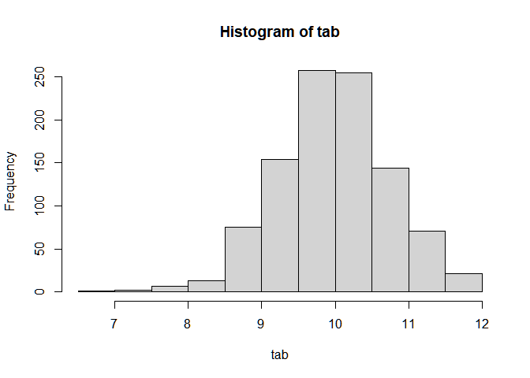
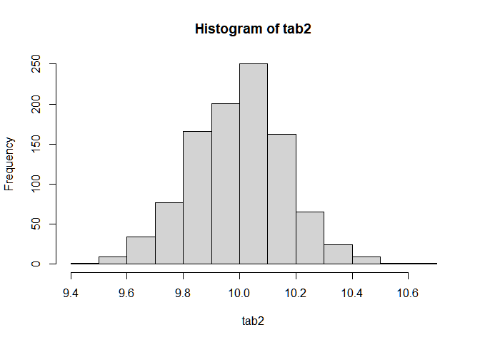
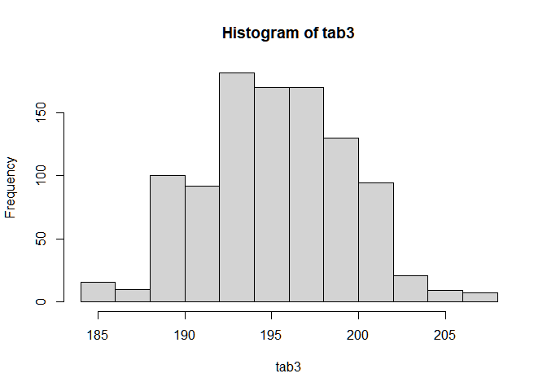

Untitled
================

``` r
library(MASS)
```

    ## Warning: package 'MASS' was built under R version 4.0.3

``` r
s<-survey
summary(s)
```

    ##      Sex          Wr.Hnd          NW.Hnd        W.Hnd          Fold    
    ##  Female:118   Min.   :13.00   Min.   :12.50   Left : 18   L on R : 99  
    ##  Male  :118   1st Qu.:17.50   1st Qu.:17.50   Right:218   Neither: 18  
    ##  NA's  :  1   Median :18.50   Median :18.50   NA's :  1   R on L :120  
    ##               Mean   :18.67   Mean   :18.58                            
    ##               3rd Qu.:19.80   3rd Qu.:19.73                            
    ##               Max.   :23.20   Max.   :23.50                            
    ##               NA's   :1       NA's   :1                                
    ##      Pulse             Clap       Exer       Smoke         Height     
    ##  Min.   : 35.00   Left   : 39   Freq:115   Heavy: 11   Min.   :150.0  
    ##  1st Qu.: 66.00   Neither: 50   None: 24   Never:189   1st Qu.:165.0  
    ##  Median : 72.50   Right  :147   Some: 98   Occas: 19   Median :171.0  
    ##  Mean   : 74.15   NA's   :  1              Regul: 17   Mean   :172.4  
    ##  3rd Qu.: 80.00                            NA's :  1   3rd Qu.:180.0  
    ##  Max.   :104.00                                        Max.   :200.0  
    ##  NA's   :45                                            NA's   :28     
    ##        M.I           Age       
    ##  Imperial: 68   Min.   :16.75  
    ##  Metric  :141   1st Qu.:17.67  
    ##  NA's    : 28   Median :18.58  
    ##                 Mean   :20.37  
    ##                 3rd Qu.:20.17  
    ##                 Max.   :73.00  
    ## 

``` r
s<-na.omit(s)
sd(s$Age)
```

    ## [1] 6.099286

``` r
meanAge<-mean(s$Age)
```

``` r
#confint(meanAge,level=0.95)
```

``` r
sd_pop <- 7
round(meanAge+c(-1,1)*sd_pop/sqrt(168)*qnorm(.975),2)
```

    ## [1] 19.38 21.49

``` r
t.test(s$Age,conf.level=0.95)
```

    ## 
    ##  One Sample t-test
    ## 
    ## data:  s$Age
    ## t = 43.423, df = 167, p-value < 2.2e-16
    ## alternative hypothesis: true mean is not equal to 0
    ## 95 percent confidence interval:
    ##  19.50454 21.36261
    ## sample estimates:
    ## mean of x 
    ##  20.43358

``` r
tab<-matrix(nrow=1, ncol=1000)
for( i in 1:1000){
tab[i]<- mean(rnorm(n=5,mean=10, sd=sqrt(3)))
}
hist(tab)
```

<!-- -->

``` r
tab2<-matrix(nrow=1, ncol=1000)
for( i in 1:1000){
tab2[i]<-mean(rnorm(n=100,mean=10, sd=sqrt(3)))
}
hist(tab2)
```

<!-- -->

``` r
library('mosaic')
```

    ## Warning: package 'mosaic' was built under R version 4.0.5

    ## Registered S3 method overwritten by 'mosaic':
    ##   method                           from   
    ##   fortify.SpatialPolygonsDataFrame ggplot2

    ## 
    ## The 'mosaic' package masks several functions from core packages in order to add 
    ## additional features.  The original behavior of these functions should not be affected by this.

    ## 
    ## Attaching package: 'mosaic'

    ## The following objects are masked from 'package:dplyr':
    ## 
    ##     count, do, tally

    ## The following object is masked from 'package:Matrix':
    ## 
    ##     mean

    ## The following object is masked from 'package:ggplot2':
    ## 
    ##     stat

    ## The following objects are masked from 'package:stats':
    ## 
    ##     binom.test, cor, cor.test, cov, fivenum, IQR, median, prop.test,
    ##     quantile, sd, t.test, var

    ## The following objects are masked from 'package:base':
    ## 
    ##     max, mean, min, prod, range, sample, sum

``` r
szczury<-read.delim("szczury.txt")
szczury<-sample(szczury,1000,replace=TRUE)
```

``` r
tab3<-matrix(nrow=1, ncol=1000)
for( i in 1:1000){
tab3[i]<-mean(szczury$X191.2[i],na.rm=TRUE)
}
mean(tab3)
```

    ## [1] 195.2806

``` r
hist(tab3)
```

<!-- -->
