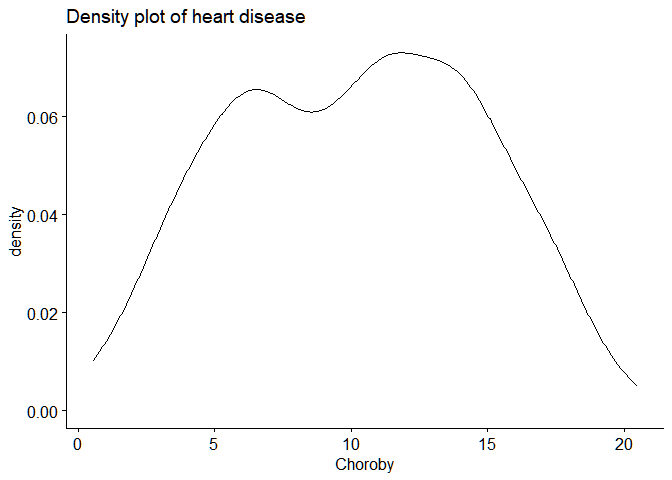
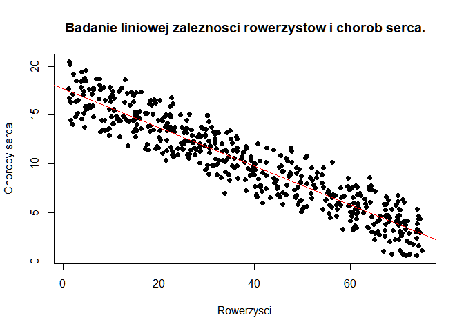
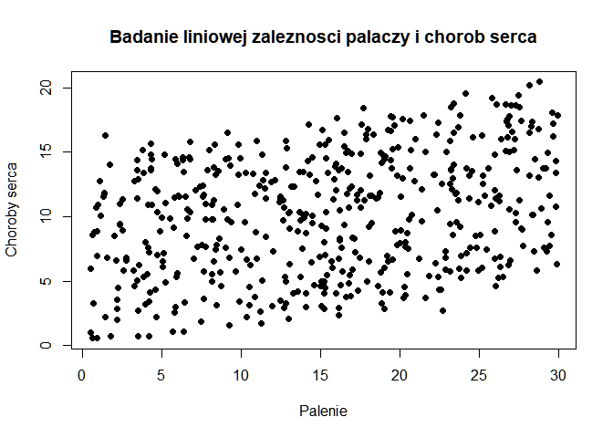
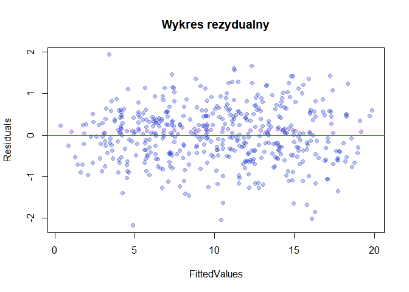
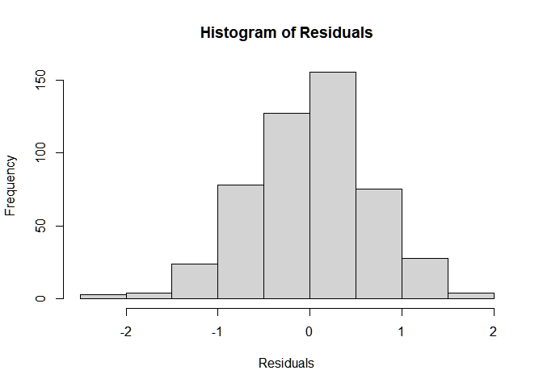
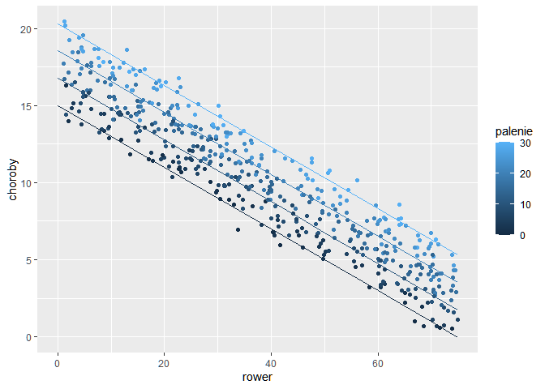

``` r
heart_disease<-read.delim("choroby_serca.txt",header=TRUE)
head(heart_disease)
```

    ##       rower   palenie   choroby
    ## 1 30.801246 10.896608 11.769423
    ## 2 65.129215  2.219563  2.854081
    ## 3  1.959665 17.588331 17.177803
    ## 4 44.800196  2.802559  6.816647
    ## 5 69.428454 15.974505  4.062224
    ## 6 54.403626 29.333176  9.550046

``` r
summary(heart_disease)
```

    ##      rower           palenie           choroby       
    ##  Min.   : 1.119   Min.   : 0.5259   Min.   : 0.5519  
    ##  1st Qu.:20.205   1st Qu.: 8.2798   1st Qu.: 6.5137  
    ##  Median :35.824   Median :15.8146   Median :10.3853  
    ##  Mean   :37.788   Mean   :15.4350   Mean   :10.1745  
    ##  3rd Qu.:57.853   3rd Qu.:22.5689   3rd Qu.:13.7240  
    ##  Max.   :74.907   Max.   :29.9467   Max.   :20.4535

``` r
cor(heart_disease)
```

    ##               rower    palenie    choroby
    ## rower    1.00000000 0.01513618 -0.9354555
    ## palenie  0.01513618 1.00000000  0.3091310
    ## choroby -0.93545547 0.30913098  1.0000000

``` r
#zmienna niezalezna: rower, palenie
#zmienne zalezne: choroby

cor.test(heart_disease$palenie,heart_disease$rower)
```

    ## 
    ##  Pearson's product-moment correlation
    ## 
    ## data:  heart_disease$palenie and heart_disease$rower
    ## t = 0.33714, df = 496, p-value = 0.7362
    ## alternative hypothesis: true correlation is not equal to 0
    ## 95 percent confidence interval:
    ##  -0.07282732  0.10286603
    ## sample estimates:
    ##        cor 
    ## 0.01513618

``` r
#korelacja jest slaba

shapiro.test(heart_disease$choroby)
```

    ## 
    ##  Shapiro-Wilk normality test
    ## 
    ## data:  heart_disease$choroby
    ## W = 0.98047, p-value = 3.158e-06

``` r
#jezeli p-value>0.05 to rozklad nie rozni sie znaczaco od rozkladu normalnego
#tutaj p-val=3.158*10-6<0.05
library("ggpubr")
```

    ## Warning: package 'ggpubr' was built under R version 4.0.5

    ## Loading required package: ggplot2

    ## Warning: package 'ggplot2' was built under R version 4.0.5

``` r
ggdensity(heart_disease$choroby, main="Density plot of heart disease", xlab="Choroby") #brak rozkladu normalnego
```

<!-- -->

``` r
plot(heart_disease$rower,heart_disease$choroby,main="Badanie liniowej zaleznosci rowerzystow i chorob serca.",xlab="Rowerzysci",ylab="Choroby serca",pch=19)
abline(lm(heart_disease$choroby~heart_disease$rower),col="red") #istnieje zaleznosc liniowa
```

<!-- -->

``` r
plot(heart_disease$palenie,heart_disease$choroby,main="Badanie liniowej zaleznosci palaczy i chorob serca",xlab="Palenie",ylab="Choroby serca",pch=19) #brak zaleznosci liniowej
```

<!-- -->

``` r
#model<-lm(heart_disease$choroby~heart_disease$rower+heart_disease$palenie) - dla takiego zapisu ggpredict nie dziala
model<-lm(choroby~rower+palenie, data=heart_disease)
summary(model)
```

    ## 
    ## Call:
    ## lm(formula = choroby ~ rower + palenie, data = heart_disease)
    ## 
    ## Residuals:
    ##     Min      1Q  Median      3Q     Max 
    ## -2.1789 -0.4463  0.0362  0.4422  1.9331 
    ## 
    ## Coefficients:
    ##              Estimate Std. Error t value Pr(>|t|)    
    ## (Intercept) 14.984658   0.080137  186.99   <2e-16 ***
    ## rower       -0.200133   0.001366 -146.53   <2e-16 ***
    ## palenie      0.178334   0.003539   50.39   <2e-16 ***
    ## ---
    ## Signif. codes:  0 '***' 0.001 '**' 0.01 '*' 0.05 '.' 0.1 ' ' 1
    ## 
    ## Residual standard error: 0.654 on 495 degrees of freedom
    ## Multiple R-squared:  0.9796, Adjusted R-squared:  0.9795 
    ## F-statistic: 1.19e+04 on 2 and 495 DF,  p-value: < 2.2e-16

``` r
summary(model)
```

    ## 
    ## Call:
    ## lm(formula = choroby ~ rower + palenie, data = heart_disease)
    ## 
    ## Residuals:
    ##     Min      1Q  Median      3Q     Max 
    ## -2.1789 -0.4463  0.0362  0.4422  1.9331 
    ## 
    ## Coefficients:
    ##              Estimate Std. Error t value Pr(>|t|)    
    ## (Intercept) 14.984658   0.080137  186.99   <2e-16 ***
    ## rower       -0.200133   0.001366 -146.53   <2e-16 ***
    ## palenie      0.178334   0.003539   50.39   <2e-16 ***
    ## ---
    ## Signif. codes:  0 '***' 0.001 '**' 0.01 '*' 0.05 '.' 0.1 ' ' 1
    ## 
    ## Residual standard error: 0.654 on 495 degrees of freedom
    ## Multiple R-squared:  0.9796, Adjusted R-squared:  0.9795 
    ## F-statistic: 1.19e+04 on 2 and 495 DF,  p-value: < 2.2e-16

``` r
#a
#Wartosc p-value jest bardzo mala, mozemy odrzucic hipoteze zerowa, poniewaz wyniki nie sa kwestia przypadku i losowosci

#b
#Zmiana zachorowalnosci na serce -0.200133, dla liczby palacych 0.178334
#wartosci te oznaczaja tyle, ze jezeli "rower" wzrosnie o 1% w gore, to choroby spadna o 0.2% w dol, natomiast w przypadku "palenia" choroby wzrosna o ~0.17% w gore dla wzrostu 1% palenia

#c
#RSE = 0.654
#R^2=0.9796
RSS=sum(model$residuals**2)
RSS
```

    ## [1] 211.7403

``` r
Residuals<-model$residuals
FittedValues<-model$fitted.values
plot(FittedValues,Residuals, col=rgb(0.1,0.2,0.8, 0.3), main="Wykres rezydualny",pch=19)

abline(0,0,  col="red")
```

<!-- -->

``` r
hist(Residuals)
```

<!-- -->

``` r
#na podstawie wykresu rezydualnego z wartosciami oraz histogramu mozemy zauwazyc, ze dopasowania dla naszego modelu regresji sa symetrycznie polozone (rownomiernie rozlozone wzgledem wartosci 0) - mozemy wiec stwierdzic, ze spelnione sa warunku homoscedastycznosci
#https://statisticsbyjim.com/regression/heteroscedasticity-regression/
```

``` r
library("ggiraphExtra")
```

    ## Warning: package 'ggiraphExtra' was built under R version 4.0.5

``` r
ggPredict(fit=model) #linie regresji
```

<!-- -->
